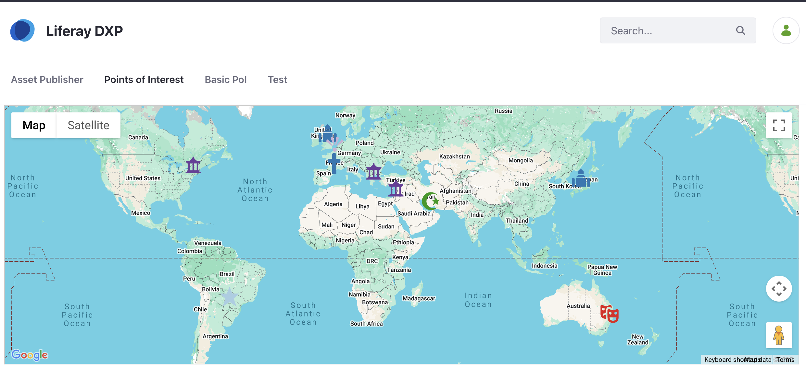
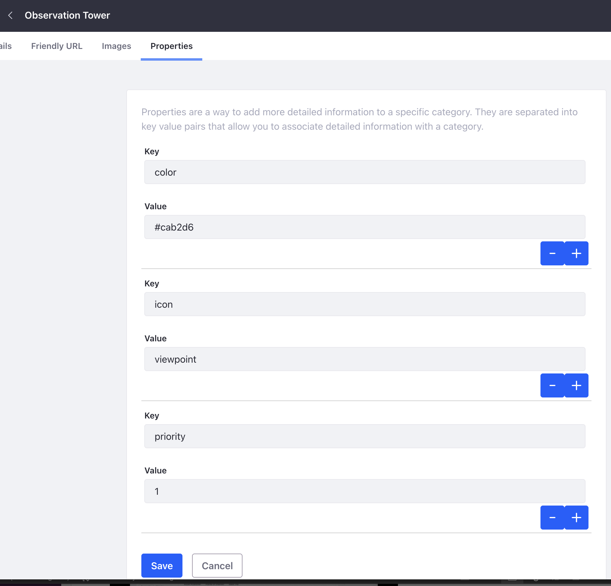
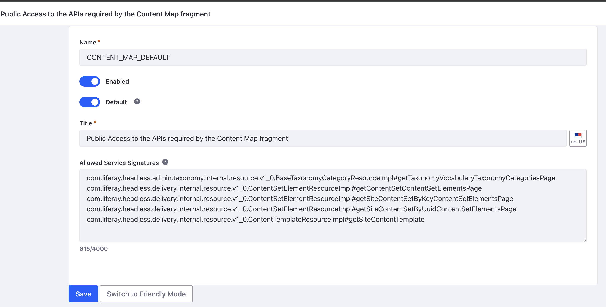

# Content Fragments

## Content Map

This fragment uses the headless API to deliver an enhanced content map similar to what the Asset Publisher provides.

- You can use the default markers and info window template to get going straightaway.
- You can use OpenStreetMap (Leaflet) or Google Maps.
- You can the default Auto Fit Bounds option or specify the zoom and map initial centre (latitude and longitude).
- You can use the default Info window trigger of hover or change it to click or none. If none is selected, then an info window will not be bound to the marker. In the case of hover, you can specify how long the info window should remain open after focus is lost.
- You can setup markers to navigate to a custom or the default Display Page, with the option to open it in a new tab.
- You can configure taxonomy within DXP to specify the icon and colour used for each marker. The fragment uses UNKPG icons. - The priority property can be used to control which category icon is used where multiple categories are mapped to a web content item.
- You can use a Web Content Template to control the layout of the info window. This uses custom placeholders which are substituted when the template is rendered in the fragment.



### Videos

- [Custom Markers](../docs/videos/Content%20Map%20Fragment%20-%20Custom%20Markers.mp4)
- [Basic](../docs/videos/Content%20Map%20Fragment%20-%20Basic.mp4)
- [Advanced](../docs/videos/Content%20Map%20Fragment%20-%20Advanced.mp4)

### Usage

As a minimum a web content structure with a single Geolocation field is needed. The inherited fields of title and description are used to place the markers on the map. The Geolocation field can be at the top level or nested within a field set; the fragment will traverse the structure to find a field of type Geolocation.

1. Create a new web content structure
2. Add a single GeoLocation field
3. Create a web content item using the structure
4. Create a collection. The collection can be dynamic or manual but needs to be configured for the new structure
5. Add the fragment to a page
6. Configure the fragment by providing the id, key, uuid or name of the collection

### Custom Markers

This fragment supports custom markers through Liferay Taxonomy. This requires creating a new vocabulary with a category which contains additional properties to specify the icon and colour. The fragment uses UNKPG icons and the value of this property needs to be the icon name without the svg extension.

There is an additional priority property which is used when a web content item has been assigned more than one category so that the fragment can determine which icon and colour to use. A value with a lower value is given a higher priority, negative integers are also supported.

__You can configure the fragment to fallback to the default markers within the map provider in the case where the user does not have permission to read the category or it was not found.__

1. Create a new vocabulary
2. Create one or more categories
3. For each category, add icon, colour and priority properties
4. Assign one or more categories to the web content items



### Custom Info Window

The fragment makes use of Liferay Content Templates to customise the content of the Info window. Below is an example of a custom template.

To reference web content fields within the template, use the {{...}} syntax. The Field Reference is used for the name of the field and a dot notation is used to navigate to it within the structure where the Label of each nested field set is the path. For example, the buildingNameNumber field is within a field set with a label Address, which in turn is nested within a field set called Location.

```html
<div class="info-window">
  <h3>{{location.address.buildingNameNumber}}</h3>
  <p><em>{{categories}}</em></p>
  <div>{{description}}</div>
  <p>Published: {{datePublished}}</p>
  <p>Phone: {{contactInformation.phoneNumber}}</p>
  <p>
    Website:
    <a href="{{contactInformation.website}}" target="_blank">
      {{contactInformation.website}}
    </a>
  </p>
</div>
```

__You can configure the fragment to fallback to the default Info template in the case where the user does not have permission to read the template or it was not found.__

### Guest Permissions

In order to allow anonymous / guest users to view the template then you need to create a new the Service Access Policy.

Depending on the value provided when configuring the Collection the Service Access Policy needs to include one or more of the following service signatures.

- Id - ``com.liferay.headless.delivery.internal.resource.v1_0.ContentSetElementResourceImpl#getContentSetContentSetElementsPage``
- Key - ``com.liferay.headless.delivery.internal.resource.v1_0.ContentSetElementResourceImpl#getSiteContentSetByKeyContentSetElementsPage``
- UUID - ``com.liferay.headless.delivery.internal.resource.v1_0.ContentSetElementResourceImpl#getSiteContentSetByUuidContentSetElementsPage``
- Name - ``com.liferay.headless.delivery.internal.resource.v1_0.ContentSetElementResourceImpl#getSiteContentSetByKeyContentSetElementsPage``

__The service signature for the Key and Name are the same, the fragment knows how to convert the name into a key__

For custom markers, add the following service signature:

``com.liferay.headless.admin.taxonomy.internal.resource.v1_0.BaseTaxonomyCategoryResourceImpl#getTaxonomyVocabularyTaxonomyCategoriesPage``

Finally, to define a custom template, add this service signature:

``com.liferay.headless.delivery.internal.resource.v1_0.ContentTemplateResourceImpl#getSiteContentTemplate``


