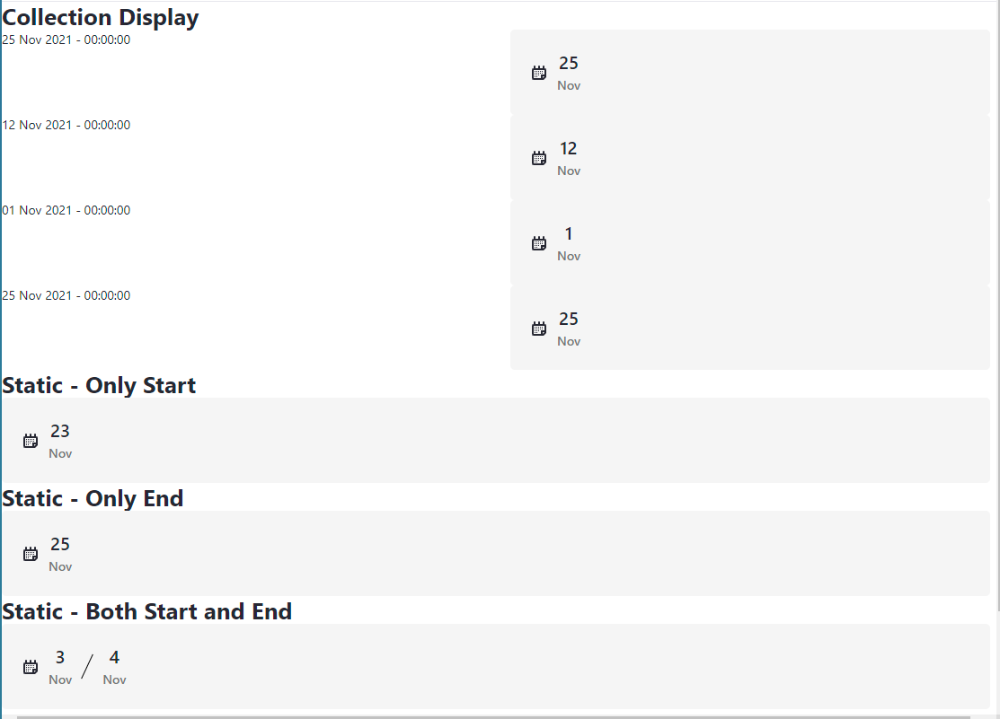
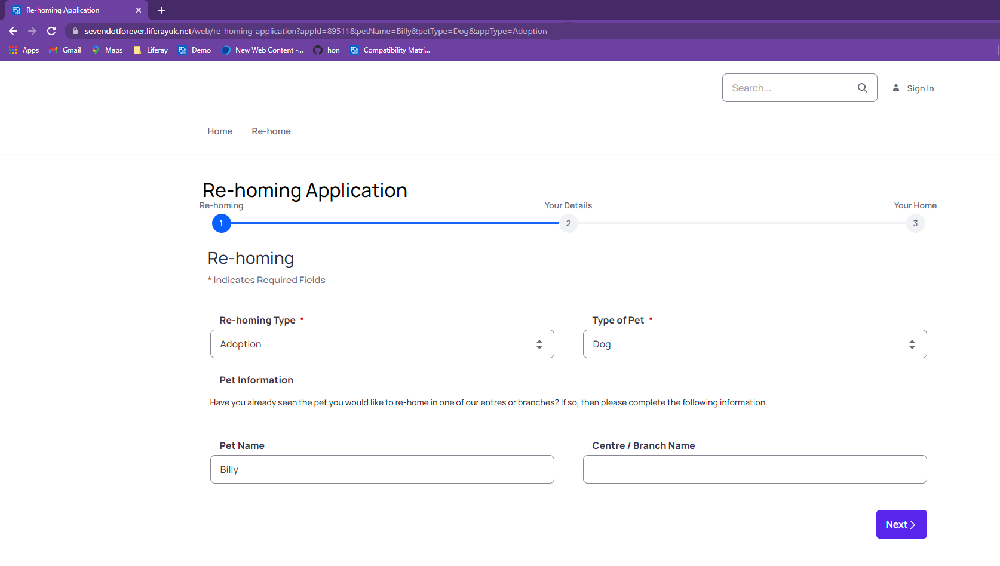
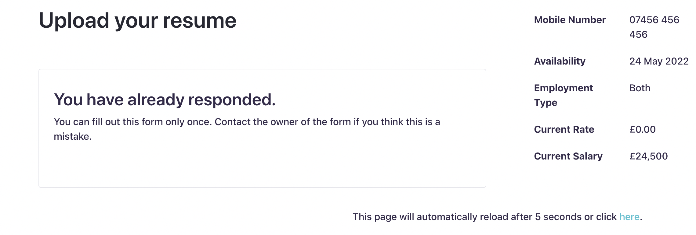
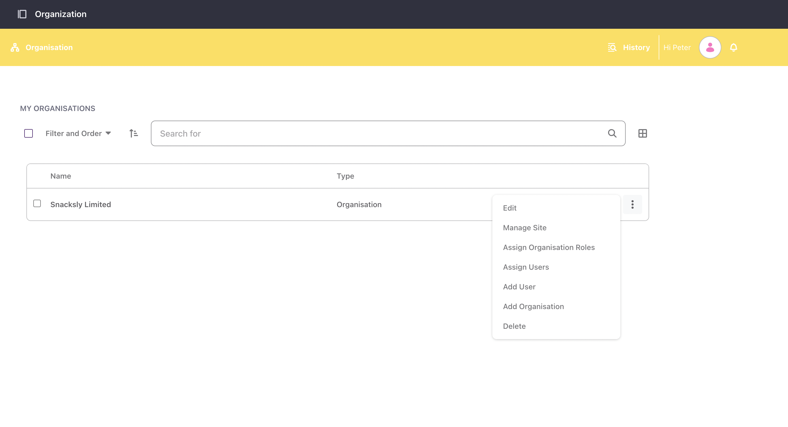
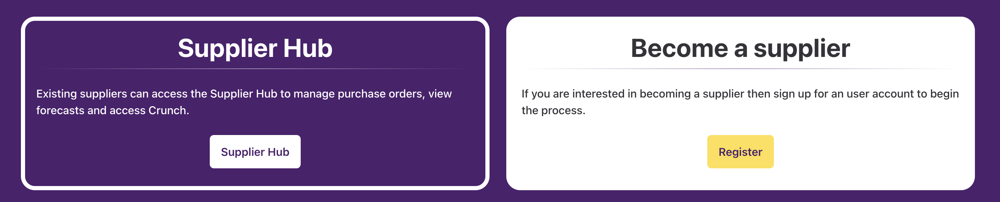
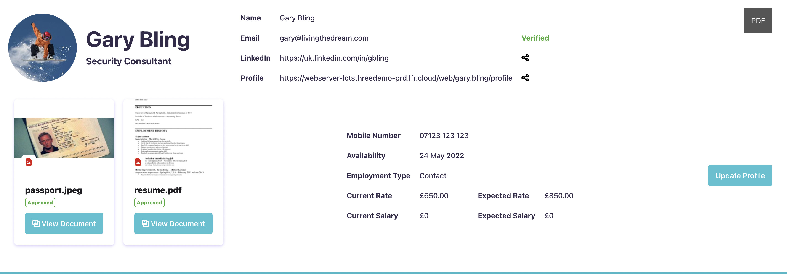

# liferay-fragments
A selection of Liferay Fragments

## Date Display (Static)
This fragment displays a date or date range via its configuration; hence it can only be used for static dates.

The date format must be yyyy-MM-dd, e.g., 2021-11-01 for the 1st November 2021.

You can set either the start date, end date or both. When only one date is displayed then no separator is displayed. If both dates are specified, then the start date will be first followed by the separator and then finally the end date.

The Clay calendar icon can be turned on or off via the configuration.

The JavaScript will not execute when the fragment is viewed in either the Fragment Editor or the Page Content Editor.

## Date Display (Collection Display)
This fragment displays a date or date range via two mappable fields; hence it can be used for collection displays.

The left-hand mappable field is for the start date and the right-hand mappable field is for the end date. If either value is empty, then its corresponding HTML will not be displayed.

The mappable fields are hidden by default and only made visible when the fragment is viewed in the Page Content Editor.

The Clay calendar icon can be turned on or off via the configuration.

The JavaScript will not execute when the fragment is viewed in either the Fragment Editor or the Page Content Editor.



#### Dependency (Prior to 7.4.3.5 CE GA5 / 7.4.13 DXP U1)
To correctly render this fragment, it is necessary for each rendered instance within the collection display to have a unique identifier. This is not something that happens at the moment but there is a JIRA issue already in place with a potential fix already to be merged. However, no timeline is currently known for its availability.

In order to ensure each instance had a unique identifier it was necessary to use the com.liferay.portal.kernel.util.PortalUtil to generate a random key. This has meant the need to enable the staticUtil variable so the class can be referenced from the fragment.

To enable this, navigate to Control Panel -> System Settings ->Template Engines (under Platform) -> FreeMarker Engine and remove staticUtil from the Restricted Variables list.

This is no longer required in Liferay 7.4 due to the issue being addressed in the product - LPS-138102

## Form Populator
This fragment can pre-populate a form fields using values passed in the URL query string. This is achieved by using a JSON based mapping configuration, which is passed to the fragment. The fragment has a drop-zone in which the form is dropped.

Currently, this fragment only populates text, numeric and select from list fields. However, this is likely to be extended in the future.

It contains a configurable retry mechanism to ensure the form, which is dynamically generated, has finished rendering before attempting to populate the field.

This may not be suitable for a production scenario, and it is simply intended to be example of what is possible.



#### Mapping Config
The following example shows the format of the JSON needed. The parameter attribute specifies the key used in the query string that should be used to populate the field value. The fieldReference is the name of the field in the DOM (make sure you examine the DOM once the form is rendered as this value can be different to the one configured). The fieldType determines which selector and setter functions are used. Finally, the fieldConfig is an object which can contain anything else the selector or setter function need in order to correctly populate the field.

In the case of a selectFromList field, it is necessary to provide the position of the list on the page, because the component does not contain a unique identifier to distinguish between different list of values.

If no value is provided for the in the query string, then the field will be skipped. Likewise, if no query string is provided at all then all fields will be skipped.
```json
[
  {
    "parameter": "petType",
    "fieldReference": "SelectFromList95537787",
    "fieldType": "selectFromList",
    "fieldConfig": {
      "listPosition": 2
    }
  },
  {
    "parameter": "appId",
    "fieldReference": "Numeric71522887",
    "fieldType": "numeric"
  },
  {
    "parameter": "petName",
    "fieldReference": "Text53774731",
    "fieldType": "text"
  },
  {
    "parameter": "appType",
    "fieldReference": "SelectFromList47997993",
    "fieldType": "selectFromList",
    "fieldConfig": {
      "listPosition": 1
    }
  }
]
```

## Refresh Page
This fragment can be used to set an automatic and / or manual page refresh.

It is useful in the case of Liferay Forms and Workflow where the workflow updates a variable that a segmentation relies upon to present a different experience. Typically, the form will be configured to limit to one submission per user. This provides a unique message on which the fragment can test for and trigger the message.

It should work in other circumstances too, but it would need to be tested and amended on a case by case basis.



## Liferay Iframer
This may seem like an unnecessary fragment but it can actually be very useful, especially when using the new Dialect theme in Liferay DXP 7.4. In Liferay DXP 7.4 there has been a move to module-less customisations and Dialect is the new theme which is intended to reduce the need for traditional theme modules. This approach makes a greater use of Master Pages in order to define the header, including navigation and footer which would normally be defined within the theme module itself.

The problem comes when you want to navigate to any of the built-in portlets, such as Notifications or Workflow Tasks because they have no knowledge of the Master Page which contains the composite theme components. An earlier approach to this problem was to use a custom Portlet Container fragment to embed the portlet within the page, however, there have been cases where actions within the portlets have resulted in a redirect which then displays the portlet outside the Master Page.

My solution to the problem was to make use of the new Remote Apps feature in Liferay DXP 7.4 and define the portlets as iframe based apps. From my limited testing, I have found that this approach survives the redirect issued seen by the Portlet Container fragment approach. The only issues I found were the fact that users with site or admin permissions saw the control and site menus within the iframe and the slight delay in load time.

The Liferay Iframet fragment solves both of these issues by using a loading animation to hide the iframe before it is ready. Within the same time, the fragment adds CSS styles to the iframe document to hide both the control and site menus. Once everything is ready the load animation is removed, and the portlet can be used as normal.



## Layout Components

This group of fragments, demonstrate how a drop-zone can be used to manipulate its content.

There is a single action card which will take on a different style depending on the wrapping card it is dropped into.



## Header Components

This is a group of fragments, which allow a fragmented theme to be created within a master page.

## Profile

The following fragments have a couple of variations. The one without the (Dashboard) suffix is intended to be included on a user's personal site. It makes use of Liferay's URL structure to extract the user's screen name from the URL and thereby display the user's profile details regardless of the user viewing it, including anonymous users.


### Profile Summary

This fragment displays a summary of the user's profile without any personal information, other than public profiles. It provides a couple of share buttons which copies the relavent link to the clipboard.

### Profile Detail

This fragment uses a similar approach to display more personal profile information. It also includes an indication where certain data is missing.

### PDF Export

This fragment uses a third-party library to export the HTML content of a targeted element. If you want to display the profile information in a different way then this can be achieved by using a hidden element. The example Profile Summary fragment, does just that.



## Miscellaneous

This is a group of miscellaneous fragments which can be useful in certain circumstances.

These fragments may not be suitable for a production scenario, and are simply intended to be example of what is possible.

### Customer Registration

This fragment contains JavaScript which targets the Liferay menu bar and Login Card fragment.

In terms of the Liferay menu bar, it is used to hide a link on the menu bar when the user is logged in. For example, you could use it to hide a Register link once the user has logged in.

In terms of the Login Card fragment, it overrides the link of the Create Account link (if present) so that it can be pointed to a custom page. This is useful if you want to introduce a custom registration / on-boarding process, i.e., avoid using the OOB create user account process.

### Modify My Profile Link

There are times when you want to override the target of menu items in the User Personal Menu. For example, you may want to override the My Profile Link to target a different page to the default.

This JavaScript based fragment allows you to do just that.

### My Dashboard Link

This fragment in another JavaScript which rather than hides a Liferay menu bar item, it changes the target of it. For example, if you want a public and private link to both point to a private page without 'hardcoding' the absolute URL, then this fragment can update the link using a relative location.

## Commerce

### Commerce Context Contributor

This fragment contains Javascript and Freemarker which extends the Liferay JS object to include a copy of the Liferay CommerceContext.

The resulting Liferay.CommerceContext object only contains a subset of the information within the Liferay CommerceContext.

If this fragment is added to a Master Page template then they Liferay.CommerceContext is avaialble to other components, fragments and Liferay aware Remote Apps (Custom Elements), on the page

### Purchased Products

This fragment presents a list of products purchased against the current Commerce Account. Each product can be 'clicked' so the user can navigate to the product's display page. In addition, the click event is used to set a set of cookies which contain the productId and a boolean to indicate the product was purchased.

These cookies can be used to drive personalisation within Liferay DXP using segmentation and experiences.

The account Id and channel Id used to retrieve the products can be configured via the page editor or the fragment can be configured to use the Liferay.CommerceContext object (dependent on Commerce Context Contributor fragment) instead.

If no products are found then a suitable, configurable, message is displayed.
