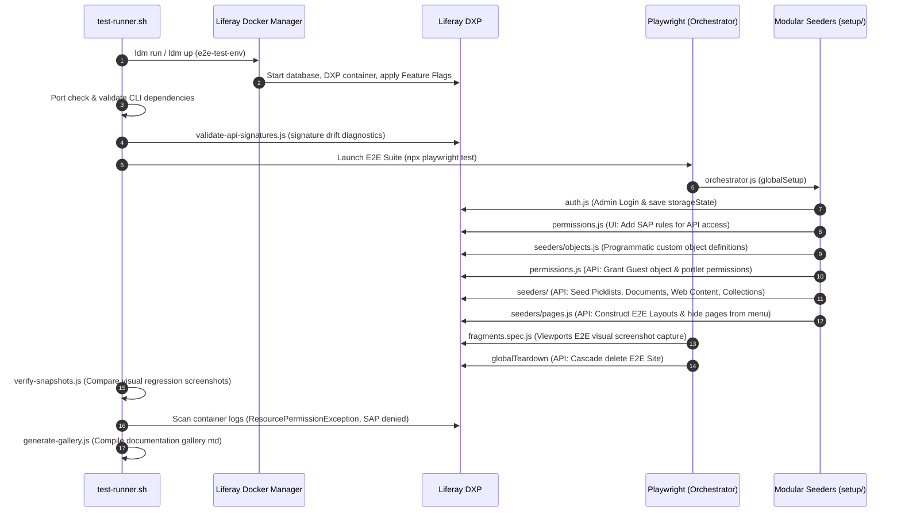

# Automated Fragment Testing

This project utilizes an end-to-end (E2E) automated testing suite to verify the
visual rendering and functional integrity of all Liferay Fragments across
multiple responsive viewports.

The testing architecture is orchestrated by a bash script
(`scripts/test-runner.sh`) and leverages **Liferay Docker Manager (LDM)** for
environment provisioning and **Playwright** for browser automation.

## Architecture & Workflow

The automated testing process follows these steps when
`./scripts/test-runner.sh` is executed:

1. **Dependency & License Validation:** Verifies required tools (`ldm`, `jq`,
   `curl`, `node`, `npm`, `docker`) are installed and that a valid Liferay DXP
   activation key is present.
2. **Environment Provisioning:** Uses LDM to spin up a clean Liferay instance
   (e.g., `2026.Q1 LTS`) non-interactively. To simplify the infrastructure and
   reduce startup time, the environment is provisioned as **seeded**, uses the
   **Sidecar** architecture (bundling Elasticsearch and the DB into the same
   pod), defaults to the **PostgreSQL** database, and communicates over **HTTP**
   (port 8080).
3. **Build & Deploy:** Compiles all fragments
   (`./create-fragment-zips.sh --all`) and deploys the ZIPs, language modules,
   and showcase data directly into the LDM container via `docker cp`.
4. **Data Sync Buffer:** Polls the Liferay logs to ensure the Headless Batch
   Engine has finished seeding the Showcase Data (Object definitions, Commerce
   data, etc.) before proceeding.
5. **Verification & Dynamic Page Generation (Playwright Setup):** A
   `global-setup.js` script logs into Liferay and establishes an **"E2E
   Bridge"** using **JSON WS**. It queries
   `fragment.fragmententry/get-fragment-entries` to verify that the fragments
   were actually registered by the database.
   - **Safety Gate**: If a fragment is not found in the database, it is skipped
     to prevent downstream 404s.
   - **Page Creation**: For registered fragments, the script programmatically
     constructs a dedicated Content Page via the **Headless Delivery API**.
6. **Responsive UI Testing:** Playwright runs the `fragments.spec.js` suite
   across three viewports.
   - **Hardened Assertions**: Tests no longer just check for a container; they
     actively scan for Liferay error text (e.g., "Fragment is unavailable") and
     verify the presence of successful rendering classes.
   - **Visual Regression**: High-fidelity snapshots are captured for every
     fragment.
7. **Automated Teardown & Reporting:**
   - **Cleanup**: The `global-teardown.js` hook automatically deletes all
     programmatically created test pages to keep the environment clean.
   - **Reporting**: A Markdown report and visual artifacts are generated.
     `docs/test-results/`, and the LDM environment is cleanly destroyed.

## Prerequisites

Before running the test suite, ensure your local environment is correctly
configured.

### 1. Install Required Tools

Ensure the following tools are installed and available in your `PATH`:

- `node` & `npm`
- `docker`
- `curl` & `jq`
- `ldm` (Liferay Docker Manager, minimum version 2.5.0)

### 2. Configure Liferay License (LDM Common)

Because the tests run against Liferay DXP, you must provide a valid activation
key.

1. Obtain a `.xml` developer or enterprise activation key for Liferay DXP.
2. Run the initialization command to create the default configuration directory:

   ```bash
   ldm init-common -y
   ```

   _Note: This generates standard configurations like `portal-ext.properties`
   which disables the setup wizard and password reset prompts._

3. Place your activation key `.xml` file inside the `~/.ldm/common/` directory.

   ```bash
   cp ~/Downloads/activation-key-dxpdevelopment...xml ~/.ldm/common/
   ```

**Security Warning:** Never place your license key inside the project workspace
to avoid accidentally committing it to Git. The `test-runner.sh` script
specifically looks for it in `~/.ldm/common/`.

### 3. Install Playwright Dependencies

If this is your first time running the tests, install the Node dependencies and
all required Playwright browsers from the root of the workspace:

```bash
npm install
npx playwright install --with-deps
```

_Note: `--with-deps` installs any missing system-level libraries required by the
browsers (Linux only). On macOS/Windows, `npx playwright install` is usually
sufficient._

## Running the Tests

To run the test suite against the default Liferay version (e.g., `2026.q1`
update prefix):

```bash
./scripts/test-runner.sh
```

To run the test suite against a specific Liferay tag:

```bash
./scripts/test-runner.sh 2025.q4.0
```

To run with verbose debugging enabled (echos all internal bash commands and LDM
output):

```bash
./scripts/test-runner.sh -v
```

To run and keep the Liferay environment alive after tests complete (useful for
manual inspection):

```bash
./scripts/test-runner.sh -k
# OR
./scripts/test-runner.sh --keep-alive
```

To run against an existing, already running LDM project (skips provisioning and
teardown):

```bash
./scripts/test-runner.sh -p my-liferay-instance
# OR
./scripts/test-runner.sh --project my-liferay-instance
```

To skip the fragment build and deployment phase (e.g., when re-running tests
against an already-provisioned environment without any fragment changes):

```bash
./scripts/test-runner.sh -p my-liferay-instance --skip-deploy
# OR
./scripts/test-runner.sh -p my-liferay-instance -s
```

To filter the test execution and only build, deploy, and verify a specific collection or fragment (highly recommended for a faster local development feedback loop):

```bash
./scripts/test-runner.sh -f aura
# OR
./scripts/test-runner.sh --filter aura
# Multiple patterns can be passed as regular expressions
./scripts/test-runner.sh -f "aura|finance"
```

This filter option optimizes the entire E2E testing pipeline by:

1. **Targeted Builds**: Only building ZIP collections, languages, and showcases that match the filter.
2. **Selective Seeding**: Restricting page creation in `global-setup.js` to only the matching fragments, which reduces setup overhead and only queries or awaits the database objects those fragments actually require.
3. **Focused Tests**: Passing the filter to Playwright via `--grep` to run only the tests matching the specified pattern.

### Overriding Default Credentials

If your Liferay instance uses different credentials than the LDM defaults
(`test@liferay.com` / `test`), you can pass them as environment variables. This
is especially useful when testing against an existing project where the password
was changed:

```bash
LIFERAY_USER="admin@mycompany.com" LIFERAY_PASSWORD="MySecurePassword123" ./scripts/test-runner.sh -p my-liferay-instance
```

### Important Execution Notes

- **Local Only:** This script is designed for local execution due to the high
  computational load and infrastructure requirements (LDM). It contains a
  safeguard to prevent execution in CI environments (e.g., GitHub Actions, where
  `CI=true`).
- **[LPD-91054] Global Fragment Auto-Deploy Silently Fails (Liferay 2026.Q1 LTS)**:
  There is a confirmed Liferay platform bug ([LPD-91054](https://liferay.atlassian.net/browse/LPD-91054))
  affecting **Liferay 2026.Q1 LTS** where fragment ZIPs dropped into the
  auto-deploy folder with a global scope (`companyWebId: "liferay.com"`) are
  **silently dropped** by the auto-deploy scanner. Affected collections are never
  imported into the database — they are neither APPROVED nor DRAFT.

  **Impact on E2E tests**: Approximately 84 of 130 tested fragments are affected,
  causing their Playwright test pages to render with 0 DOM elements and producing
  ~252 consistent test failures. The 46 fragments that pass are from collections
  whose ZIPs happen to survive the broken scanner (typically simpler collections).

  **Status**: Waiting for Liferay to release a hotfix or fix pack. No workaround
  has been implemented — manual UI import or the Fragments Toolkit CLI can deploy
  fragments successfully but are not suitable for automated CI.

  **Resolution**: Once LPD-91054 is fixed in a Liferay patch release, the E2E
  failure count should drop to 0 (or near 0) without any changes to this project.

- **Liferay Version-Targeted Deployment**: The test runner queries the target Liferay instance to determine its release version (e.g. `2026.q1.8-lts`) and automatically selects the compatible ZIP suffix variant to deploy:
  - **Latest (`-collection-min.zip`)**: For Liferay `2026.q1` or later. These use `"dataType": "number"` and boolean literals for checkboxes, while numeric text/length fields use string representations.
  - **pre2026q1 (`-pre2026q1-min.zip`)**: For intermediate versions (like `2025.q4`) which require checkbox boolean values to also be represented as strings.
  - **pre2025q3 (`-pre2025q3-min.zip`)**: For legacy versions (before `2025.q3`) which convert `"dataType": "number"` to legacy `"int"` and use stringified default values for all fields.

- **ZIP Structure (Flattening):** Liferay's `FragmentFileInstaller`
  (Auto-Deploy) requires a flat directory structure. The build script
  automatically flattens the ZIPs so that `collection.json` and all fragment
  folders are direct siblings at the root of the ZIP.
- **Explicit Command Logging:** When running in verbose mode (`-v`), the script
  echos the primary `ldm`, `docker`, and build commands it executes, including
  all resolved parameters (ports, tags, paths). This allows for easy manual
  replication and transparent debugging of the provisioning process.

## Headless Testing Stack & State Coordinator

To coordinate execution states with external parent processes or CI runners without relying on heavy network sockets or arbitrary `sleep` timeouts, the test suite implements the **State Coordinator Pattern**. This pattern uses a lightweight, zero-dependency local plain-text file at the workspace root named `.progress-signal` as a shared Inter-Process Communication (IPC) mailbox.

### The `.progress-signal` Lifecycle & Protocol

The `scripts/test-runner.sh` script automatically writes progress information to `.progress-signal` during lifecycle transitions. To maintain strict backward compatibility, the first line of the file always contains exactly one of the following case-sensitive status labels:

1. `BUILDING`: Staged at the very beginning of the compilation or build packaging phase.
2. `WAITING_HEALTHY`: Staged when build artifacts are hot-deployed, servers are starting, or container health-checks are warming up.
3. `TESTING`: Staged the exact millisecond the browser E2E test runner (Playwright) launches.
4. `SUCCESS`: Written if the test runner exits cleanly with Exit Code 0.
5. `FAILED`: Written if any compilation, deployment, warm-up, or individual test fails/times out (propagating a non-zero exit code).

Subsequent lines contain additional structured progress metadata key-value pairs:

- `ESTIMATED_REMAINING_SECONDS`: Dynamic ballpark estimation of the remaining execution time in seconds.
- `ESTIMATED_COMPLETION_TIME`: Target ISO-8601 timestamp of when the test runner is estimated to complete.
- `PROGRESS_PERCENT`: Ballpark integer percentage of the completed execution progress.

### Robust Signal Trapping

The test runner utilizes a bash `trap` catcher (`trap handle_exit EXIT INT TERM ERR`) to handle all unexpected errors, script aborts (Ctrl+C / `SIGINT`), and terminations (`SIGTERM`). If any step in the lifecycle fails, the trap catches the exit, writes `FAILED` to `.progress-signal`, runs cleanup, and propagates the failure exit code.

### Querying Progress (Parent Processes / CI)

Parent processes or CI environments can query and poll the status of the E2E lifecycle dynamically. You can use the provided monitoring script:

```bash
# Run the progress monitor in a separate process or shell
& "C:\Program Files\Git\bin\bash.exe" ./scripts/monitor-progress.sh
```

Alternatively, a custom polling check can be written as follows:

```bash
# Example polling check for parent processes
while true; do
  STATUS=$(head -n 1 .progress-signal 2>/dev/null || echo "No signal")
  echo "Current State: $STATUS"
  if [ "$STATUS" = "SUCCESS" ] || [ "$STATUS" = "FAILED" ]; then
    break
  fi
  sleep 1
done
```

### Windows Execution Environment Command

When running in a Windows environment, all `.sh` scripts (including `scripts/test-runner.sh` and `scripts/monitor-progress.sh`) must be run via `bash.exe` (such as Git Bash or WSL). Running them directly or using standard PowerShell or Command Prompt will result in syntax or execution errors.

Example:

```powershell
# Execute from Windows PowerShell using Git Bash path
& "C:\Program Files\Git\bin\bash.exe" ./scripts/test-runner.sh
```

## Test Data & Configuration Overrides

The Playwright test suite dynamically generates Liferay Content Pages to capture visual snapshots of each fragment. By default, it uses the fragment's default configuration values defined in `configuration.json` and a generic wrapper layout.

You can customize the generated page layout or the fragment configuration used during E2E testing by providing specific manifest files alongside the fragment (in a `test/` subdirectory):

### 1. `test-data.json`

This file defines the semantic layout structure and inner child elements for the fragment. This is particularly useful for container fragments (like `dashboard-container` or `interactive-wizard`) which require nested components to render properly.

- **Location:** `<fragment-name>/test/test-data.json`

### 2. `test-fragment-config.json`

If you need to override the fragment's default configuration values explicitly for E2E testing, you can provide this file.

- **Location:** `<fragment-name>/test/test-fragment-config.json`
- **Strict Typing Warning:** Liferay 2026.Q1+ strictly enforces typing in Headless API payloads. Ensure that the JSON values provided in this override file exactly match the primitive type defined by their `dataType` in `configuration.json`. For example, if a configuration field has `"dataType": "number"`, you must provide an integer (e.g., `3`), not a stringified number (`"3"`), to avoid `500 Internal Server Error` failures during the automated seeding phase.

## Lessons Learned & Guest Rendering Standards

During the implementation of the visual fragment testing suite, several critical
architectural constraints were resolved regarding guest permissions, admin
panels, and layout styling:

### 1. Unauthenticated Guest Contexts

By default, the Playwright project is configured to use the authenticated admin
session state (`state.json`). However, this causes visual screenshots to capture
the Liferay control menus, edit mode margins, and fixed sidebar navigation
overlays (which are particularly intrusive on tablet and mobile viewports).

To ensure high-fidelity, clean visual regression captures representing the true
end-user experience, all responsive fragment specs must run in an
unauthenticated guest context by defining:

```javascript
test.describe('Responsive Fragment Rendering', () => {
  // Run all tests as Guest (unauthenticated) to check true visitor experience and prevent admin menus
  test.use({ storageState: { cookies: [], origins: [] } });

  // Test iterations...
});
```

### 2. Seeding Assets with Guest Permissions

When seeding showcase data (collections, articles, documents, custom objects)
for dynamic fragments, you must explicitly configure Guest permissions so they
can render successfully in the guest viewport checks:

- **Documents & Media**: Avoid external image URLs to prevent 404s and network
  latency. Upload mock files programmatically to the Liferay instance, then
  patch the document's view permission to `Anyone` via
  `/o/headless-delivery/v1.0/documents/{documentId}` using REST.
- **Web Content Articles**: Set the `viewableBy` property to `"Anyone"` in the
  structured content payloads.
- **Asset Collections**: Pass the `serviceContext` parameter with
  `{ addGuestPermissions: true, addGroupPermissions: true }` in JSON WS calls
  (e.g. `assetlist.assetlistentry/add-manual-asset-list-entry`).

### 3. Service Access Policies (SAP)

By default, Liferay blocks unauthenticated Guest access to many headless
endpoints (such as
`/o/headless-delivery/v1.0/content-sets/{id}/content-set-elements`). To prevent
`403 Forbidden` API failures during guest rendering, the setup phase must
configure the `SYSTEM_DEFAULT` Service Access Policy:

- Navigate to the **Service Access Policies** control panel page.
- Select the `SYSTEM_DEFAULT` policy.
- Ensure the resource implementation class (e.g.
  `com.liferay.headless.delivery.internal.resource.v1_0.ContentSetElementResourceImpl`)
  is added with the action method wildcard `*`.

### 4. Emulated Device User-Agents

Liferay evaluates session contexts for CSRF security. When Playwright emulates
viewports (like tablet or mobile) with default emulated user-agents, Liferay may
reject API calls with a `403 Forbidden` session mismatch if the user-agent
changes across requests in the same browser context.

- **Standard**: Always override the `userAgent` configuration for emulated
  tablet/mobile projects in
  [playwright.config.js](file:///Volumes/SanDisk/repos/liferay-fragments/e2e-tests/playwright.config.js)
  to match the `Desktop Chrome` user-agent.

## Reviewing Results

After the suite completes (or if it fails), a Markdown report will be generated
detailing the infrastructure phases and Playwright outcomes:

```bash
docs/test-results/results-<LIFERAY_TAG>.md
```

### Visual Snapshots

For every fragment tested, Playwright captures high-resolution PNG screenshots
across the three viewports. These are stored in:

```
e2e-tests/snapshots/<CollectionName>/<FragmentName>-<Viewport>.png
```

You can use these snapshots to manually verify that fragments are rendering
correctly or to source up-to-date visuals for project documentation. This
directory is excluded from Git.

### LDM Project Directory & Artifacts

When the script runs, LDM creates a `fragments-test-env/` directory in the root
of the workspace. This contains the runtime data for the Liferay instance. This
directory, along with the Playwright report (`e2e-tests/playwright-report/`) and
log (`e2e-tests/playwright_output.log`), are intentionally excluded from version
control via `.gitignore`.

If you use the `-k` flag, this `fragments-test-env/` directory will remain on
your disk so you can manually inspect the `deploy/` and `logs/` folders.
Otherwise, the script automatically deletes it during the cleanup phase.

### E2E Seeding & Verification Lifecycle Diagram



## <!-- markdownlint-disable MD049 -->

_Last Updated: 2026-07-09_ | _Last Reviewed: 2026-07-09_
