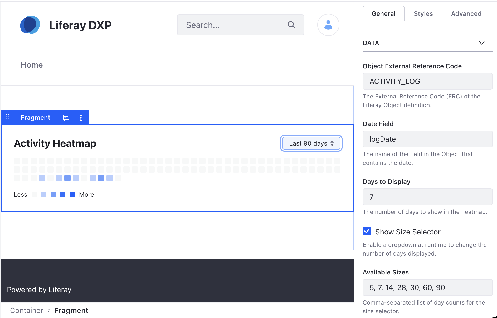

# Activity Heatmap

A visualization grid showing data density (e.g., check-ins, readings) over time from Liferay Object data.

## Features

- GitHub-style visualization of data frequency.
- Configurable color levels and base theme color.
- Automatically handles date-based mapping from any Liferay Object.
- Tooltips showing exact counts for each day.
- **Runtime Size Selector**: Optional dropdown to allow users to switch between different time ranges.

## Visuals

## Configuration

- **Object ERC**: The External Reference Code of the source Object.
- **Date Field**: The name of the field containing the date to aggregate.
- **Days to Display**: The number of days to show in the heatmap (default: 90).
- **Show Size Selector**: Enable a dropdown at runtime to change the display range.
- **Available Sizes**: Comma-separated list of day counts for the size selector (e.g., 7, 30, 90).
- **Base Color**: The primary color used for the heatmap intensity levels.
