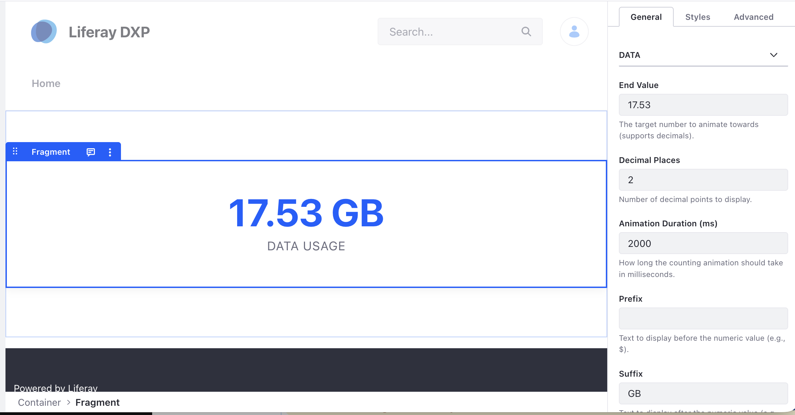

# Animated Metric Counter

A high-impact card that animates numeric totals when they enter the user's
viewport.

## Features

- Smooth count-up animations.
- Intersection Observer triggers (only animates when visible).
- Support for custom prefixes and suffixes (e.g., "$", "%", "GB").
- **Decimal Support**: Configure precision for floating-point values.
- Fully configurable duration and target values.

## Visuals

## Configuration

- **End Value**: The target number to count up to (supports decimals).
- **Decimal Places**: The number of decimal points to display (default: 0).
- **Animation Duration**: Time in milliseconds for the count animation.
- **Prefix/Suffix**: Strings to display before or after the number.
- **Text Color**: Custom theme color for the value.
