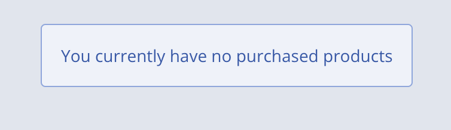

# Commerce Fragments

## Commerce Context Contributor

This fragment contains Javascript and Freemarker which extends the Liferay JS object to include a copy of the Liferay CommerceContext.

The resulting Liferay.CommerceContext object only contains a subset of the information within the Liferay CommerceContext.

If this fragment is added to a Master Page template then they Liferay.CommerceContext is avaialble to other components, fragments and Liferay aware Remote Apps (Custom Elements), on the page

## Purchased Products

This fragment presents a list of products purchased against the current Commerce Account. Each product can be 'clicked' so the user can navigate to the product's display page. In addition, the click event is used to set a set of cookies which contain the productId and a boolean to indicate the product was purchased.

These cookies can be used to drive personalisation within Liferay DXP using segmentation and experiences.

The account Id and channel Id used to retrieve the products can be configured via the page editor or the fragment can be configured to use the Liferay.CommerceContext object (dependent on Commerce Context Contributor fragment) instead.

If no products are found then a suitable, configurable, message is displayed.

