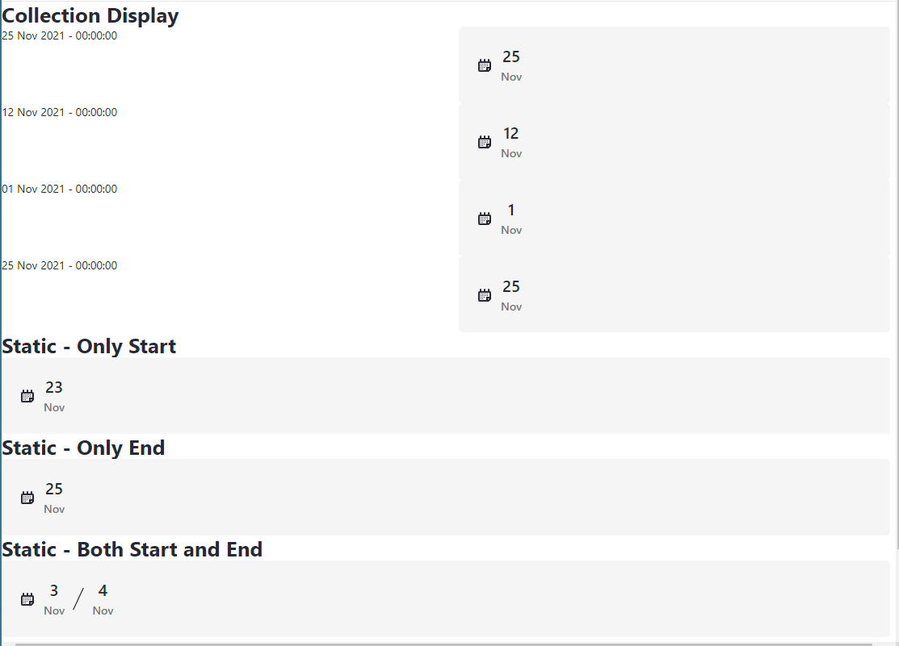

# Date Display

## Date Display (Static)
This fragment displays a date or date range via its configuration; hence it can only be used for static dates.

The date format must be yyyy-MM-dd, e.g., 2021-11-01 for the 1st November 2021.

You can set either the start date, end date or both. When only one date is displayed then no separator is displayed. If both dates are specified, then the start date will be first followed by the separator and then finally the end date.

The Clay calendar icon can be turned on or off via the configuration.

The JavaScript will not execute when the fragment is viewed in either the Fragment Editor or the Page Content Editor.

## Date Display (Collection Display)
This fragment displays a date or date range via two mappable fields; hence it can be used for collection displays.

The left-hand mappable field is for the start date and the right-hand mappable field is for the end date. If either value is empty, then its corresponding HTML will not be displayed.

The mappable fields are hidden by default and only made visible when the fragment is viewed in the Page Content Editor.

The Clay calendar icon can be turned on or off via the configuration.

The JavaScript will not execute when the fragment is viewed in either the Fragment Editor or the Page Content Editor.

#### Dependency (Prior to 7.4.3.5 CE GA5 / 7.4.13 DXP U1)
To correctly render this fragment, it is necessary for each rendered instance within the collection display to have a unique identifier. This is not something that happens at the moment but there is a JIRA issue already in place with a potential fix already to be merged. However, no timeline is currently known for its availability.

In order to ensure each instance had a unique identifier it was necessary to use the com.liferay.portal.kernel.util.PortalUtil to generate a random key. This has meant the need to enable the staticUtil variable so the class can be referenced from the fragment.

To enable this, navigate to Control Panel -> System Settings ->Template Engines (under Platform) -> FreeMarker Engine and remove staticUtil from the Restricted Variables list.

This is no longer required in Liferay 7.4 due to the issue being addressed in the product - LPS-138102
