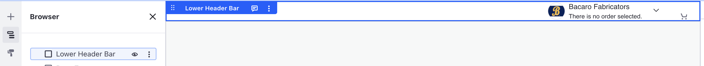

# Lower Header Layout

A layout container designed for the bottom row of a multi-row header.

## Visuals

## Configuration

<!-- markdownlint-disable MD049 -->

---

_Last Updated: 2026-08-14_ | _Last Reviewed: 2026-07-09_
