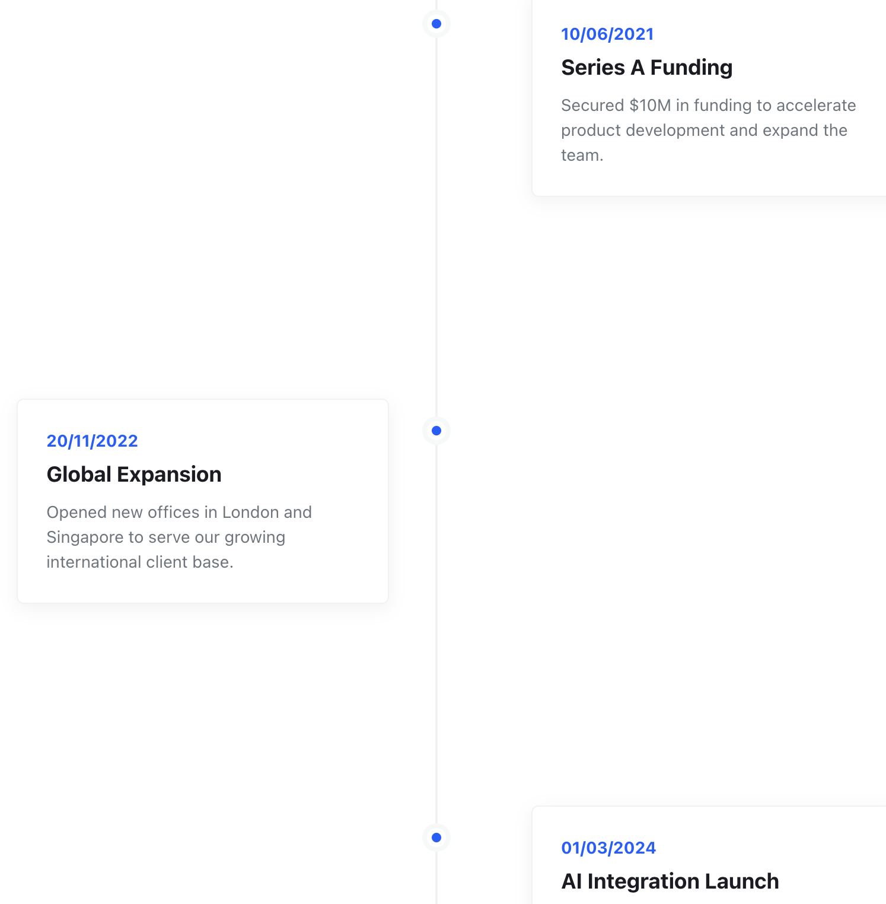
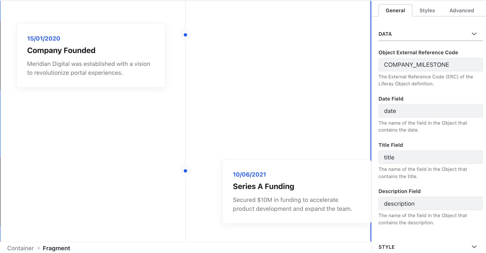

# Interactive Event Timeline

A vertical/horizontal timeline that dynamically renders milestones from a
Liferay Object.

## Features

- Scroll-triggered animations for milestone entry.
- Clean, semantic vertical line design.
- Alternating layout (milestones swap sides) for better visual rhythm.
- Automatically sorts entries by the configured date field.

## Visuals

## Configuration

- **Object ERC**: The External Reference Code of the source Object.
- **Field Mappings**: Map Date, Title, and Description to Object fields.
- **Timeline Color**: Customize the accent color for dots and dates.
