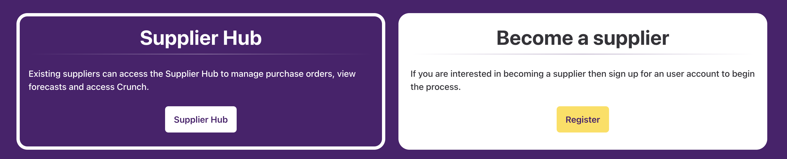

# Layout Components

This group of fragments demonstrate how a drop-zone can be used to manipulate its content.

There is a single action card which will take on a different style depending on the wrapping card it is dropped into.

