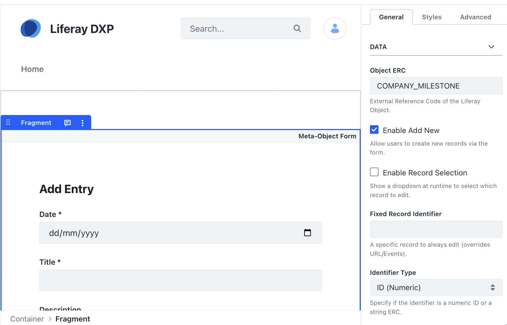
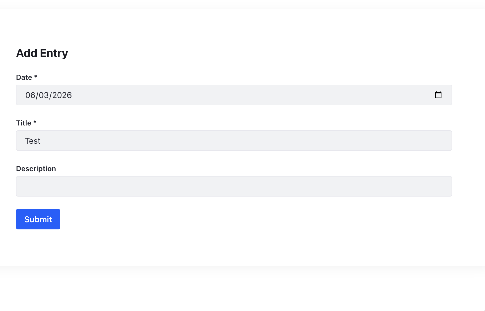

# Meta-Object Form

A truly dynamic form that auto-generates inputs based on a Liferay Object's
definition.

## Features

- **Self-Discovering**: Fetches field metadata (type, required, label,
  read-only) at runtime via Object Admin API.
- **Dynamic Record Selection**: Optional dropdown to select existing records to
  edit, using the Object's "Entry Title Field".
- **Mappable Title**: The form title is fully mappable and editable in the Page
  Editor. It intelligently defaults to the Object's localized name if not
  customized.
- **Mappable Configuration**: Key configuration values like **Object ERC** and
  **Submit Button Label** are mappable directly in the fragment body. These
  values take priority over the sidebar configuration, enabling visual page
  assembly.
- **Multiple Modes**: Support for "Add New", "Edit Specific", and "Select to
  Edit" workflows.
- **External Integration**: Automatically picks up record identifiers from URL
  parameters (`id`, `entryId`, `erc`, `entryERC`) or listens for the
  `lfr-object-form-select` JavaScript event.
- **Hybrid Identification**: Supports identifying records by numeric **Record
  ID** or string **External Reference Code (ERC)**.
- **Production-Ready**: Supports submitting new entries or updating existing
  ones directly to the Custom Object API.

## Visuals

## Configuration

- **Object ERC**: The source Object definition (e.g., `COMPANY_MILESTONE`).
- **Enable Add New**: Allow creating new records. If disabled and no record is
  loaded, the form displays a "Please select a record" prompt.
- **Enable Record Selection**: Display a dropdown at runtime to choose which
  record to edit.
- **Fixed Record Identifier**: A specific record value to always edit (overrides
  URL/Events).
- **Identifier Type**: Specify if the fixed identifier is a numeric **ID** or a
  string **ERC**.
- **Submit Button Color**: Custom theme color for the action button.

## Editor Ergonomics

In the Page Editor, specific configuration fields are displayed in a styled
container (`.meta-editor-mappable-fields`) at the bottom of the fragment. This
allows editors to map dynamic data (like an ERC from a collection) directly to
the fragment without using the sidebar.

## Technical Infrastructure

This fragment utilizes the **Shared Resources Architecture**:

- **`discovery.js`**: Uses `resolveObjectPath` and `resolveObjectPathByERC` to
  dynamically discover REST endpoints.
- **`localization.js`**: Uses `getLocalizedValue` for field labels and Object
  names.
- **`dom.js`**: Uses `debounce` for searchable select inputs.
- **`validation.js`**: Uses `isValidIdentifier` for robust record and
  configuration checking.
