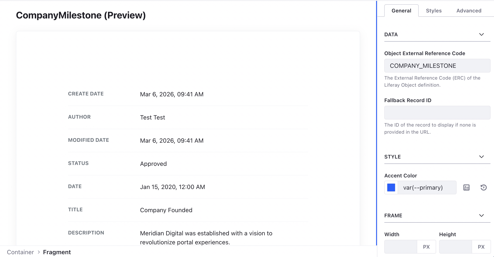

# Meta-Object Record View

A single-entry detail view that dynamically discovers fields and provides a
high-fidelity PDF export feature.

## Features

- **Self-Discovering**: Renders all fields for a specific Object entry via the
  Object Admin API.
- **Dynamic Record Selection**: Optional dropdown to select different records to
  view at runtime.
- **Mappable Title**: The record title is fully mappable and editable in the
  Page Editor. It intelligently defaults to the Object's localized name if not
  customized.
- **Mappable Configuration**: Key configuration values like **Object ERC** are
  mappable directly in the fragment body. These values take priority over the
  sidebar configuration, enabling visual page assembly.
- **Hybrid Identification**: Supports identifying records by numeric **Record
  ID** or string **External Reference Code (ERC)**.
- **PDF Export**: Integrated jsPDF and html2canvas support for downloading
  high-quality reports.
- **Integration**: Automatically picks up record identifiers from URL parameters
  (`id`, `entryId`, `erc`, `entryERC`) or listens for the
  `lfr-object-view-select` JavaScript event.
- Clean, label-value pair layout optimized for reports.

## Visuals




## Configuration

- **Object ERC**: The source Object definition (e.g., `COMPANY_MILESTONE`).
- **Enable Record Selection**: Display a dropdown at runtime to choose which
  record to view.
- **Fallback Record Identifier**: A specific record value to display if none is
  found in the page URL or via events.
- **Identifier Type**: Specify if the fallback identifier is a numeric **ID** or
  a string **ERC**.
- **Colors**: Pick custom colors for field labels and values to match your
  theme.

## Editor Ergonomics

In the Page Editor, the **Object ERC** configuration field is displayed in a
styled container (`.meta-editor-mappable-fields`) at the bottom of the fragment.
This allows editors to map dynamic data (like an ERC from a collection) directly
to the fragment without using the sidebar.

## External Selection (JS Event)

You can trigger the record view to load a specific record using a custom event.
The fragment intelligently fetches the record based on whether you provide a
numeric ID or a string ERC:

```javascript
window.dispatchEvent(
  new CustomEvent('lfr-object-view-select', {
    detail: {
      objectERC: 'COMPANY_MILESTONE',
      recordId: '12345', // Or use recordERC: "MY_ERC_VALUE"
    },
  })
);
```

## Technical Infrastructure

This fragment utilizes the **Shared Resources Architecture**:

- **`discovery.js`**: Uses `resolveObjectPathByERC` to dynamically discover the
  REST endpoint.
- **`localization.js`**: Uses `getLocalizedValue` for field labels and data.
- **`dom.js`**: Uses `debounce` for search and filter actions.
- **`validation.js`**: Uses `isValidIdentifier` for robust record and
  configuration checking.
