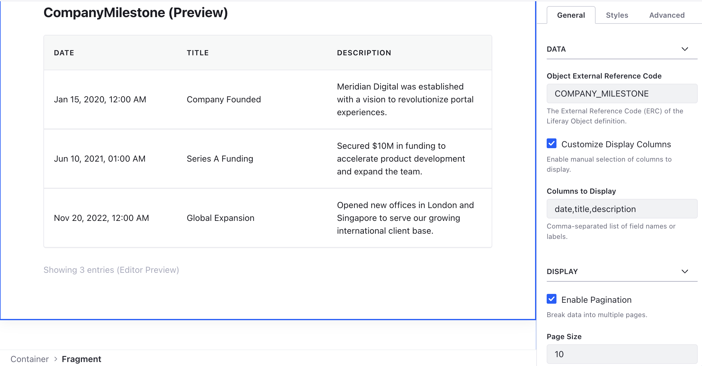

# Meta-Object Table

A powerful data table that dynamically discovers fields and renders Object data with functional pagination.

## Features

- **Field Discovery**: Automatically fetches and renders headers based on the Object definition.
- **Column Customization**: Strictly display only the fields you want, in the order you specify.
- **Triple-Modal Architecture**: Dedicated modal structures for **Add**, **View**, and **Edit** actions.
- **Embedded Dropzones**: When configured in "Modal Window" mode, each modal provides an `lfr-dropzone`. This allows Page Editors to drop other fragments (like the Meta-Object Form or Record View) directly into the table's modals.
- **Visual Customization**: Granular control over header colors, body text, action icons, and zebra striping (even/odd configurable).
- **Integration Modes**: Connect to other fragments via:
  - **JS Events**: Trigger other fragments on the same page (e.g., Form or Record View).
  - **Modal Window**: Open an embedded popup containing dropped fragments.
  - **Redirect/Tab**: Navigate to detail pages with the record ID in the query string.
- **Functional Pagination**: Real-time server-side paging with Prev/Next controls.
- **CSV Export**: Built-in client-side CSV generation for all loaded data.
- **Responsive**: Stacks into a card-like view on mobile devices using data-labels.

## Visuals




## Configuration

- **Object ERC**: The External Reference Code of the source Object.
- **Columns to Display**: Comma-separated list of field names to show.
- **Action Modes**: Choose between "JS Event", "Modal Window", "Redirect", or "New Tab".
- **Modal Size**: Set the width (Small, Medium, Large) independently for Add, View, and Edit modals.
- **Row Shading Type**: Toggle zebra striping and choose between Even or Odd row highlighting.
- **Colors**: Pick custom colors for headers, body text, icons, and striped backgrounds.

## Working with Modals

When you set an action mode to **"Modal Window"**:

1. Open the Liferay Page Editor.
2. The table will display the modal structures as stackable dashed boxes.
3. Drop a fragment (e.g., **Meta-Object Record View**) into the "View Record" dropzone.
4. Configure the dropped fragment to use the same **Object ERC** as the table.
5. At runtime, clicking the "View" icon will open the modal and automatically trigger the dropped fragment to load the correct record.

## Inter-Fragment Events

The table dispatches the following events when configured in **"JS Event"** OR **"Modal Window"** mode:

- `lfr-object-view-select`: For viewing record details.
- `lfr-object-form-select`: For adding or editing a record.

Example Event Detail:

```json
{
  "objectERC": "COMPANY_MILESTONE",
  "recordId": "12345",
  "recordERC": "MILE-001"
}
```
