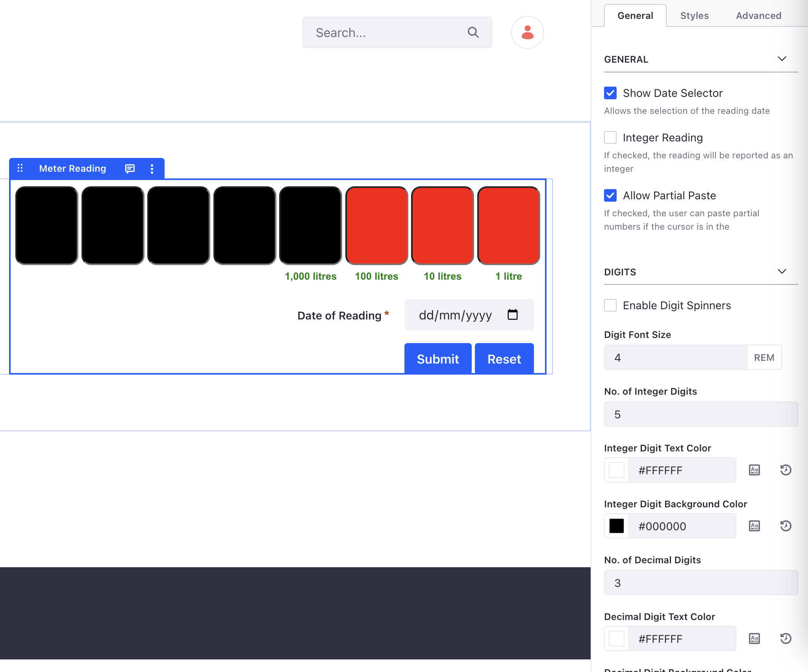
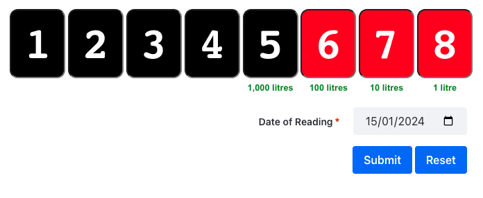
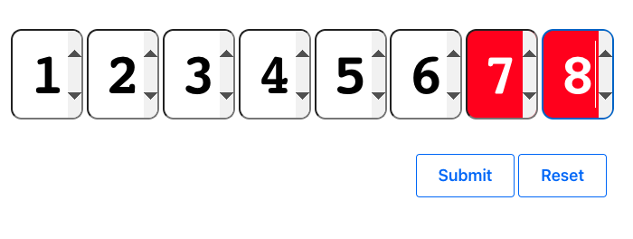

# Meter Reading

This fragment captures a numeric value using individual input elements for each digit. It does this while supporting usual input experience, such as moving to the next digit as it is provided, removing each digit as backspace or delete are used and copy and paste of a suitability sized number.

The fragment is configurable, in terms of functionality and look and feel. including adding lables, spinners, date entry.

Error messages are stored as a JavaScript array so can easily be updated, with the ability to specify how the message is displayed, i.e. inline or using the Liferay Toast feature.

To submit the reading to a Liferay Object or third party system, simply change the readingCallback() method. There is a sample implementation included within the fragment.

The [Language.properties](../../meter-reading/language-overrides/Language_en_US.properties) file can be imported to give more help in the Page Editor view.

The JavaScript will not execute when the fragment is viewed in either the Fragment Editor or the Page Content Editor. 

Here are some examples with different a look and feel

