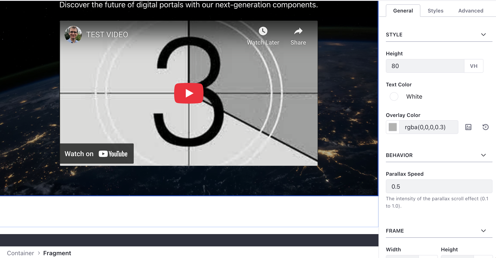

# Modern Parallax Hero

A premium hero fragment with multi-layer parallax effects and configurable text animations.

## Features

- **Depth Effect**: Background image moves at a different speed than page scroll.
- **Fluid Layout**: High-impact, full-width design.
- **Drop Zone**: Allows dragging secondary buttons or elements directly into the hero.
- **Performance**: Uses `translate3d` for hardware-accelerated, stutter-free movement.

## Visuals

## Configuration

- **Parallax Speed**: Control the intensity of the depth effect.
- **Height**: Adjustable vertical span (e.g., "80vh", "600px").
- **Overlay Color**: Custom scrim to ensure text readability over images.
