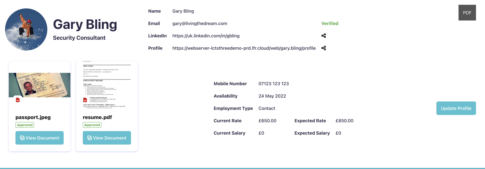

# Profile Fragments

The following fragments have a couple of variations. The one without the (Dashboard) suffix is intended to be included on a user's personal site. It makes use of Liferay's URL structure to extract the user's screen name from the URL and thereby display the user's profile details regardless of the user viewing it, including anonymous users.

## Profile Summary

This fragment displays a summary of the user's profile without any personal information, other than public profiles. It provides a couple of share buttons which copies the relavent link to the clipboard.

## Profile Detail

This fragment uses a similar approach to display more personal profile information. It also includes an indication where certain data is missing.

## PDF Export

This fragment uses a third-party library to export the HTML content of a targeted element. If you want to display the profile information in a different way then this can be achieved by using a hidden element. The example Profile Summary fragment, does just that.

