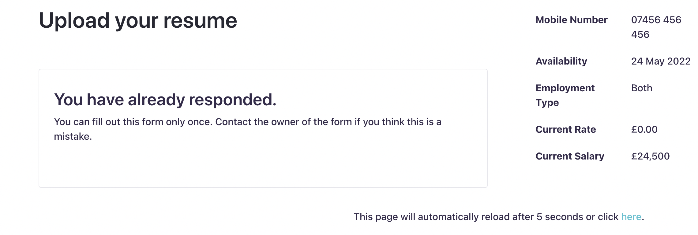

# Refresh Page

This fragment can be used to set an automatic and / or manual page refresh.

It is useful in the case of Liferay Forms and Workflow where the workflow updates a variable that a segmentation relies upon to present a different experience. Typically, the form will be configured to limit to one submission per user. This provides a unique message on which the fragment can test for and trigger the message.

It should work in other circumstances too, but it would need to be tested and amended on a case by case basis.

