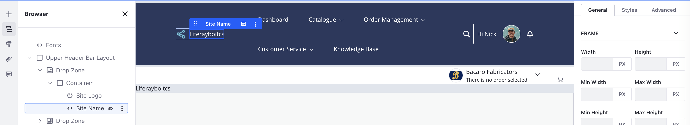

# Site Name

Displays the current Liferay Site name with optional manual override and dynamic linking.

## Visuals

## Key Features

- **Meridian Ready**: Built using theme tokens for consistent spacing and color.
- **Accessible**: Follows Liferay accessibility standards.
- **Responsive**: Mobile-first design.
