# Fragment Visual Gallery

A visual reference for the high-fidelity fragments available in this Liferay DXP repository.

## Data Visualization & Integration

### Activity Heatmap

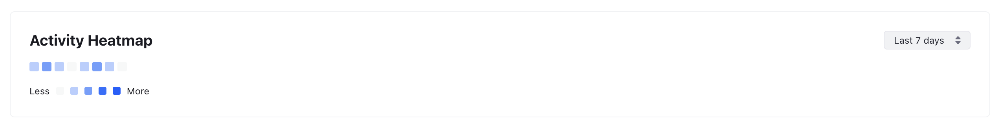
Flexible, data-driven heatmap for visualizing activity frequency from Liferay Objects.
[Detailed Documentation](./fragments/activity-heatmap.md)

### Object-Linked Chart

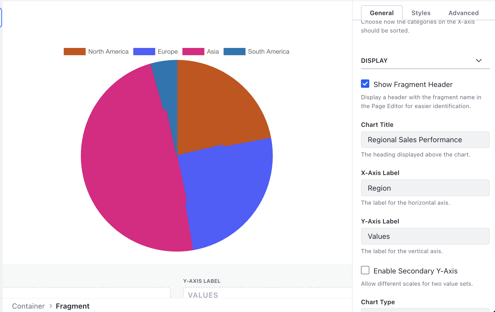
Data visualization fragment that integrates Chart.js to render Liferay Object data with support for multiple chart types and aggregations.
[Detailed Documentation](./fragments/object-linked-chart.md)

### Animated Metric Counter

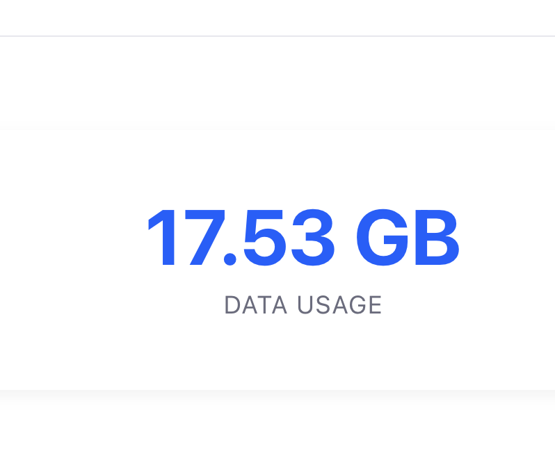
High-impact numeric visualization with smooth scroll-triggered animations.
[Detailed Documentation](./fragments/animated-metric-counter.md)

### Content Map

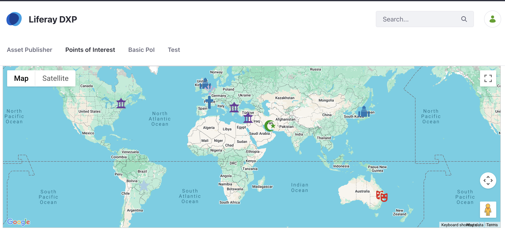
Enhanced mapping utility for web content, supporting Headless APIs and custom taxonomy markers.
[Detailed Documentation](./fragments/content-map.md)

### Date Display

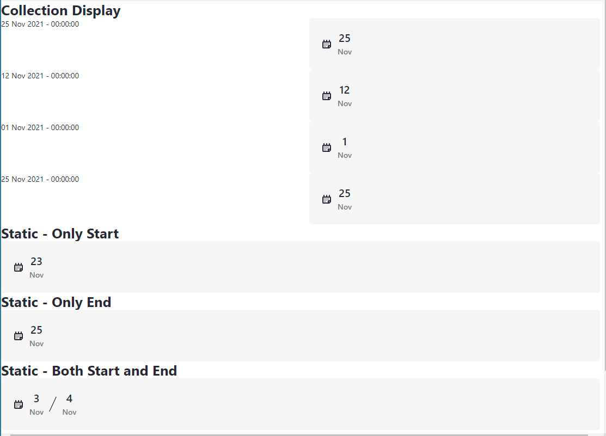
Flexible date formatting for both static values and dynamic Liferay Collections.
[Detailed Documentation](./fragments/date-display.md)

### Radial KPI Gauge

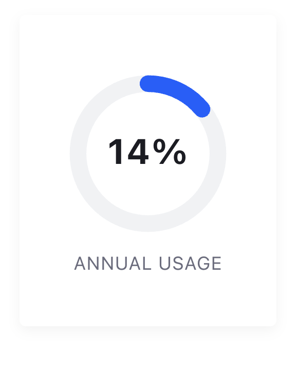
A high-fidelity radial progress indicator for showing single metrics derived from Object data.
[Detailed Documentation](./fragments/radial-kpi-gauge.md)

---

## Workflow & Process

### Tracker

A cohesive visual indicator for multi-stage processes, featuring connecting lines and adaptive step coloring.
[Detailed Documentation](./fragments/tracker.md) | [Tracker Step](./fragments/tracker-step.md)

---

## Dynamic Content & Objects

### Conditional Content

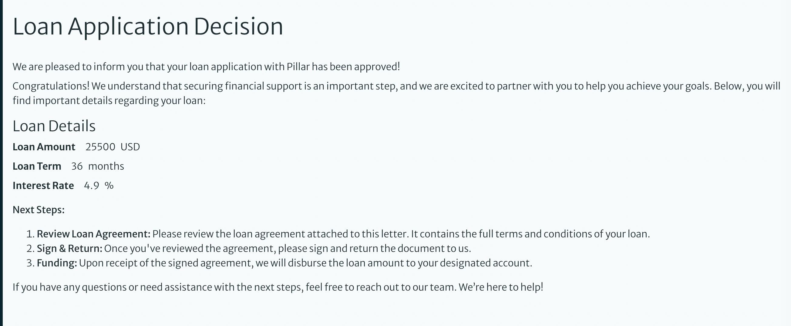
Dynamically shows or hides content drop-zones based on user-editable outcomes.
[Detailed Documentation](./conditional-content.md)

### Dynamic Object Gallery

A flexible grid/masonry view that dynamically maps Object fields to a polished gallery layout.
[Detailed Documentation](./fragments/dynamic-object-gallery.md)

### Interactive Event Timeline

Vertical/horizontal timeline that dynamically renders and animates milestones from Liferay Objects.
[Detailed Documentation](./fragments/interactive-event-timeline.md)

### Meta-Object Record View

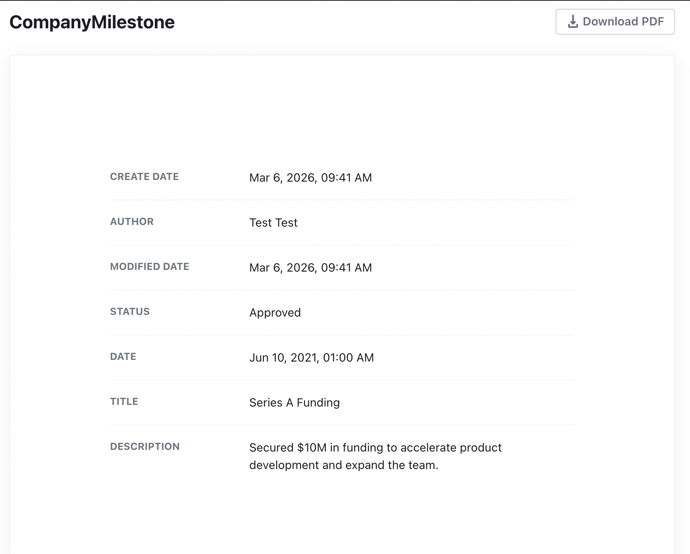
A single-entry detail view that dynamically discovers fields and provides a high-fidelity PDF export feature.
[Detailed Documentation](./fragments/meta-object-record-view.md)

### Meta-Object Form

A truly dynamic form that auto-generates inputs based on a Liferay Object's definition, supporting "Add New" and "Edit" modes.
[Detailed Documentation](./fragments/meta-object-form.md)

### Meta-Object Table

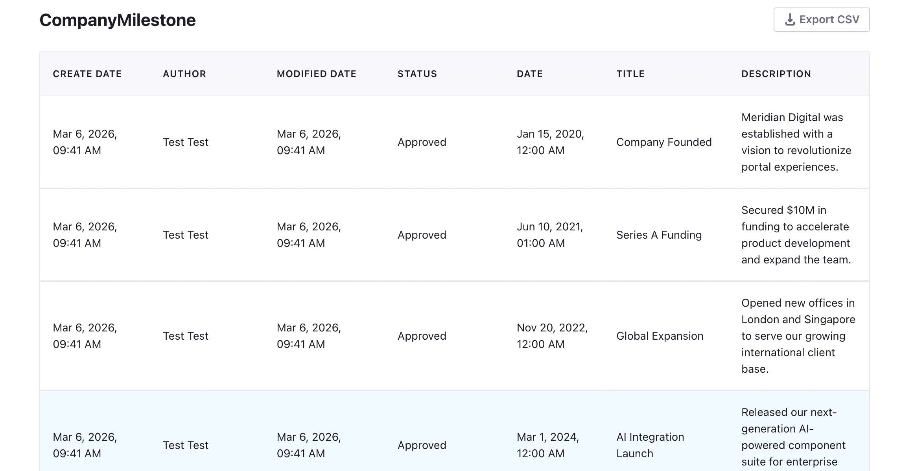
A powerful data table that dynamically discovers fields and renders Object data with functional pagination.
[Detailed Documentation](./fragments/meta-object-table.md)

---

## Forms & User Interaction

### Form Populator

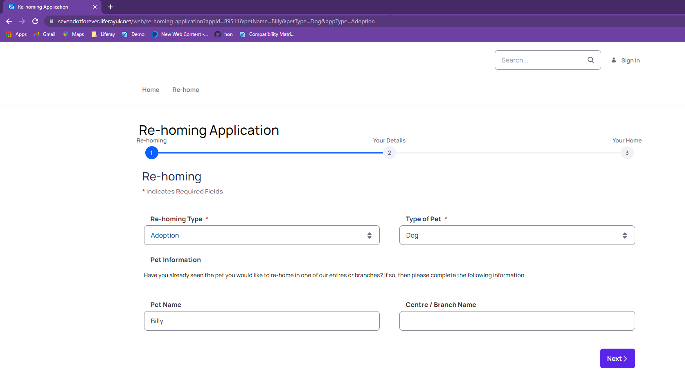
Intelligent pre-population of Liferay Form fields via URL query parameters and JSON mapping.
[Detailed Documentation](./fragments/form-populator.md)

### Confirmation Field

Ensures two inputs match (e.g. Email/Password confirmation) within a Liferay Form.
[Detailed Documentation](./fragments/confirmation-field.md)

### Populate Select

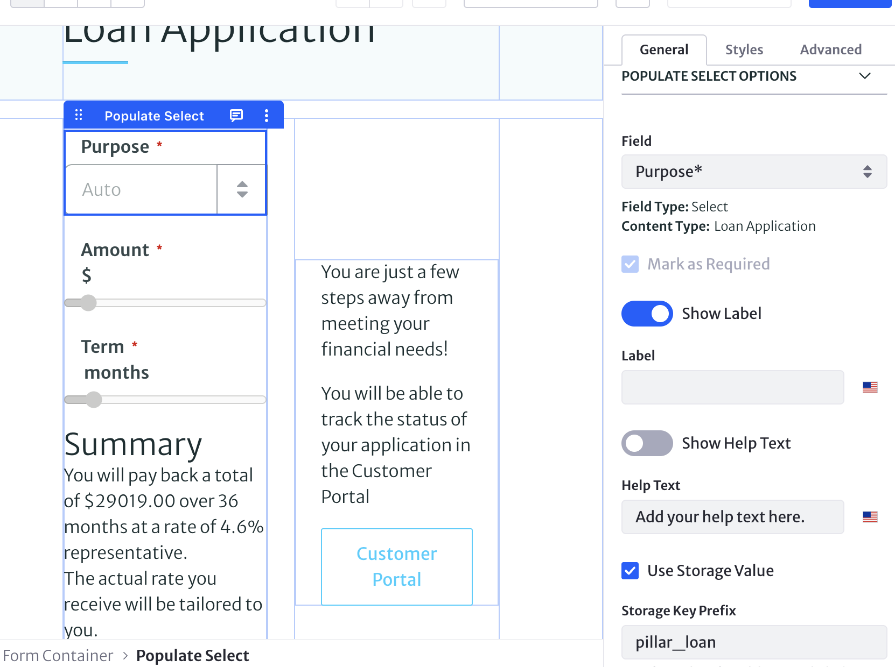
A smart dropdown fragment that can pre-populate its selection from Session Storage or Headless APIs.
[Detailed Documentation](./fragments/populate-select.md)

### Populated Range

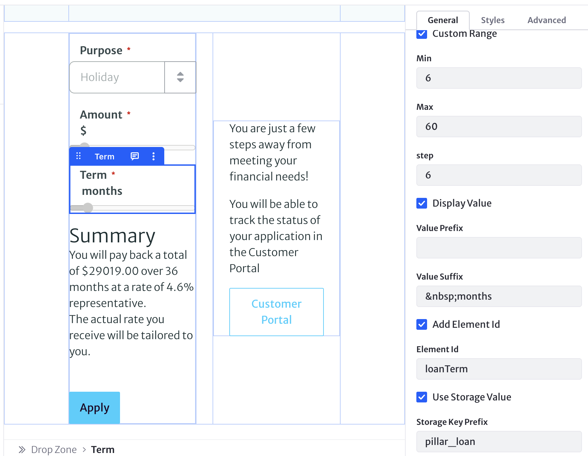
A specialized range/slider input that automatically saves and retrieves its value from Session Storage.
[Detailed Documentation](./fragments/populated-range.md)

### Store Default Value

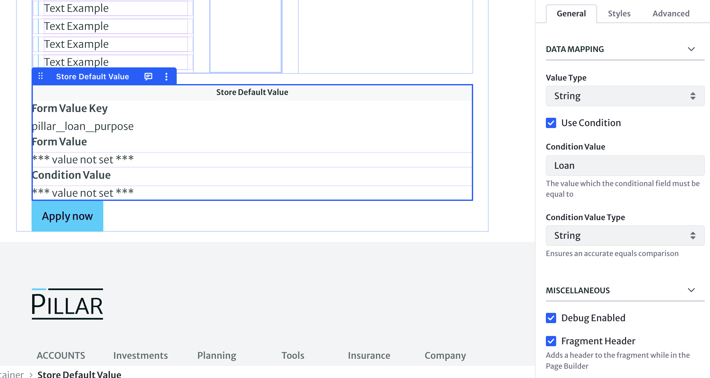
A utility fragment that silently stores specific key/value pairs in Session Storage when a page is loaded.
[Detailed Documentation](./fragments/store-default-value.md)

### Page Refresh / Redirect

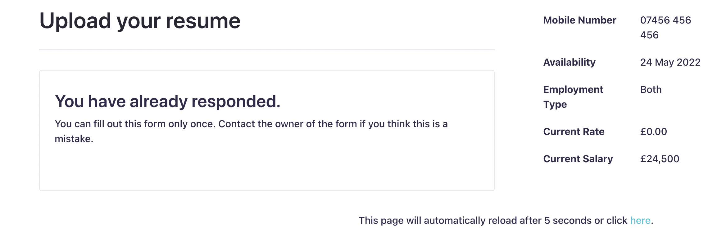
Automated page refresh and intelligent redirection logic, ideal for post-form-submission workflows.
[Detailed Documentation](./fragments/redirect-page.md) | [Refresh Page](./fragments/refresh-page.md)

---

## Calculators & Finance

### Loan Application Calculator

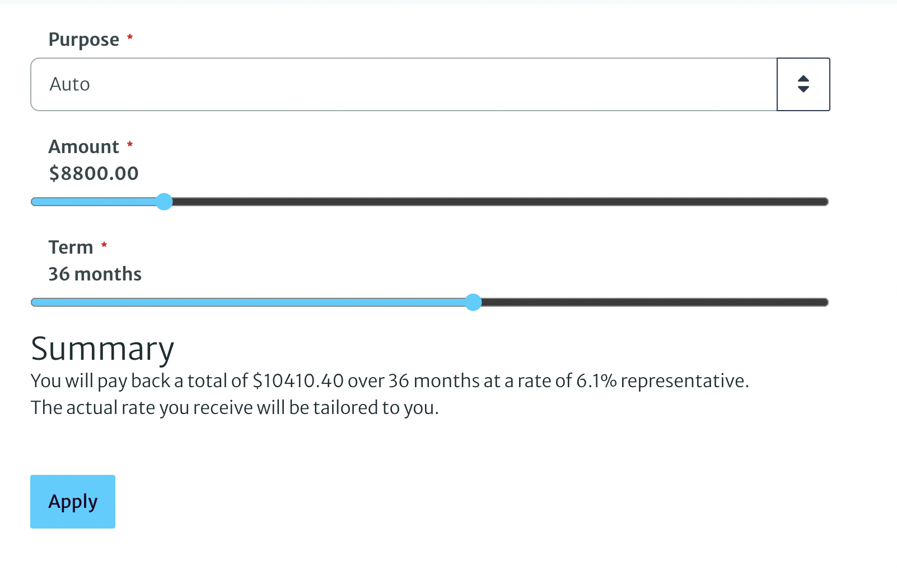
Calculates loan repayments based on amount, term, and dynamically determined interest rates. Coordinates with Range fragments.
[Detailed Documentation](./fragments/loan-application-calculator.md)

### Loan Calculator

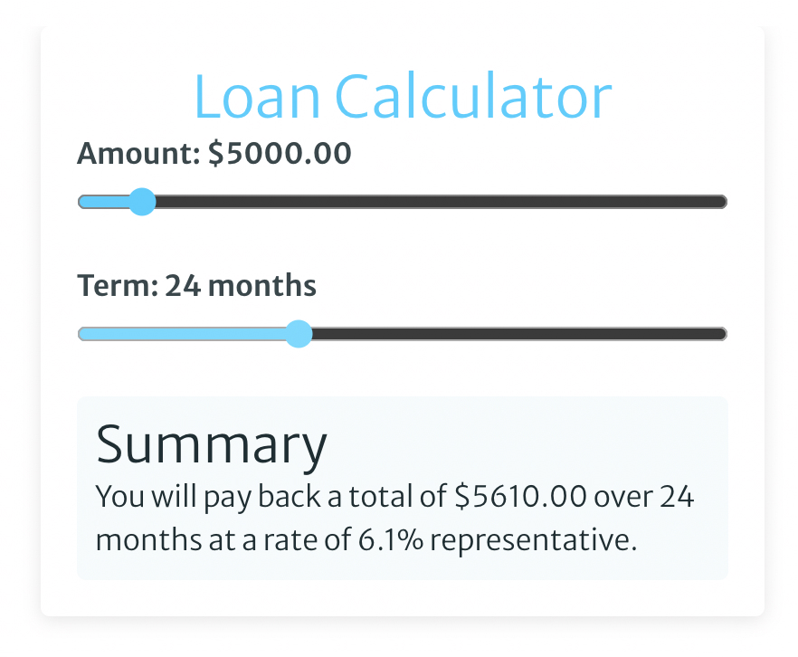
Interactive loan calculator with built-in sliders for amount and term, calculating monthly payments instantly.
[Detailed Documentation](./fragments/loan-calculator.md)

---

## User Profile & Commerce

### Profile Fragments

Comprehensive suite for displaying user information, permissions, and identity details.
[Detailed Documentation](./fragments/profile.md)

### Public Profile

A public-facing view for user profiles, integrated with Liferay's user management system.
[Detailed Documentation](./fragments/profile-detail.md)

### Dynamic Badge Overlay

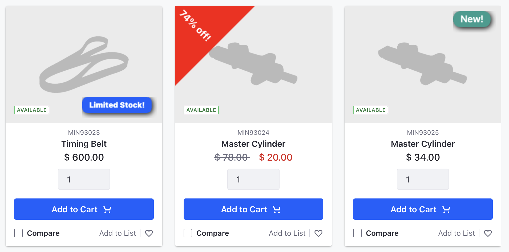
A versatile overlay for commerce product images that dynamically displays badges (e.g., "New", "Sale") based on product attributes.
[Detailed Documentation](./fragments/dynamic-badge-overlay.md)

### Purchased Products

Display commerce history and purchased items for the current user in a clean, responsive layout.
[Detailed Documentation](./fragments/purchased-products.md)

---

## Header & Menus

### Header Components Overview

Atomic fragments (Logo, Site Name, Navigation, Search, User Bar) for building custom Master Page headers.
[Detailed Documentation](./fragments/header-components.md)

### Navigation

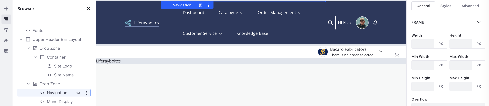
Highly accessible navigation menu supporting nested levels and Liferay Navigation Menus.
[Detailed Documentation](./fragments/navigation.md)

### Search Bar

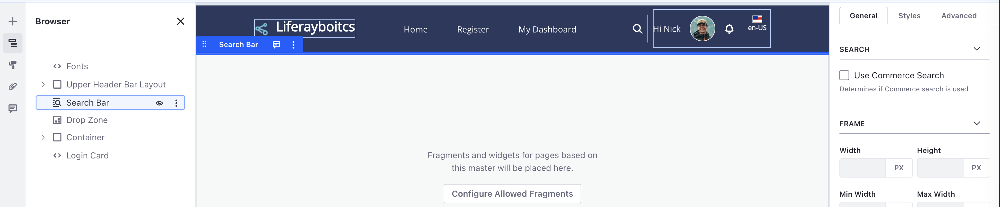
A compact search input integrated with Liferay Search, optimized for placement in site headers.
[Detailed Documentation](./fragments/search-bar.md)

### User Bar

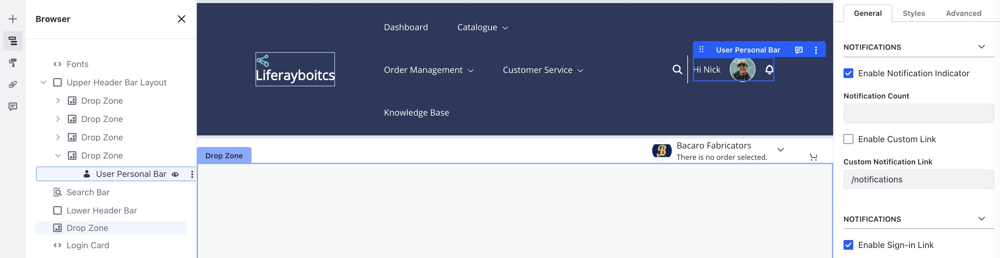
A compact user identity and action bar for site headers, showing profile links and login status.
[Detailed Documentation](./fragments/user-bar.md)

### Linear Gradient Container

A structural container that applies CSS gradients, perfect for modern header backgrounds.
[Detailed Documentation](./fragments/linear-gradient-container.md)

---

## Miscellaneous & Utilities

### Icon Button

A minimalist, theme-ready button component focused on iconography.
[Detailed Documentation](./fragments/icon-button.md)

### Dynamic Copyright

A small but essential utility for footers that ensures the copyright year is always current.
[Detailed Documentation](./fragments/dynamic-copyright.md)

---

## Layout & Utilities

### Layout Components

Foundational cards, containers, and structural elements designed for modern portal layouts.
[Detailed Documentation](./fragments/layout-components.md)

### Liferay Iframer

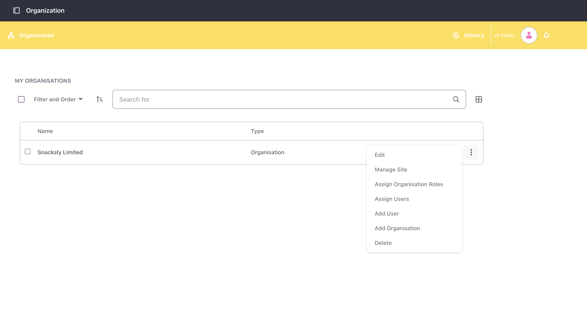
Enhanced iframe utility with automatic responsive resizing and deep configuration options.
[Detailed Documentation](./fragments/liferay-iframer.md)

### Modern Parallax Hero

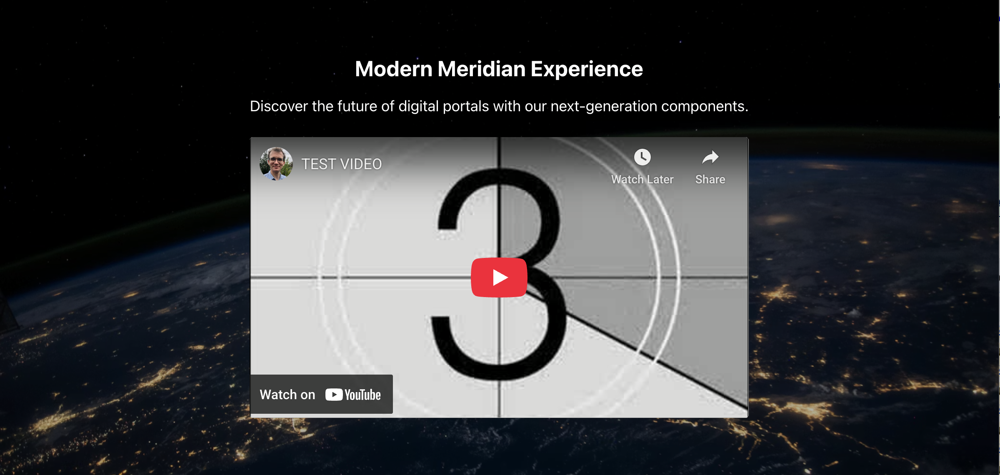
A premium hero fragment with multi-layer parallax effects and configurable text animations.
[Detailed Documentation](./fragments/modern-parallax-hero.md)

### PDF Export

High-fidelity PDF generation for Liferay Object records, perfect for detail views and reports.
[Detailed Documentation](./fragments/pdf-export.md)

### Pricing Comparison Grid

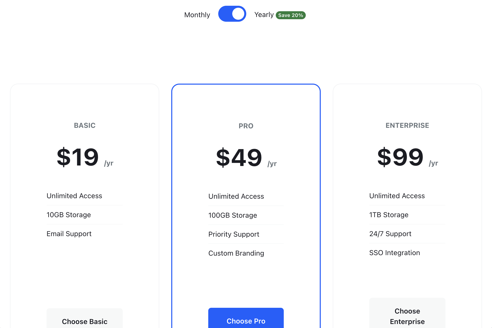
A visually rich comparison grid for service plans that pulls data from Liferay Objects or static config.
[Detailed Documentation](./fragments/pricing-comparison-grid.md)
