# Fragment Visual Gallery

A visual reference for the high-fidelity fragments available in this Liferay DXP repository. Generated automatically.

**Last Tested Against Liferay Version:** `2026.q1.9-lts`

## Aura Design System

A lifestyle-focused design system with a scoped container architecture, high-fidelity design tokens, and modern product showcase components.

### Aura - Final CTA Banner

|                                       Original Image                                        |                                             Desktop (1920px)                                             |                                             Tablet (768px)                                             |                                             Mobile (375px)                                             |
| :-----------------------------------------------------------------------------------------: | :------------------------------------------------------------------------------------------------------: | :----------------------------------------------------------------------------------------------------: | :----------------------------------------------------------------------------------------------------: |
| 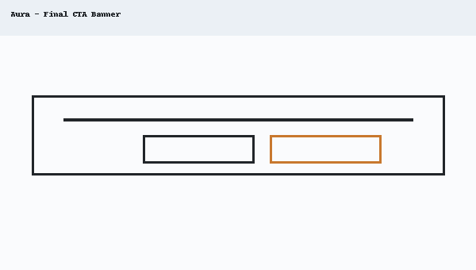 |  | 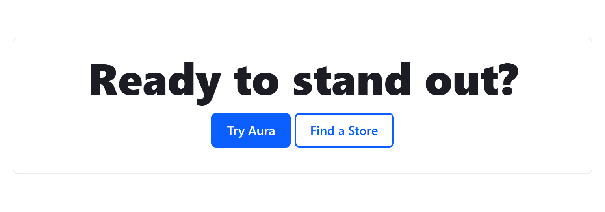 | 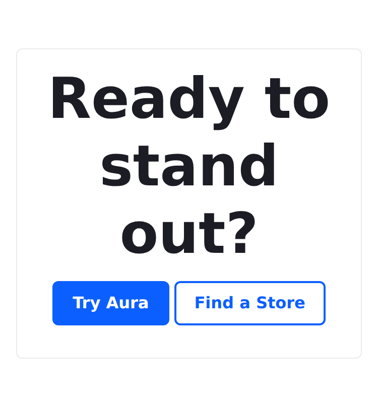 |

---

### Aura - Lookbook Row

|                                       Original Image                                       |                                           Desktop (1920px)                                           |                                           Tablet (768px)                                           |                                           Mobile (375px)                                           |
| :----------------------------------------------------------------------------------------: | :--------------------------------------------------------------------------------------------------: | :------------------------------------------------------------------------------------------------: | :------------------------------------------------------------------------------------------------: |
| 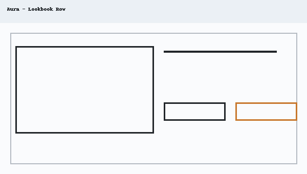 | 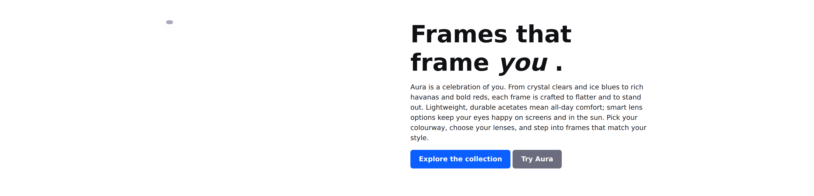 | 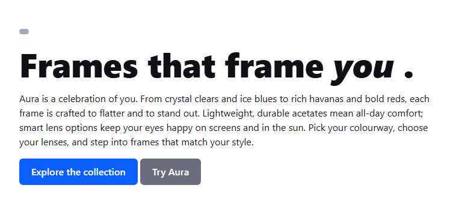 | 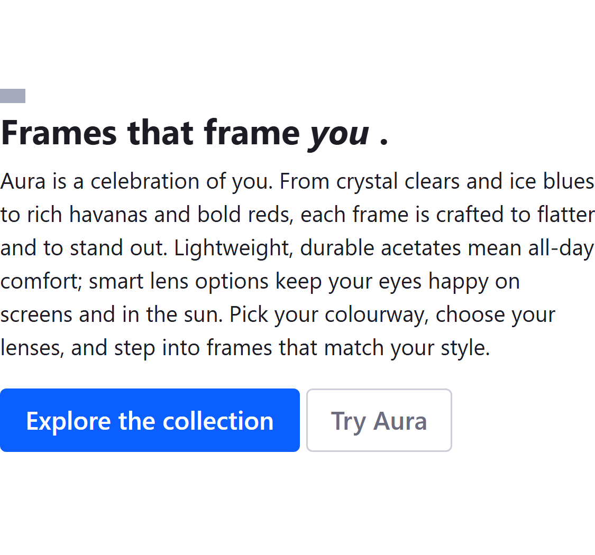 |

---

### Aura - Product Gallery

|                                          Original Image                                           |                                            Desktop (1920px)                                             |                                            Tablet (768px)                                             |                                            Mobile (375px)                                             |
| :-----------------------------------------------------------------------------------------------: | :-----------------------------------------------------------------------------------------------------: | :---------------------------------------------------------------------------------------------------: | :---------------------------------------------------------------------------------------------------: |
| 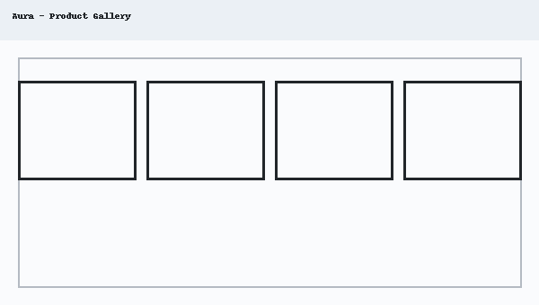 |  | 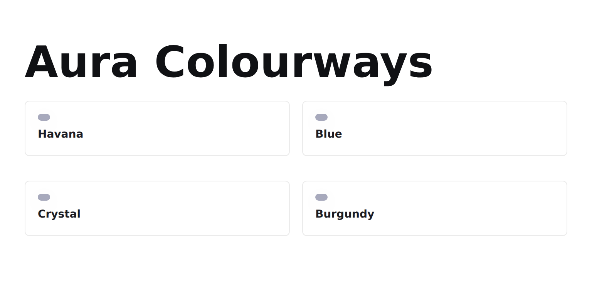 | 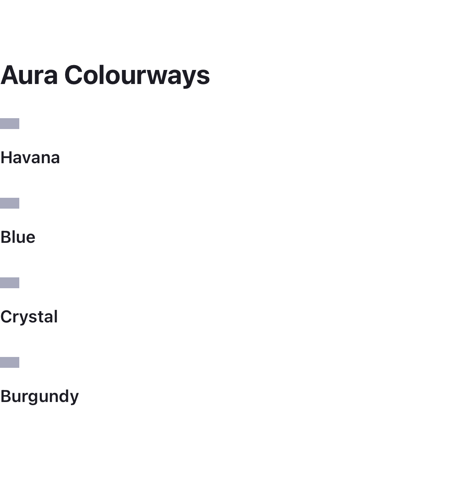 |

---

### Aura - USP Grid

|                                       Original Image                                       |                                         Desktop (1920px)                                         |                                         Tablet (768px)                                         |                                         Mobile (375px)                                         |
| :----------------------------------------------------------------------------------------: | :----------------------------------------------------------------------------------------------: | :--------------------------------------------------------------------------------------------: | :--------------------------------------------------------------------------------------------: |
| 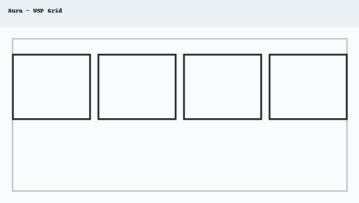 |  | 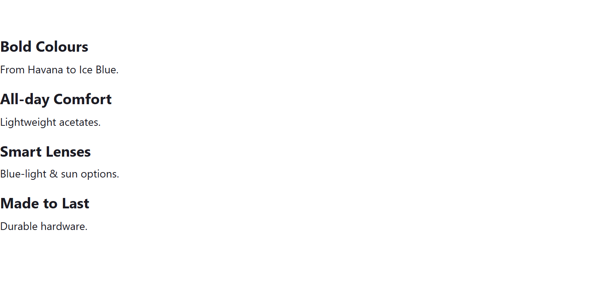 | 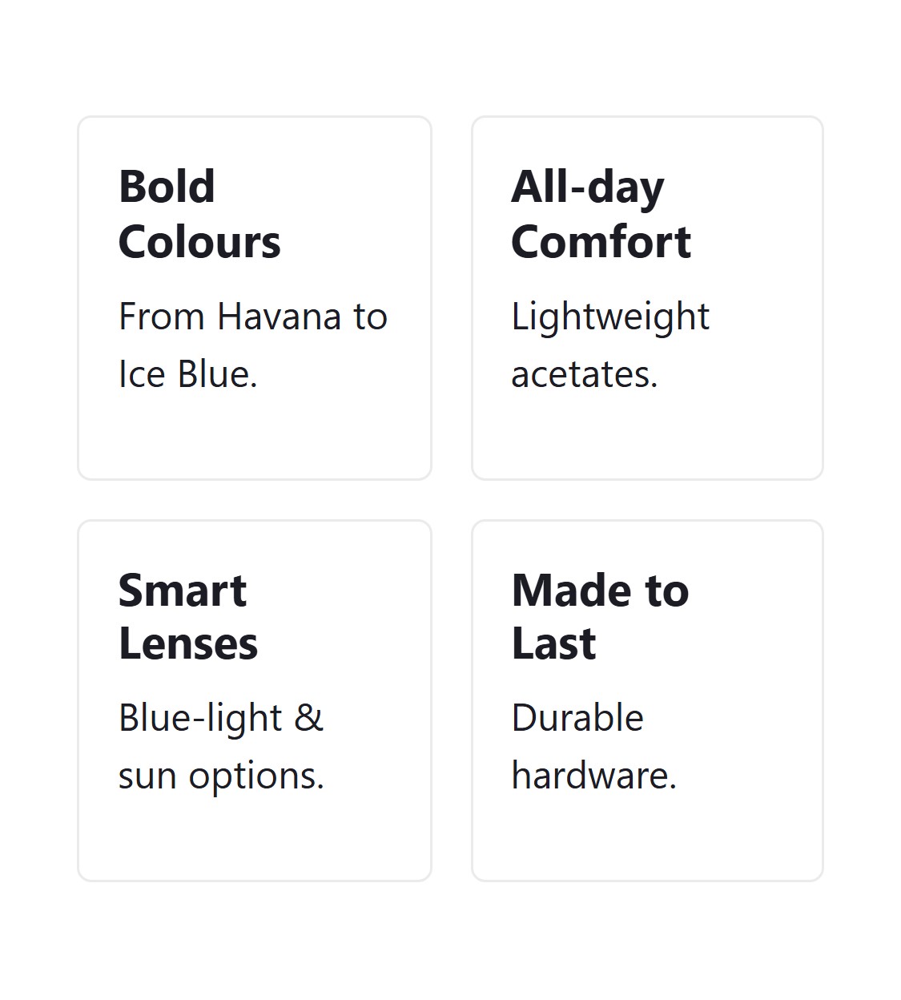 |

---

## Commerce

### Dynamic Badge Overlay

|                                 Original Image                                  |                                                Desktop (1920px)                                                 |                                                Tablet (768px)                                                 |                                                Mobile (375px)                                                 |
| :-----------------------------------------------------------------------------: | :-------------------------------------------------------------------------------------------------------------: | :-----------------------------------------------------------------------------------------------------------: | :-----------------------------------------------------------------------------------------------------------: |
|  |  🟢 **Passed** |  🟢 **Passed** |  🟢 **Passed** |

[Detailed Documentation](./fragments/dynamic-badge-overlay.md)

---

### Purchased Products

|                                           Original Image                                            |                                      Desktop (1920px)                                       |                                      Tablet (768px)                                       |                                      Mobile (375px)                                       |
| :-------------------------------------------------------------------------------------------------: | :-----------------------------------------------------------------------------------------: | :---------------------------------------------------------------------------------------: | :---------------------------------------------------------------------------------------: |
|  |  |  |  |

[Detailed Documentation](./fragments/purchased-products.md)

---

## Content

### Content Map

|                            Original Image                             |                                  Desktop (1920px)                                   |                                  Tablet (768px)                                   |                                  Mobile (375px)                                   |
| :-------------------------------------------------------------------: | :---------------------------------------------------------------------------------: | :-------------------------------------------------------------------------------: | :-------------------------------------------------------------------------------: |
|  | 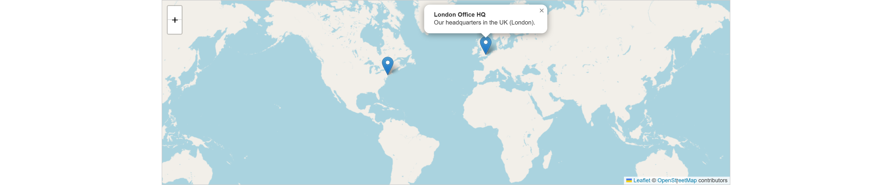 | 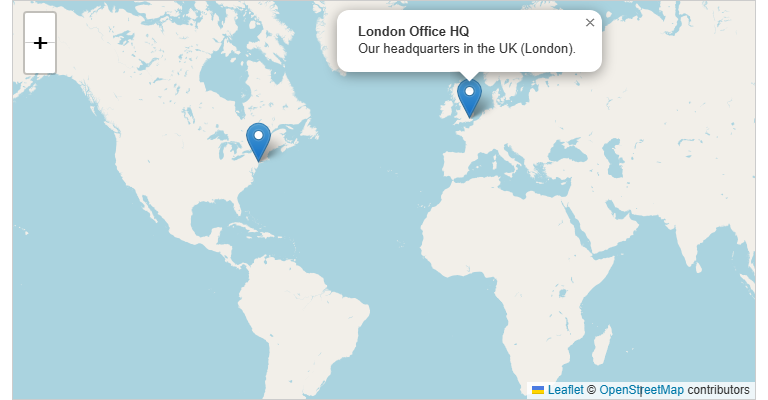 | 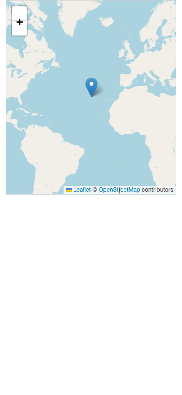 |

[Detailed Documentation](./fragments/content-map.md)

---

### Service Card

|                                        Original Image                                        |                                   Desktop (1920px)                                   |                                   Tablet (768px)                                   |                                   Mobile (375px)                                   |
| :------------------------------------------------------------------------------------------: | :----------------------------------------------------------------------------------: | :--------------------------------------------------------------------------------: | :--------------------------------------------------------------------------------: |
|  |  | 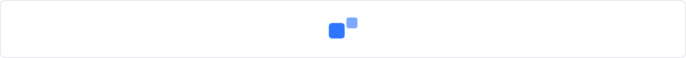 | 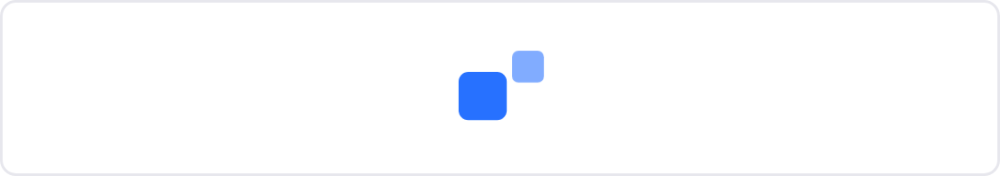 |

[Detailed Documentation](./fragments/service-card.md)

---

### Service Icon

|                                        Original Image                                        |                                   Desktop (1920px)                                   |                                   Tablet (768px)                                   |                                   Mobile (375px)                                   |
| :------------------------------------------------------------------------------------------: | :----------------------------------------------------------------------------------: | :--------------------------------------------------------------------------------: | :--------------------------------------------------------------------------------: |
|  |  |  |  |

[Detailed Documentation](./fragments/service-icon.md)

---

### Service Link Button

|                                      Desktop (1920px)                                       |                                      Tablet (768px)                                       |                                      Mobile (375px)                                       |
| :-----------------------------------------------------------------------------------------: | :---------------------------------------------------------------------------------------: | :---------------------------------------------------------------------------------------: |
|  |  |  |

[Detailed Documentation](./fragments/service-link-button.md)

---

## Heathcare Portal

### Dashboard Container

|                                           Desktop (1920px)                                           |                                           Tablet (768px)                                           |                                           Mobile (375px)                                           |
| :--------------------------------------------------------------------------------------------------: | :------------------------------------------------------------------------------------------------: | :------------------------------------------------------------------------------------------------: |
| 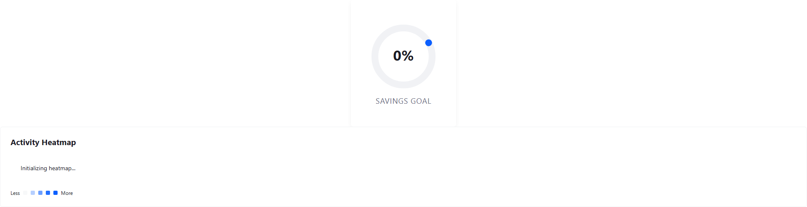 | 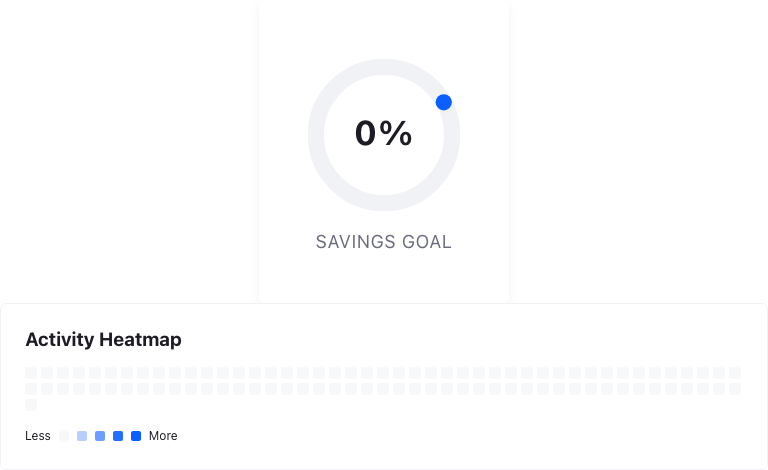 | 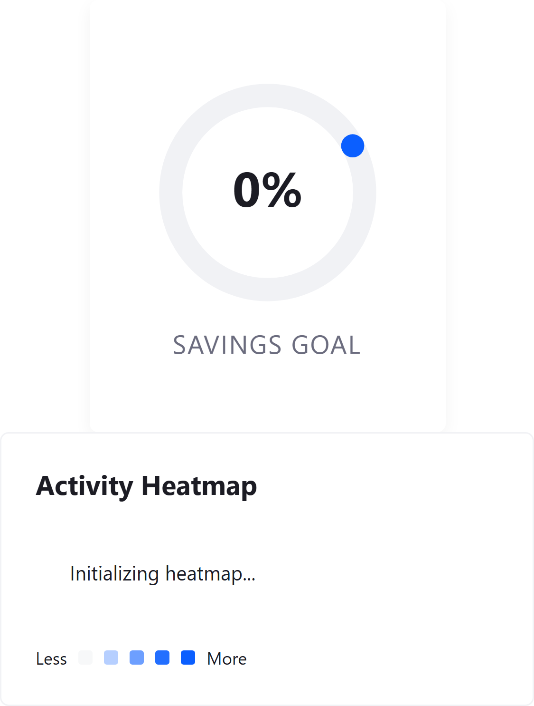 |

[Detailed Documentation](./fragments/dashboard-container.md)

---

### Dashboard Filter

|                                         Desktop (1920px)                                          |                                         Tablet (768px)                                          |                                         Mobile (375px)                                          |
| :-----------------------------------------------------------------------------------------------: | :---------------------------------------------------------------------------------------------: | :---------------------------------------------------------------------------------------------: |
| 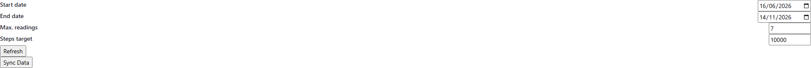 | 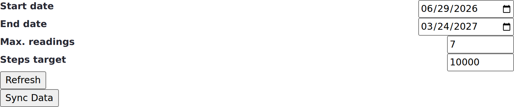 | 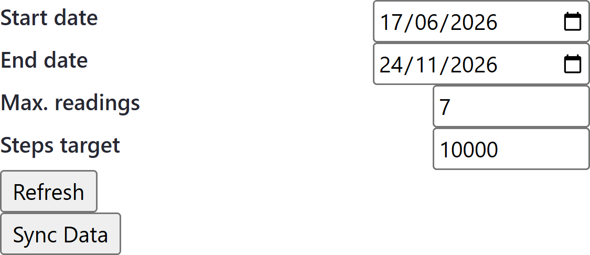 |

[Detailed Documentation](./fragments/dashboard-filter.md)

---

## Date Display

## Finance

### Loan Application Calculator

|                                    Original Image                                     |                                          Desktop (1920px)                                           |                                          Tablet (768px)                                           |                                          Mobile (375px)                                           |
| :-----------------------------------------------------------------------------------: | :-------------------------------------------------------------------------------------------------: | :-----------------------------------------------------------------------------------------------: | :-----------------------------------------------------------------------------------------------: |
|  | 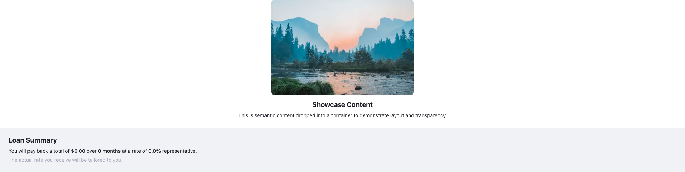 | 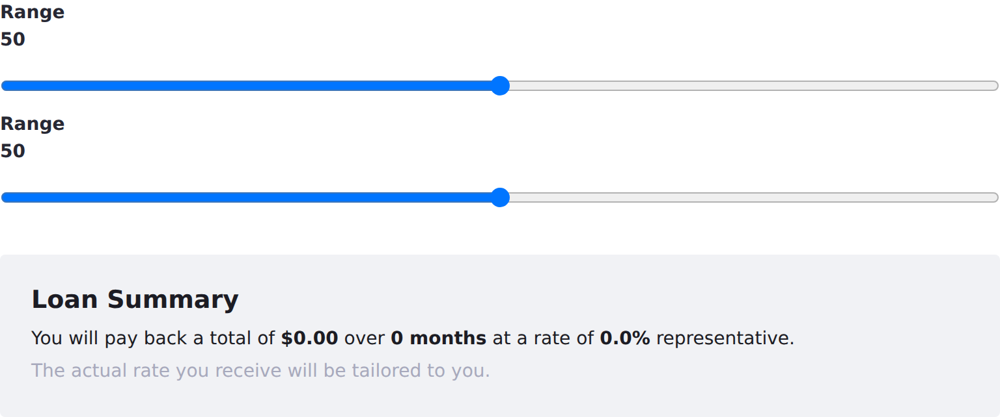 | 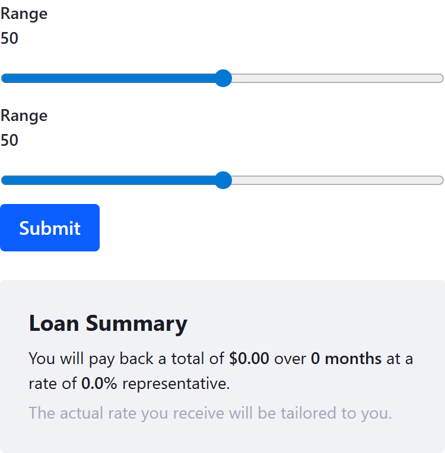 |

[Detailed Documentation](./fragments/loan-application-calculator.md)

---

### Loan Calculator

|                              Original Image                               |                                    Desktop (1920px)                                     |                                    Tablet (768px)                                     |                                    Mobile (375px)                                     |
| :-----------------------------------------------------------------------: | :-------------------------------------------------------------------------------------: | :-----------------------------------------------------------------------------------: | :-----------------------------------------------------------------------------------: |
|  | 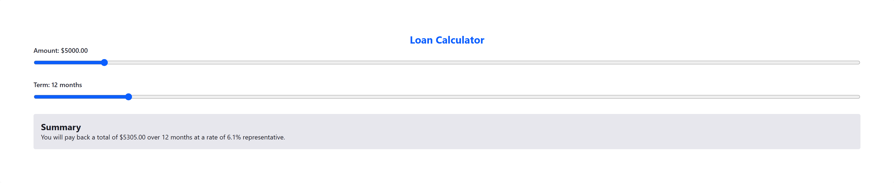 | 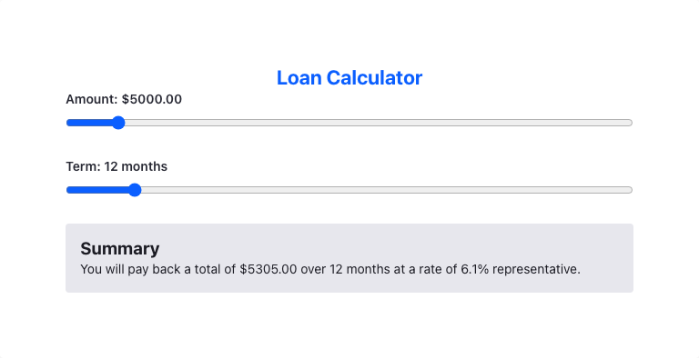 |  |

[Detailed Documentation](./fragments/loan-calculator.md)

---

## Forms Fragments

### Address Autocomplete

|                                           Desktop (1920px)                                           |                                           Tablet (768px)                                           |                                           Mobile (375px)                                           |
| :--------------------------------------------------------------------------------------------------: | :------------------------------------------------------------------------------------------------: | :------------------------------------------------------------------------------------------------: |
|  | 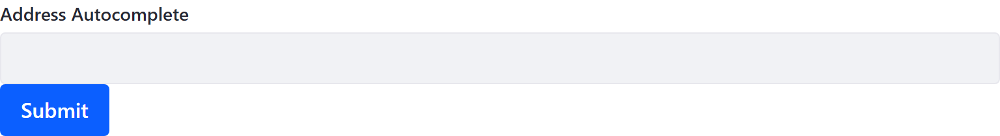 | 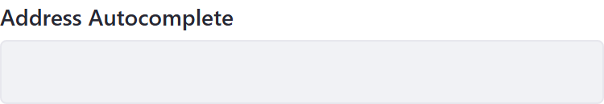 |

---

### Autocomplete (Object)

|                                                Original Image                                                |                                           Desktop (1920px)                                           |                                           Tablet (768px)                                           |                                           Mobile (375px)                                           |
| :----------------------------------------------------------------------------------------------------------: | :--------------------------------------------------------------------------------------------------: | :------------------------------------------------------------------------------------------------: | :------------------------------------------------------------------------------------------------: |
| 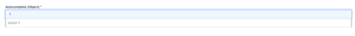 |  | 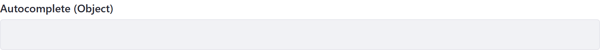 |  |

[Detailed Documentation](<./fragments/autocomplete-(object).md>)

---

### Autocomplete (Picklist)

|                                                 Original Image                                                 |                                            Desktop (1920px)                                            |                                            Tablet (768px)                                            |                                            Mobile (375px)                                            |
| :------------------------------------------------------------------------------------------------------------: | :----------------------------------------------------------------------------------------------------: | :--------------------------------------------------------------------------------------------------: | :--------------------------------------------------------------------------------------------------: |
| 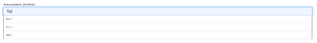 | 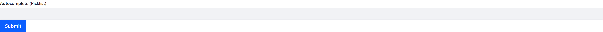 | 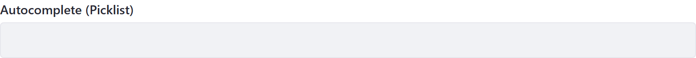 |  |

[Detailed Documentation](<./fragments/autocomplete-(picklist).md>)

---

### Color Swatches

|                                        Desktop (1920px)                                        |                                        Tablet (768px)                                        |                                        Mobile (375px)                                        |
| :--------------------------------------------------------------------------------------------: | :------------------------------------------------------------------------------------------: | :------------------------------------------------------------------------------------------: |
|  | 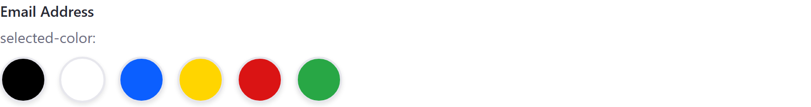 |  |

---

### Confirmation Field

|                                              Original Image                                               |                                          Desktop (1920px)                                          |                                          Tablet (768px)                                          |                                          Mobile (375px)                                          |
| :-------------------------------------------------------------------------------------------------------: | :------------------------------------------------------------------------------------------------: | :----------------------------------------------------------------------------------------------: | :----------------------------------------------------------------------------------------------: |
|  | 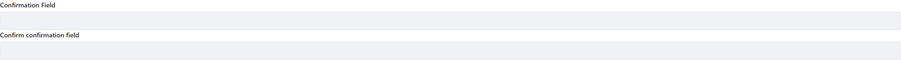 | 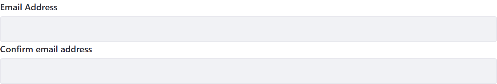 | 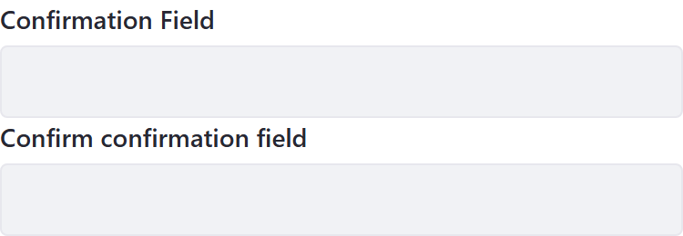 |

[Detailed Documentation](./fragments/confirmation-field.md)

---

### Currency Masked Input

|                                           Desktop (1920px)                                            |                                           Tablet (768px)                                            |                                           Mobile (375px)                                            |
| :---------------------------------------------------------------------------------------------------: | :-------------------------------------------------------------------------------------------------: | :-------------------------------------------------------------------------------------------------: |
| 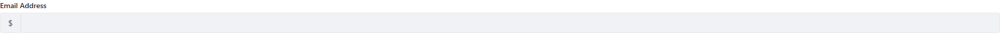 | 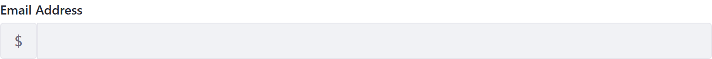 | 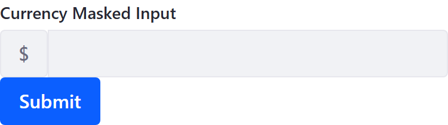 |

---

### File Drop Zone

|                                        Desktop (1920px)                                        |                                        Tablet (768px)                                        |                                        Mobile (375px)                                        |
| :--------------------------------------------------------------------------------------------: | :------------------------------------------------------------------------------------------: | :------------------------------------------------------------------------------------------: |
| 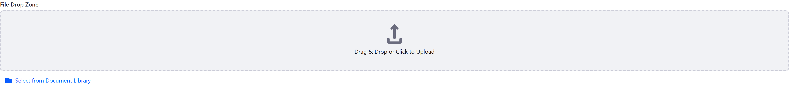 | 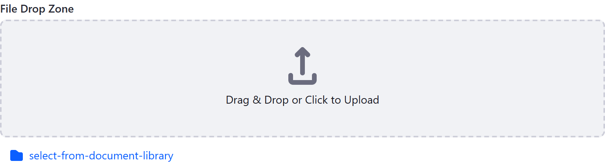 | 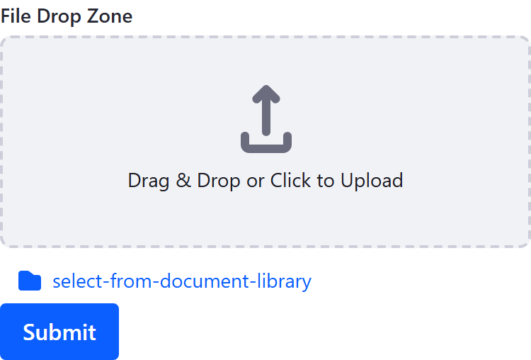 |

---

### Image Choice

|                                       Desktop (1920px)                                       |                                       Tablet (768px)                                       |                                       Mobile (375px)                                       |
| :------------------------------------------------------------------------------------------: | :----------------------------------------------------------------------------------------: | :----------------------------------------------------------------------------------------: |
| 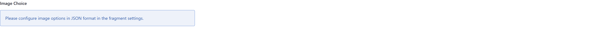 | 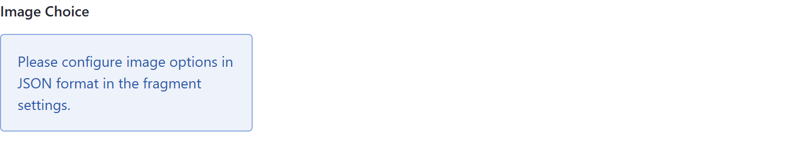 | 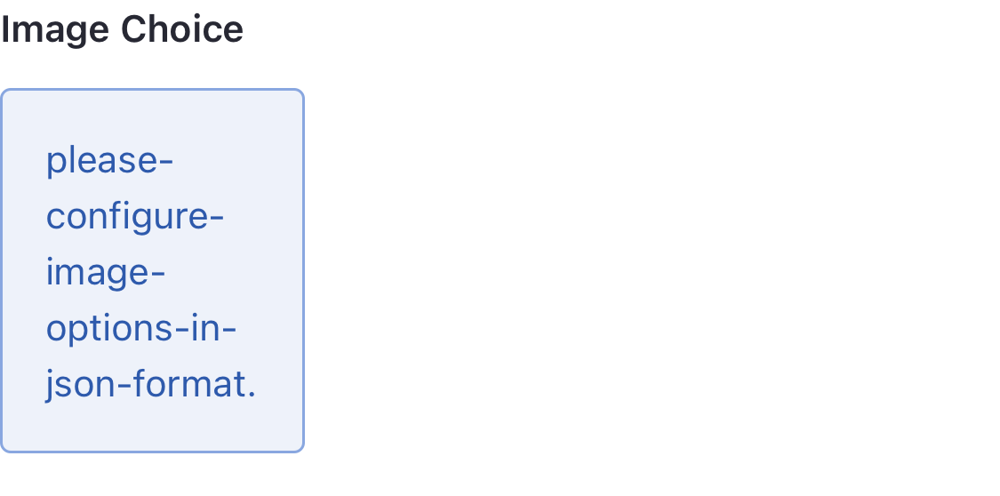 |

---

### Listbox Multiselect

|                                Original Image                                 |                                          Desktop (1920px)                                           |                                          Tablet (768px)                                           |                                          Mobile (375px)                                           |
| :---------------------------------------------------------------------------: | :-------------------------------------------------------------------------------------------------: | :-----------------------------------------------------------------------------------------------: | :-----------------------------------------------------------------------------------------------: |
|  | 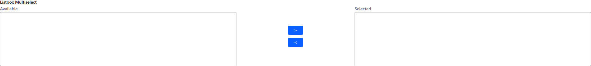 |  |  |

[Detailed Documentation](./fragments/listbox-multiselect.md)

---

### OTP / Verification Code

|                                           Mobile (375px)                                            |
| :-------------------------------------------------------------------------------------------------: |
|  |

---

### Password Strength

|                                         Desktop (1920px)                                          |                                         Tablet (768px)                                          |                                         Mobile (375px)                                          |
| :-----------------------------------------------------------------------------------------------: | :---------------------------------------------------------------------------------------------: | :---------------------------------------------------------------------------------------------: |
|  |  |  |

---

### Range

|                                        Original Image                                        |                                   Desktop (1920px)                                    |                                   Tablet (768px)                                    |                                   Mobile (375px)                                    |
| :------------------------------------------------------------------------------------------: | :-----------------------------------------------------------------------------------: | :---------------------------------------------------------------------------------: | :---------------------------------------------------------------------------------: |
|  |  |  |  |

[Detailed Documentation](./fragments/range.md)

---

### Segmented Numeric

|                               Original Image                                |                                         Desktop (1920px)                                          |                                         Tablet (768px)                                          |                                         Mobile (375px)                                          |
| :-------------------------------------------------------------------------: | :-----------------------------------------------------------------------------------------------: | :---------------------------------------------------------------------------------------------: | :---------------------------------------------------------------------------------------------: |
|  |  |  |  |

[Detailed Documentation](./fragments/segmented-numeric.md)

---

### Signature Pad

|                                       Desktop (1920px)                                        |                                       Tablet (768px)                                        |                                       Mobile (375px)                                        |
| :-------------------------------------------------------------------------------------------: | :-----------------------------------------------------------------------------------------: | :-----------------------------------------------------------------------------------------: |
|  |  |  |

---

### Star Rating

|                            Original Image                             |                                      Desktop (1920px)                                       |                                      Tablet (768px)                                       |                                      Mobile (375px)                                       |
| :-------------------------------------------------------------------: | :-----------------------------------------------------------------------------------------: | :---------------------------------------------------------------------------------------: | :---------------------------------------------------------------------------------------: |
|  |  |  |  |

[Detailed Documentation](./fragments/star-rating.md)

---

### Submit Button (Confirmation)

|                                              Desktop (1920px)                                               |                                              Tablet (768px)                                               |                                              Mobile (375px)                                               |
| :---------------------------------------------------------------------------------------------------------: | :-------------------------------------------------------------------------------------------------------: | :-------------------------------------------------------------------------------------------------------: |
|  |  |  |

[Detailed Documentation](./fragments/submit-button.md)

---

### Toggle Switch

|                             Original Image                              |                                       Desktop (1920px)                                        |                                       Tablet (768px)                                        |                                       Mobile (375px)                                        |
| :---------------------------------------------------------------------: | :-------------------------------------------------------------------------------------------: | :-----------------------------------------------------------------------------------------: | :-----------------------------------------------------------------------------------------: |
|  |  |  |  |

[Detailed Documentation](./fragments/toggle-switch.md)

---

### User Attribute

|                                        Desktop (1920px)                                        |                                        Tablet (768px)                                        |                                        Mobile (375px)                                        |
| :--------------------------------------------------------------------------------------------: | :------------------------------------------------------------------------------------------: | :------------------------------------------------------------------------------------------: |
|  |  |  |

[Detailed Documentation](./fragments/user-field.md)

---

## Forms

### Masthead Call to Action Form Holder

|                                             Desktop (1920px)                                              |                                             Tablet (768px)                                              |                                             Mobile (375px)                                              |
| :-------------------------------------------------------------------------------------------------------: | :-----------------------------------------------------------------------------------------------------: | :-----------------------------------------------------------------------------------------------------: |
|  |  |  |

[Detailed Documentation](./fragments/masthead-call-to-action-form-header.md)

---

## Gemini Generated

Visually appealing fragments generated by Gemini.

### Activity Heatmap

|                               Original Image                               |                                         Desktop (1920px)                                          |                                         Tablet (768px)                                          |                                         Mobile (375px)                                          |
| :------------------------------------------------------------------------: | :-----------------------------------------------------------------------------------------------: | :---------------------------------------------------------------------------------------------: | :---------------------------------------------------------------------------------------------: |
|  |  |  |  |

[Detailed Documentation](./fragments/activity-heatmap.md)

---

### AI Assistant Chat UI

|                                           Desktop (1920px)                                            |                                           Tablet (768px)                                            |                                           Mobile (375px)                                            |
| :---------------------------------------------------------------------------------------------------: | :-------------------------------------------------------------------------------------------------: | :-------------------------------------------------------------------------------------------------: |
|  |  |  |

[Detailed Documentation](./fragments/ai-chat-ui.md)

---

### Animated Metric Counter

|                                  Original Image                                   |                                             Desktop (1920px)                                             |                                             Tablet (768px)                                             |                                             Mobile (375px)                                             |
| :-------------------------------------------------------------------------------: | :------------------------------------------------------------------------------------------------------: | :----------------------------------------------------------------------------------------------------: | :----------------------------------------------------------------------------------------------------: |
|  |  |  |  |

[Detailed Documentation](./fragments/animated-metric-counter.md)

---

### Dynamic Collection Slider

|                                   Original Image                                    |                                              Desktop (1920px)                                              |                                              Tablet (768px)                                              |                                              Mobile (375px)                                              |
| :---------------------------------------------------------------------------------: | :--------------------------------------------------------------------------------------------------------: | :------------------------------------------------------------------------------------------------------: | :------------------------------------------------------------------------------------------------------: |
|  |  |  |  |

[Detailed Documentation](./fragments/dynamic-collection-slider.md)

---

### Dynamic Object Gallery

|                                  Original Image                                  |                                            Desktop (1920px)                                             |                                            Tablet (768px)                                             |                                            Mobile (375px)                                             |
| :------------------------------------------------------------------------------: | :-----------------------------------------------------------------------------------------------------: | :---------------------------------------------------------------------------------------------------: | :---------------------------------------------------------------------------------------------------: |
|  |  |  |  |

[Detailed Documentation](./fragments/dynamic-object-gallery.md)

---

### Interactive Event Timeline

|                                    Original Image                                    |                                              Desktop (1920px)                                               |                                              Tablet (768px)                                               |                                              Mobile (375px)                                               |
| :----------------------------------------------------------------------------------: | :---------------------------------------------------------------------------------------------------------: | :-------------------------------------------------------------------------------------------------------: | :-------------------------------------------------------------------------------------------------------: |
|  |  |  |  |

[Detailed Documentation](./fragments/interactive-event-timeline.md)

---

### Interactive Wizard

|                                          Desktop (1920px)                                           |                                          Tablet (768px)                                           |                                          Mobile (375px)                                           |
| :-------------------------------------------------------------------------------------------------: | :-----------------------------------------------------------------------------------------------: | :-----------------------------------------------------------------------------------------------: |
|  |  |  |

[Detailed Documentation](./fragments/interactive-wizard.md)

---

### Meta-Object Form

|                               Original Image                               |                                         Desktop (1920px)                                          |                                         Tablet (768px)                                          |                                         Mobile (375px)                                          |
| :------------------------------------------------------------------------: | :-----------------------------------------------------------------------------------------------: | :---------------------------------------------------------------------------------------------: | :---------------------------------------------------------------------------------------------: |
|  |  |  |  |

[Detailed Documentation](./fragments/meta-object-form.md)

---

### Meta-Object Record View

|                                  Original Image                                   |                                             Desktop (1920px)                                             |                                             Tablet (768px)                                             |                                             Mobile (375px)                                             |
| :-------------------------------------------------------------------------------: | :------------------------------------------------------------------------------------------------------: | :----------------------------------------------------------------------------------------------------: | :----------------------------------------------------------------------------------------------------: |
|  |  |  |  |

[Detailed Documentation](./fragments/meta-object-record-view.md)

---

### Meta-Object Table

|                               Original Image                                |                                          Desktop (1920px)                                          |                                          Tablet (768px)                                          |                                          Mobile (375px)                                          |
| :-------------------------------------------------------------------------: | :------------------------------------------------------------------------------------------------: | :----------------------------------------------------------------------------------------------: | :----------------------------------------------------------------------------------------------: |
|  |  |  |  |

[Detailed Documentation](./fragments/meta-object-table.md)

---

### Modern Parallax Hero

|                                 Original Image                                 |                                           Desktop (1920px)                                            |                                           Tablet (768px)                                            |                                           Mobile (375px)                                            |
| :----------------------------------------------------------------------------: | :---------------------------------------------------------------------------------------------------: | :-------------------------------------------------------------------------------------------------: | :-------------------------------------------------------------------------------------------------: |
|  |  |  |  |

[Detailed Documentation](./fragments/modern-parallax-hero.md)

---

### Object-Linked Chart

|                                Original Image                                 |                                           Desktop (1920px)                                           |                                           Tablet (768px)                                           |                                           Mobile (375px)                                           |
| :---------------------------------------------------------------------------: | :--------------------------------------------------------------------------------------------------: | :------------------------------------------------------------------------------------------------: | :------------------------------------------------------------------------------------------------: |
|  |  |  |  |

[Detailed Documentation](./fragments/object-linked-chart.md)

---

### Pricing Comparison Grid

|                                  Original Image                                   |                                             Desktop (1920px)                                             |                                             Tablet (768px)                                             |                                             Mobile (375px)                                             |
| :-------------------------------------------------------------------------------: | :------------------------------------------------------------------------------------------------------: | :----------------------------------------------------------------------------------------------------: | :----------------------------------------------------------------------------------------------------: |
|  |  |  |  |

[Detailed Documentation](./fragments/pricing-comparison-grid.md)

---

### Radial KPI Gauge

|                               Original Image                               |                                         Desktop (1920px)                                          |                                         Tablet (768px)                                          |                                         Mobile (375px)                                          |
| :------------------------------------------------------------------------: | :-----------------------------------------------------------------------------------------------: | :---------------------------------------------------------------------------------------------: | :---------------------------------------------------------------------------------------------: |
|  |  |  |  |

[Detailed Documentation](./fragments/radial-kpi-gauge.md)

---

### Modern Search Overlay

|                                            Desktop (1920px)                                            |                                            Tablet (768px)                                            |                                            Mobile (375px)                                            |
| :----------------------------------------------------------------------------------------------------: | :--------------------------------------------------------------------------------------------------: | :--------------------------------------------------------------------------------------------------: |
|  |  |  |

[Detailed Documentation](./fragments/search-overlay.md)

---

## Header Components

### Linear Gradient Container

|                                              Desktop (1920px)                                               |                                              Tablet (768px)                                               |                                              Mobile (375px)                                               |
| :---------------------------------------------------------------------------------------------------------: | :-------------------------------------------------------------------------------------------------------: | :-------------------------------------------------------------------------------------------------------: |
|  |  |  |

[Detailed Documentation](<./fragments/linear-gradient-container-(custom).md>)

---

### Login and User Menu

|                                                Original Image                                                 |                                           Desktop (1920px)                                            |                                           Tablet (768px)                                            |                                           Mobile (375px)                                            |
| :-----------------------------------------------------------------------------------------------------------: | :---------------------------------------------------------------------------------------------------: | :-------------------------------------------------------------------------------------------------: | :-------------------------------------------------------------------------------------------------: |
|  |  |  |  |

[Detailed Documentation](./fragments/login-and-user-menu.md)

---

### Site Logo

|                                         Original Image                                         |                                      Desktop (1920px)                                       |                                      Tablet (768px)                                       |                                      Mobile (375px)                                       |
| :--------------------------------------------------------------------------------------------: | :-----------------------------------------------------------------------------------------: | :---------------------------------------------------------------------------------------: | :---------------------------------------------------------------------------------------: |
|  |  |  |  |

[Detailed Documentation](./fragments/logo.md)

---

### Lower Header Bar

|                                Original Image                                 |                                          Desktop (1920px)                                          |                                          Tablet (768px)                                          |                                          Mobile (375px)                                          |
| :---------------------------------------------------------------------------: | :------------------------------------------------------------------------------------------------: | :----------------------------------------------------------------------------------------------: | :----------------------------------------------------------------------------------------------: |
|  |  |  |  |

[Detailed Documentation](./fragments/lower-header-layout.md)

---

### Search Bar

|                                            Original Image                                            |                                       Desktop (1920px)                                       |                                       Tablet (768px)                                       |                                       Mobile (375px)                                       |
| :--------------------------------------------------------------------------------------------------: | :------------------------------------------------------------------------------------------: | :----------------------------------------------------------------------------------------: | :----------------------------------------------------------------------------------------: |
|  |  |  |  |

[Detailed Documentation](./fragments/search-bar.md)

---

### Search Button

|                                             Original Image                                              |                                        Desktop (1920px)                                         |                                        Tablet (768px)                                         |                                        Mobile (375px)                                         |
| :-----------------------------------------------------------------------------------------------------: | :---------------------------------------------------------------------------------------------: | :-------------------------------------------------------------------------------------------: | :-------------------------------------------------------------------------------------------: |
|  |  |  |  |

[Detailed Documentation](./fragments/search-button.md)

---

### Site Name

|                                           Original Image                                            |                                      Desktop (1920px)                                       |                                      Tablet (768px)                                       |                                      Mobile (375px)                                       |
| :-------------------------------------------------------------------------------------------------: | :-----------------------------------------------------------------------------------------: | :---------------------------------------------------------------------------------------: | :---------------------------------------------------------------------------------------: |
|  |  |  |  |

[Detailed Documentation](./fragments/site-name.md)

---

### Upper Header Bar Layout

|                                                Original Image                                                 |                                             Desktop (1920px)                                              |                                             Tablet (768px)                                              |                                             Mobile (375px)                                              |
| :-----------------------------------------------------------------------------------------------------------: | :-------------------------------------------------------------------------------------------------------: | :-----------------------------------------------------------------------------------------------------: | :-----------------------------------------------------------------------------------------------------: |
|  |  |  |  |

[Detailed Documentation](./fragments/upper-header-layout.md)

---

### User Personal Bar

|                                           Original Image                                           |                                          Desktop (1920px)                                           |                                          Tablet (768px)                                           |                                          Mobile (375px)                                           |
| :------------------------------------------------------------------------------------------------: | :-------------------------------------------------------------------------------------------------: | :-----------------------------------------------------------------------------------------------: | :-----------------------------------------------------------------------------------------------: |
|  |  |  |  |

[Detailed Documentation](./fragments/user-bar.md)

---

## Hero Assets

Prominent visuals, such as videos or banners, that capture attention and define page impact.

### Banner Video

|                                         Original Image                                         |                                     Desktop (1920px)                                     |                                     Tablet (768px)                                     |                                     Mobile (375px)                                     |
| :--------------------------------------------------------------------------------------------: | :--------------------------------------------------------------------------------------: | :------------------------------------------------------------------------------------: | :------------------------------------------------------------------------------------: |
|  |  |  |  |

[Detailed Documentation](./fragments/hero-video.md)

---

### Overlay Background

|                                             Original Image                                             |                                        Desktop (1920px)                                        |                                        Tablet (768px)                                        |                                        Mobile (375px)                                        |
| :----------------------------------------------------------------------------------------------------: | :--------------------------------------------------------------------------------------------: | :------------------------------------------------------------------------------------------: | :------------------------------------------------------------------------------------------: |
|  |  |  |  |

[Detailed Documentation](./fragments/overlay-background.md)

---

## Layout Components

### Card Content

|                                        Desktop (1920px)                                        |                                        Tablet (768px)                                        |                                        Mobile (375px)                                        |
| :--------------------------------------------------------------------------------------------: | :------------------------------------------------------------------------------------------: | :------------------------------------------------------------------------------------------: |
|  |  |  |

[Detailed Documentation](./fragments/card-content.md)

---

### Primary Card

|                                             Original Image                                             |                                        Desktop (1920px)                                        |                                        Tablet (768px)                                        |                                        Mobile (375px)                                        |
| :----------------------------------------------------------------------------------------------------: | :--------------------------------------------------------------------------------------------: | :------------------------------------------------------------------------------------------: | :------------------------------------------------------------------------------------------: |
|  |  |  |  |

[Detailed Documentation](./fragments/primary-card.md)

---

### Secondary Card

|                                              Original Image                                              |                                         Desktop (1920px)                                         |                                         Tablet (768px)                                         |                                         Mobile (375px)                                         |
| :------------------------------------------------------------------------------------------------------: | :----------------------------------------------------------------------------------------------: | :--------------------------------------------------------------------------------------------: | :--------------------------------------------------------------------------------------------: |
|  |  |  |  |

[Detailed Documentation](./fragments/secondary-card.md)

---

## Meter Reading

### Meter Reading

|                                           Original Image                                            |                                      Desktop (1920px)                                       |                                      Tablet (768px)                                       |                                      Mobile (375px)                                       |
| :-------------------------------------------------------------------------------------------------: | :-----------------------------------------------------------------------------------------: | :---------------------------------------------------------------------------------------: | :---------------------------------------------------------------------------------------: |
|  |  |  |  |

[Detailed Documentation](./fragments/meter-reading.md)

---

## Miscellaneous

### Back Button

|                                     Desktop (1920px)                                      |                                     Tablet (768px)                                      |                                     Mobile (375px)                                      |
| :---------------------------------------------------------------------------------------: | :-------------------------------------------------------------------------------------: | :-------------------------------------------------------------------------------------: |
|  |  |  |

[Detailed Documentation](./fragments/back-button.md)

---

### Custom Tabs

|                                      Original Image                                      |                                     Desktop (1920px)                                      |                                     Tablet (768px)                                      |                                     Mobile (375px)                                      |
| :--------------------------------------------------------------------------------------: | :---------------------------------------------------------------------------------------: | :-------------------------------------------------------------------------------------: | :-------------------------------------------------------------------------------------: |
|  |  |  |  |

[Detailed Documentation](./fragments/custom-tabs.md)

---

### Dynamic Copyright

|                               Original Image                                |                                        Desktop (1920px)                                         |                                        Tablet (768px)                                         |                                        Mobile (375px)                                         |
| :-------------------------------------------------------------------------: | :---------------------------------------------------------------------------------------------: | :-------------------------------------------------------------------------------------------: | :-------------------------------------------------------------------------------------------: |
|  |  |  |  |

[Detailed Documentation](./fragments/dynamic-copyright.md)

---

### Icon Button

|                            Original Image                             |                                     Desktop (1920px)                                      |                                     Tablet (768px)                                      |                                     Mobile (375px)                                      |
| :-------------------------------------------------------------------: | :---------------------------------------------------------------------------------------: | :-------------------------------------------------------------------------------------: | :-------------------------------------------------------------------------------------: |
|  |  |  |  |

[Detailed Documentation](./fragments/icon-button.md)

---

### Launch Analytics Cloud

|                                           Original Image                                            |                                           Desktop (1920px)                                           |                                           Tablet (768px)                                           |                                           Mobile (375px)                                           |
| :-------------------------------------------------------------------------------------------------: | :--------------------------------------------------------------------------------------------------: | :------------------------------------------------------------------------------------------------: | :------------------------------------------------------------------------------------------------: |
|  |  |  |  |

[Detailed Documentation](./fragments/launch-analytics-cloud.md)

---

### Modify My Profile Link

|                                           Desktop (1920px)                                           |                                           Tablet (768px)                                           |                                           Mobile (375px)                                           |
| :--------------------------------------------------------------------------------------------------: | :------------------------------------------------------------------------------------------------: | :------------------------------------------------------------------------------------------------: |
|  |  |  |

[Detailed Documentation](./fragments/modify-my-profile-link.md)

---

### My Dashboard Link

|                                        Desktop (1920px)                                         |                                        Tablet (768px)                                         |                                        Mobile (375px)                                         |
| :---------------------------------------------------------------------------------------------: | :-------------------------------------------------------------------------------------------: | :-------------------------------------------------------------------------------------------: |
|  |  |  |

[Detailed Documentation](./fragments/my-dashboard-link.md)

---

### Test Fragment (Manual Check)

|                                             Desktop (1920px)                                              |                                             Tablet (768px)                                              |                                             Mobile (375px)                                              |
| :-------------------------------------------------------------------------------------------------------: | :-----------------------------------------------------------------------------------------------------: | :-----------------------------------------------------------------------------------------------------: |
|  |  |  |

---

## Modern Intranet

A collection of high-fidelity fragments for constructing modern corporate intranet pages, including social feeds, learning centers, and personalized dashboards.

### App Launcher

|                                       Desktop (1920px)                                       |                                       Tablet (768px)                                       |                                       Mobile (375px)                                       |
| :------------------------------------------------------------------------------------------: | :----------------------------------------------------------------------------------------: | :----------------------------------------------------------------------------------------: |
|  |  |  |

---

### Course Progress Card

|                                           Desktop (1920px)                                           |                                           Tablet (768px)                                           |                                           Mobile (375px)                                           |
| :--------------------------------------------------------------------------------------------------: | :------------------------------------------------------------------------------------------------: | :------------------------------------------------------------------------------------------------: |
|  |  |  |

---

### File Repository List

|                                           Desktop (1920px)                                           |                                           Tablet (768px)                                           |                                           Mobile (375px)                                           |
| :--------------------------------------------------------------------------------------------------: | :------------------------------------------------------------------------------------------------: | :------------------------------------------------------------------------------------------------: |
|  |  |  |

---

### Intranet Feed

|                                       Desktop (1920px)                                        |                                       Tablet (768px)                                        |                                       Mobile (375px)                                        |
| :-------------------------------------------------------------------------------------------: | :-----------------------------------------------------------------------------------------: | :-----------------------------------------------------------------------------------------: |
|  |  |  |

---

### News Hero

|                                     Desktop (1920px)                                      |                                     Tablet (768px)                                      |                                     Mobile (375px)                                      |
| :---------------------------------------------------------------------------------------: | :-------------------------------------------------------------------------------------: | :-------------------------------------------------------------------------------------: |
|  |  |  |

---

### Stat Card

|                                     Desktop (1920px)                                      |                                     Tablet (768px)                                      |                                     Mobile (375px)                                      |
| :---------------------------------------------------------------------------------------: | :-------------------------------------------------------------------------------------: | :-------------------------------------------------------------------------------------: |
|  |  |  |

---

### Welcome Banner

|                                        Desktop (1920px)                                        |                                        Tablet (768px)                                        |                                        Mobile (375px)                                        |
| :--------------------------------------------------------------------------------------------: | :------------------------------------------------------------------------------------------: | :------------------------------------------------------------------------------------------: |
|  |  |  |

---

## Forms

### Audit Button

|                                        Original Image                                        |                                  Desktop (1920px)                                  |                                  Tablet (768px)                                  |                                  Mobile (375px)                                  |
| :------------------------------------------------------------------------------------------: | :--------------------------------------------------------------------------------: | :------------------------------------------------------------------------------: | :------------------------------------------------------------------------------: |
|  |  |  |  |

[Detailed Documentation](./fragments/audit-button.md)

---

### Comment

|                          Original Image                           |                               Desktop (1920px)                                |                               Tablet (768px)                                |                               Mobile (375px)                                |
| :---------------------------------------------------------------: | :---------------------------------------------------------------------------: | :-------------------------------------------------------------------------: | :-------------------------------------------------------------------------: |
|  |  |  |  |

[Detailed Documentation](./fragments/comment.md)

---

### View Comments

|                              Original Image                               |                                  Desktop (1920px)                                   |                                  Tablet (768px)                                   |                                  Mobile (375px)                                   |
| :-----------------------------------------------------------------------: | :---------------------------------------------------------------------------------: | :-------------------------------------------------------------------------------: | :-------------------------------------------------------------------------------: |
|  |  |  |  |

[Detailed Documentation](./fragments/public-comments.md)

---

## Populated Form Fields

### Populated Range

|                              Original Image                               |                                           Desktop (1920px)                                            |                                           Tablet (768px)                                            |                                           Mobile (375px)                                            |
| :-----------------------------------------------------------------------: | :---------------------------------------------------------------------------------------------------: | :-------------------------------------------------------------------------------------------------: | :-------------------------------------------------------------------------------------------------: |
|  |  |  |  |

[Detailed Documentation](./fragments/populated-range.md)

---

## Profile

## Pulse

### Pulse Button

|                                       Original Image                                       |                                  Desktop (1920px)                                  |                                  Tablet (768px)                                  |                                  Mobile (375px)                                  |
| :----------------------------------------------------------------------------------------: | :--------------------------------------------------------------------------------: | :------------------------------------------------------------------------------: | :------------------------------------------------------------------------------: |
|  |  |  |  |

[Detailed Documentation](./fragments/pulse-button.md)

---

## Responsive Menus

### Logo Zone

|                                      Desktop (1920px)                                      |                                      Tablet (768px)                                      |                                      Mobile (375px)                                      |
| :----------------------------------------------------------------------------------------: | :--------------------------------------------------------------------------------------: | :--------------------------------------------------------------------------------------: |
|  |  |  |

[Detailed Documentation](./fragments/logo-zone.md)

---

### Responsive Menu

|                                              Original Image                                              |                                         Desktop (1920px)                                         |                                         Tablet (768px)                                         |                                         Mobile (375px)                                         |
| :------------------------------------------------------------------------------------------------------: | :----------------------------------------------------------------------------------------------: | :--------------------------------------------------------------------------------------------: | :--------------------------------------------------------------------------------------------: |
|  |  |  |  |

[Detailed Documentation](./fragments/responsive-menu.md)

---

### Responsive Side Menu

|                                                Original Image                                                 |                                           Desktop (1920px)                                            |                                           Tablet (768px)                                            |                                           Mobile (375px)                                            |
| :-----------------------------------------------------------------------------------------------------------: | :---------------------------------------------------------------------------------------------------: | :-------------------------------------------------------------------------------------------------: | :-------------------------------------------------------------------------------------------------: |
|  |  |  |  |

[Detailed Documentation](./fragments/responsive-side-menu.md)

---

### Zone Layout

|                                       Desktop (1920px)                                       |                                       Tablet (768px)                                       |                                       Mobile (375px)                                       |
| :------------------------------------------------------------------------------------------: | :----------------------------------------------------------------------------------------: | :----------------------------------------------------------------------------------------: |
|  |  |  |

[Detailed Documentation](./fragments/zone-layout.md)

---

## User Account

### My Rights

|                                    Desktop (1920px)                                    |                                    Tablet (768px)                                    |                                    Mobile (375px)                                    |
| :------------------------------------------------------------------------------------: | :----------------------------------------------------------------------------------: | :----------------------------------------------------------------------------------: |
|  |  |  |

[Detailed Documentation](./fragments/my-rights.md)

---

## Widget Modifiers
