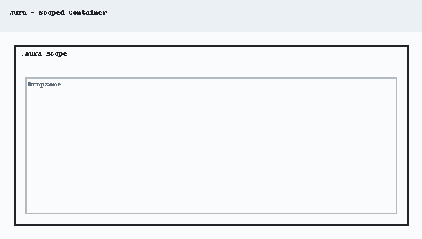

# Fragment Visual Gallery

A visual reference for the high-fidelity fragments available in this Liferay DXP repository. Generated automatically.

**Last Tested Against Liferay Version:** `2026.q1.9-lts`

## Aura Design System

A lifestyle-focused design system with a scoped container architecture, high-fidelity design tokens, and modern product showcase components.

### Aura - Final CTA Banner

|                                                     Desktop (1920px)                                                      |                                                     Tablet (768px)                                                      |                                                     Mobile (375px)                                                      |
| :-----------------------------------------------------------------------------------------------------------------------: | :---------------------------------------------------------------------------------------------------------------------: | :---------------------------------------------------------------------------------------------------------------------: |
|  🟢 **Passed** |  🟢 **Passed** |  🟢 **Passed** |

---

### Aura - Lookbook Row

|                                                   Desktop (1920px)                                                    |                                                   Tablet (768px)                                                    |                                                   Mobile (375px)                                                    |
| :-------------------------------------------------------------------------------------------------------------------: | :-----------------------------------------------------------------------------------------------------------------: | :-----------------------------------------------------------------------------------------------------------------: |
|  🟢 **Passed** |  🟢 **Passed** |  🟢 **Passed** |

---

### Aura - Product Gallery

|                                                     Desktop (1920px)                                                     |                                                     Tablet (768px)                                                     |                                                     Mobile (375px)                                                     |
| :----------------------------------------------------------------------------------------------------------------------: | :--------------------------------------------------------------------------------------------------------------------: | :--------------------------------------------------------------------------------------------------------------------: |
|  🟢 **Passed** |  🟢 **Passed** |  🟢 **Passed** |

---

### Aura - Scoped Container

---

### Aura - USP Grid

|                                                 Desktop (1920px)                                                  |                                                 Tablet (768px)                                                  |                                                 Mobile (375px)                                                  |
| :---------------------------------------------------------------------------------------------------------------: | :-------------------------------------------------------------------------------------------------------------: | :-------------------------------------------------------------------------------------------------------------: |
|  🟢 **Passed** |  🟢 **Passed** |  🟢 **Passed** |

---

## Commerce

### Dynamic Badge Overlay

[Detailed Documentation](./fragments/dynamic-badge-overlay.md)

---

### Purchased Products

[Detailed Documentation](./fragments/purchased-products.md)

---

## Content

### Content Map

[Detailed Documentation](./fragments/content-map.md)

---

### Service Card

[Detailed Documentation](./fragments/service-card.md)

---

### Service Icon

[Detailed Documentation](./fragments/service-icon.md)

---

### Service Link Button

_No image available_

[Detailed Documentation](./fragments/service-link-button.md)

---

## Heathcare Portal

### Dashboard Container

_No image available_

[Detailed Documentation](./fragments/dashboard-container.md)

---

### Dashboard Filter

_No image available_

[Detailed Documentation](./fragments/dashboard-filter.md)

---

## Date Display

## Finance

### Loan Application Calculator

[Detailed Documentation](./fragments/loan-application-calculator.md)

---

### Loan Calculator

[Detailed Documentation](./fragments/loan-calculator.md)

---

## Forms Fragments

### Address Autocomplete

_No image available_

---

### Autocomplete (Object)

/thumbnail.png>)

[Detailed Documentation](<./fragments/autocomplete-(object).md>)

---

### Autocomplete (Picklist)

/thumbnail.png>)

[Detailed Documentation](<./fragments/autocomplete-(picklist).md>)

---

### Color Swatches

_No image available_

---

### Confirmation Field

[Detailed Documentation](./fragments/confirmation-field.md)

---

### Currency Masked Input

_No image available_

---

### File Drop Zone

_No image available_

---

### Hidden Relationship

[Detailed Documentation](./fragments/hidden-relationship.md)

---

### Image Choice

_No image available_

---

### Listbox Multiselect

[Detailed Documentation](./fragments/listbox-multiselect.md)

---

### OTP / Verification Code

_No image available_

---

### Password Strength

_No image available_

---

### Range

[Detailed Documentation](./fragments/range.md)

---

### Segmented Numeric

[Detailed Documentation](./fragments/segmented-numeric.md)

---

### Signature Pad

_No image available_

---

### Star Rating

[Detailed Documentation](./fragments/star-rating.md)

---

### Submit Button (Confirmation)

_No image available_

[Detailed Documentation](./fragments/submit-button.md)

---

### Toggle Switch

[Detailed Documentation](./fragments/toggle-switch.md)

---

### URL Populated Hidden Relationship

_No image available_

[Detailed Documentation](./fragments/url-populated-hidden-relationship.md)

---

### User Attribute

_No image available_

[Detailed Documentation](./fragments/user-field.md)

---

## Forms

### Link Form to Applicant

_No image available_

[Detailed Documentation](./fragments/form-session-id.md)

---

### Generate Form Session Id

_No image available_

[Detailed Documentation](./fragments/generate-form-session-id.md)

---

### Masthead Call to Action Form Holder

_No image available_

[Detailed Documentation](./fragments/masthead-call-to-action-form-header.md)

---

### Redirect Page

_No image available_

[Detailed Documentation](./fragments/redirect-page.md)

---

### Refresh Page

[Detailed Documentation](./fragments/refresh-page.md)

---

## Gemini Generated

Visually appealing fragments generated by Gemini.

### Activity Heatmap

[Detailed Documentation](./fragments/activity-heatmap.md)

---

### AI Assistant Chat UI

_No image available_

[Detailed Documentation](./fragments/ai-chat-ui.md)

---

### Animated Metric Counter

[Detailed Documentation](./fragments/animated-metric-counter.md)

---

### Dynamic Collection Slider

[Detailed Documentation](./fragments/dynamic-collection-slider.md)

---

### Dynamic Object Gallery

[Detailed Documentation](./fragments/dynamic-object-gallery.md)

---

### Interactive Event Timeline

[Detailed Documentation](./fragments/interactive-event-timeline.md)

---

### Interactive Wizard

_No image available_

[Detailed Documentation](./fragments/interactive-wizard.md)

---

### Meta-Object Form

[Detailed Documentation](./fragments/meta-object-form.md)

---

### Meta-Object Record View

[Detailed Documentation](./fragments/meta-object-record-view.md)

---

### Meta-Object Table

[Detailed Documentation](./fragments/meta-object-table.md)

---

### Modern Parallax Hero

[Detailed Documentation](./fragments/modern-parallax-hero.md)

---

### Object-Linked Chart

[Detailed Documentation](./fragments/object-linked-chart.md)

---

### Pricing Comparison Grid

[Detailed Documentation](./fragments/pricing-comparison-grid.md)

---

### Radial KPI Gauge

[Detailed Documentation](./fragments/radial-kpi-gauge.md)

---

### Modern Search Overlay

_No image available_

[Detailed Documentation](./fragments/search-overlay.md)

---

## Header Components

### Linear Gradient Container

_No image available_

[Detailed Documentation](<./fragments/linear-gradient-container-(custom).md>)

---

### Login and User Menu

[Detailed Documentation](./fragments/login-and-user-menu.md)

---

### Site Logo

[Detailed Documentation](./fragments/logo.md)

---

### Lower Header Bar

[Detailed Documentation](./fragments/lower-header-layout.md)

---

### Search Bar

[Detailed Documentation](./fragments/search-bar.md)

---

### Search Button

[Detailed Documentation](./fragments/search-button.md)

---

### Site Name

[Detailed Documentation](./fragments/site-name.md)

---

### Upper Header Bar Layout

[Detailed Documentation](./fragments/upper-header-layout.md)

---

### User Personal Bar

[Detailed Documentation](./fragments/user-bar.md)

---

## Hero Assets

Prominent visuals, such as videos or banners, that capture attention and define page impact.

### Banner Video

[Detailed Documentation](./fragments/hero-video.md)

---

### Overlay Background

[Detailed Documentation](./fragments/overlay-background.md)

---

## Layout Components

### Card Content

_No image available_

[Detailed Documentation](./fragments/card-content.md)

---

### Primary Card

[Detailed Documentation](./fragments/primary-card.md)

---

### Secondary Card

[Detailed Documentation](./fragments/secondary-card.md)

---

## Meter Reading

### Meter Reading

[Detailed Documentation](./fragments/meter-reading.md)

---

## Miscellaneous

### Back Button

_No image available_

[Detailed Documentation](./fragments/back-button.md)

---

### Custom Tabs

[Detailed Documentation](./fragments/custom-tabs.md)

---

### Dynamic Copyright

[Detailed Documentation](./fragments/dynamic-copyright.md)

---

### Hide Control Menu

_No image available_

[Detailed Documentation](./fragments/hide-control-menu.md)

---

### Icon Button

[Detailed Documentation](./fragments/icon-button.md)

---

### Launch Analytics Cloud

[Detailed Documentation](./fragments/launch-analytics-cloud.md)

---

### Modify My Profile Link

_No image available_

[Detailed Documentation](./fragments/modify-my-profile-link.md)

---

### My Dashboard Link

_No image available_

[Detailed Documentation](./fragments/my-dashboard-link.md)

---

### Test Fragment (Manual Check)

_No image available_

---

### Trigger Ray

_No image available_

[Detailed Documentation](./fragments/trigger-ray.md)

---

## Modern Intranet

A collection of high-fidelity fragments for constructing modern corporate intranet pages, including social feeds, learning centers, and personalized dashboards.

### App Launcher

_No image available_

---

### Course Progress Card

_No image available_

---

### File Repository List

_No image available_

---

### Intranet Feed

_No image available_

---

### News Hero

_No image available_

---

### Stat Card

_No image available_

---

### Welcome Banner

_No image available_

---

## Forms

### Audit Button

[Detailed Documentation](./fragments/audit-button.md)

---

### Comment

[Detailed Documentation](./fragments/comment.md)

---

### View Comments

[Detailed Documentation](./fragments/public-comments.md)

---

## Populated Form Fields

### Populate Select

[Detailed Documentation](./fragments/populate-select.md)

---

### Populated Range

[Detailed Documentation](./fragments/populated-range.md)

---

### Store Default Value

[Detailed Documentation](./fragments/store-default-value.md)

---

### Store Form Field Values

_No image available_

[Detailed Documentation](./fragments/store-form-field-values.md)

---

### Text (Derived Value)

_No image available_

[Detailed Documentation](./fragments/text-derived-value.md)

---

## Profile

## Pulse

### Campaign Initialiser

_No image available_

[Detailed Documentation](./fragments/campaign-initialiser.md)

---

### Campaign Insights

_No image available_

[Detailed Documentation](./fragments/cookie-sniffer.md)

---

### Custom Event Listener

_No image available_

[Detailed Documentation](./fragments/custom-event-listener.md)

---

### Pulse Button

[Detailed Documentation](./fragments/pulse-button.md)

---

## Responsive Menus

### Logo Zone

_No image available_

[Detailed Documentation](./fragments/logo-zone.md)

---

### Responsive Menu

[Detailed Documentation](./fragments/responsive-menu.md)

---

### Responsive Side Menu

[Detailed Documentation](./fragments/responsive-side-menu.md)

---

### Zone Layout

_No image available_

[Detailed Documentation](./fragments/zone-layout.md)

---

## User Account

### My Rights

_No image available_

[Detailed Documentation](./fragments/my-rights.md)

---

### Ping

_No image available_

[Detailed Documentation](./fragments/ping.md)

---

### Who Am I

_No image available_

[Detailed Documentation](./fragments/who-am-i.md)

---

## Widget Modifiers

### Announcements Modifier

[Detailed Documentation](./fragments/alerts-modifier.md)

---
