# Fragment Visual Gallery

A visual reference for the high-fidelity fragments available in this Liferay DXP repository. Generated automatically.

**Last Tested Against Liferay Version:** `2026.q1.10-lts`

## Aura Design System

A lifestyle-focused design system with a scoped container architecture, high-fidelity design tokens, and modern product showcase components.

### Aura - Final CTA Banner

**Snapshot Prerequisites / Layout Components:**

- Fragment: `aura-scoped-container`

#### Desktop (1920px)  🟢 **Passed**

|                                                     Tablet (768px)                                                      |                                                     Mobile (375px)                                                      |
| :---------------------------------------------------------------------------------------------------------------------: | :---------------------------------------------------------------------------------------------------------------------: |
|  🟢 **Passed** |  🟢 **Passed** |

[Detailed Documentation](./fragments/aura/aura-final-cta.md)

---

### Aura - Lookbook Row

**Snapshot Prerequisites / Layout Components:**

- Fragment: `aura-scoped-container`

#### Desktop (1920px)  🟢 **Passed**

|                                                   Tablet (768px)                                                    |                                                   Mobile (375px)                                                    |
| :-----------------------------------------------------------------------------------------------------------------: | :-----------------------------------------------------------------------------------------------------------------: |
|  🟢 **Passed** |  🟢 **Passed** |

[Detailed Documentation](./fragments/aura/aura-lookbook.md)

---

### Aura - Product Gallery

**Snapshot Prerequisites / Layout Components:**

- Fragment: `aura-scoped-container`

#### Desktop (1920px)  🟢 **Passed**

|                                                     Tablet (768px)                                                     |                                                     Mobile (375px)                                                     |
| :--------------------------------------------------------------------------------------------------------------------: | :--------------------------------------------------------------------------------------------------------------------: |
|  🟢 **Passed** |  🟢 **Passed** |

[Detailed Documentation](./fragments/aura/aura-product-gallery.md)

---

### Aura - USP Grid

**Snapshot Prerequisites / Layout Components:**

- Fragment: `aura-scoped-container`

#### Desktop (1920px)  🟢 **Passed**

|                                                 Tablet (768px)                                                  |                                                 Mobile (375px)                                                  |
| :-------------------------------------------------------------------------------------------------------------: | :-------------------------------------------------------------------------------------------------------------: |
|  🟢 **Passed** |  🟢 **Passed** |

[Detailed Documentation](./fragments/aura/aura-usp-grid.md)

---

## Commerce

### Dynamic Badge Overlay

**Snapshot Prerequisites / Layout Components:**

- Fragment: `HTML (System Component)`

#### Original Design

#### Desktop (1920px)  🟢 **Passed**

|                                                Tablet (768px)                                                 |                                                Mobile (375px)                                                 |
| :-----------------------------------------------------------------------------------------------------------: | :-----------------------------------------------------------------------------------------------------------: |
|  🟢 **Passed** |  🟢 **Passed** |

[Detailed Documentation](./fragments/commerce/dynamic-badge-overlay.md)

---

## Content

### Content Map

#### Original Design

#### Desktop (1920px)  🟢 **Passed**

|                                           Tablet (768px)                                           |                                           Mobile (375px)                                           |
| :------------------------------------------------------------------------------------------------: | :------------------------------------------------------------------------------------------------: |
|  🟢 **Passed** |  🟢 **Passed** |

[Detailed Documentation](./fragments/content/content-map.md)

---

### Service Card

#### Desktop (1920px)  🟢 **Passed**

|                                           Tablet (768px)                                            |                                           Mobile (375px)                                            |
| :-------------------------------------------------------------------------------------------------: | :-------------------------------------------------------------------------------------------------: |
|  🟢 **Passed** |  🟢 **Passed** |

[Detailed Documentation](./fragments/content/service-card.md)

---

### Service Icon

#### Desktop (1920px)  🟢 **Passed**

|                                           Tablet (768px)                                            |                                           Mobile (375px)                                            |
| :-------------------------------------------------------------------------------------------------: | :-------------------------------------------------------------------------------------------------: |
|  🟢 **Passed** |  🟢 **Passed** |

[Detailed Documentation](./fragments/content/service-icon.md)

---

### Service Link Button

#### Desktop (1920px)  🟢 **Passed**

|                                               Tablet (768px)                                               |                                               Mobile (375px)                                               |
| :--------------------------------------------------------------------------------------------------------: | :--------------------------------------------------------------------------------------------------------: |
|  🟢 **Passed** |  🟢 **Passed** |

[Detailed Documentation](./fragments/content/service-link-button.md)

---

## Heathcare Portal

### Dashboard Container

**Snapshot Prerequisites / Layout Components:**

- Fragment: `activity-heatmap`
- Fragment: `radial-kpi-gauge`

#### Desktop (1920px)  🟢 **Passed**

|                                                   Tablet (768px)                                                    |                                                   Mobile (375px)                                                    |
| :-----------------------------------------------------------------------------------------------------------------: | :-----------------------------------------------------------------------------------------------------------------: |
|  🟢 **Passed** |  🟢 **Passed** |

[Detailed Documentation](./fragments/dashboard-components/dashboard-container.md)

---

### Dashboard Filter

#### Desktop (1920px)  🟢 **Passed**

|                                                  Tablet (768px)                                                  |                                                  Mobile (375px)                                                  |
| :--------------------------------------------------------------------------------------------------------------: | :--------------------------------------------------------------------------------------------------------------: |
|  🟢 **Passed** |  🟢 **Passed** |

[Detailed Documentation](./fragments/dashboard-components/dashboard-filter.md)

---

## Finance

### Loan Application Calculator

**Snapshot Prerequisites / Layout Components:**

- FormFragment: `range`

#### Original Design

#### Desktop (1920px)  🟢 **Passed**

|                                                   Tablet (768px)                                                   |                                                   Mobile (375px)                                                   |
| :----------------------------------------------------------------------------------------------------------------: | :----------------------------------------------------------------------------------------------------------------: |
|  🟢 **Passed** |  🟢 **Passed** |

[Detailed Documentation](./fragments/finance/loan-application-calculator.md)

---

### Loan Calculator

#### Original Design

#### Desktop (1920px)  🟢 **Passed**

|                                             Tablet (768px)                                             |                                             Mobile (375px)                                             |
| :----------------------------------------------------------------------------------------------------: | :----------------------------------------------------------------------------------------------------: |
|  🟢 **Passed** |  🟢 **Passed** |

[Detailed Documentation](./fragments/finance/loan-calculator.md)

---

## Forms (Fragments)

### Address Autocomplete

#### Desktop (1920px)  🟢 **Passed**

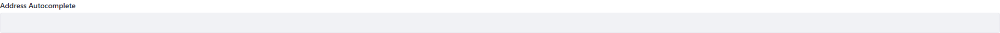

|                                                    Tablet (768px)                                                    |                                                    Mobile (375px)                                                    |
| :------------------------------------------------------------------------------------------------------------------: | :------------------------------------------------------------------------------------------------------------------: |
|  🟢 **Passed** | 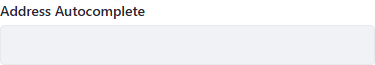 🟢 **Passed** |

[Detailed Documentation](./fragments/form-fragments/address-autocomplete.md)

---

### Autocomplete (Object)

#### Desktop (1920px)  🟢 **Passed**

|                                                    Tablet (768px)                                                    |                                                    Mobile (375px)                                                    |
| :------------------------------------------------------------------------------------------------------------------: | :------------------------------------------------------------------------------------------------------------------: |
|  🟢 **Passed** | 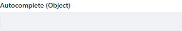 🟢 **Passed** |

[Detailed Documentation](./fragments/form-fragments/autocomplete-%28object%29.md)

---

### Autocomplete (Picklist)

#### Desktop (1920px)  🟢 **Passed**

|                                                     Tablet (768px)                                                     |                                                     Mobile (375px)                                                     |
| :--------------------------------------------------------------------------------------------------------------------: | :--------------------------------------------------------------------------------------------------------------------: |
|  🟢 **Passed** |  🟢 **Passed** |

[Detailed Documentation](./fragments/form-fragments/autocomplete-%28picklist%29.md)

---

### Color Swatches

#### Desktop (1920px)  🟢 **Passed**

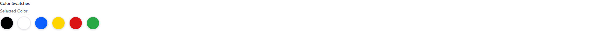

|                                                 Tablet (768px)                                                 |                                                 Mobile (375px)                                                 |
| :------------------------------------------------------------------------------------------------------------: | :------------------------------------------------------------------------------------------------------------: |
|  🟢 **Passed** | 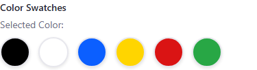 🟢 **Passed** |

[Detailed Documentation](./fragments/form-fragments/color-swatches.md)

---

### Confirmation Field

#### Desktop (1920px)  🟢 **Passed**

|                                                   Tablet (768px)                                                   |                                                   Mobile (375px)                                                   |
| :----------------------------------------------------------------------------------------------------------------: | :----------------------------------------------------------------------------------------------------------------: |
| 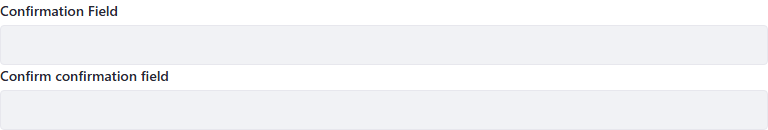 🟢 **Passed** | 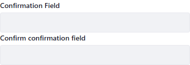 🟢 **Passed** |

[Detailed Documentation](./fragments/form-fragments/confirmation-field.md)

---

### Currency Masked Input

#### Desktop (1920px)  🟢 **Passed**

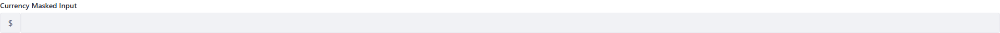

|                                                    Tablet (768px)                                                     |                                                    Mobile (375px)                                                     |
| :-------------------------------------------------------------------------------------------------------------------: | :-------------------------------------------------------------------------------------------------------------------: |
| 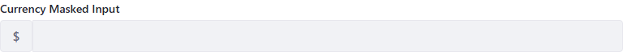 🟢 **Passed** | 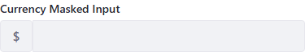 🟢 **Passed** |

[Detailed Documentation](./fragments/form-fragments/currency-input.md)

---

### File Drop Zone

#### Desktop (1920px)  🟢 **Passed**

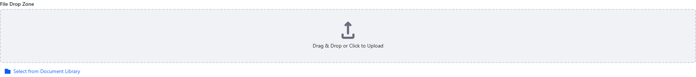

|                                                 Tablet (768px)                                                 |                                                 Mobile (375px)                                                 |
| :------------------------------------------------------------------------------------------------------------: | :------------------------------------------------------------------------------------------------------------: |
| 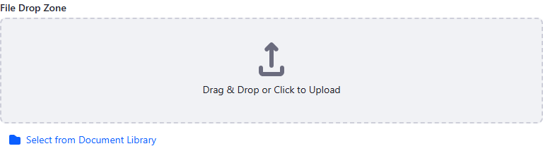 🟢 **Passed** | 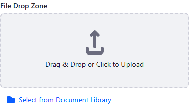 🟢 **Passed** |

[Detailed Documentation](./fragments/form-fragments/file-drop-zone.md)

---

### Image Choice

#### Desktop (1920px)  🟢 **Passed**

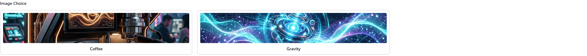

|                                                Tablet (768px)                                                |                                                Mobile (375px)                                                |
| :----------------------------------------------------------------------------------------------------------: | :----------------------------------------------------------------------------------------------------------: |
|  🟢 **Passed** | 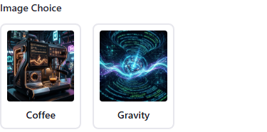 🟢 **Passed** |

[Detailed Documentation](./fragments/form-fragments/image-choice.md)

---

### Listbox Multiselect

#### Original Design

#### Desktop (1920px)  🟢 **Passed**

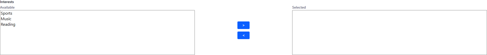

|                                                   Tablet (768px)                                                    |                                                   Mobile (375px)                                                    |
| :-----------------------------------------------------------------------------------------------------------------: | :-----------------------------------------------------------------------------------------------------------------: |
| 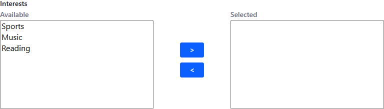 🟢 **Passed** | 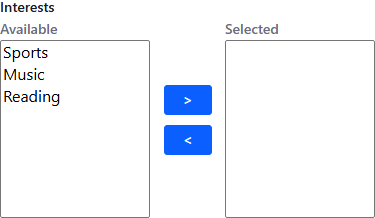 🟢 **Passed** |

[Detailed Documentation](./fragments/form-fragments/listbox-multiselect.md)

---

### OTP - Verification Code

#### Desktop (1920px)  🟢 **Passed**

|                                                    Tablet (768px)                                                     |                                                    Mobile (375px)                                                     |
| :-------------------------------------------------------------------------------------------------------------------: | :-------------------------------------------------------------------------------------------------------------------: |
|  🟢 **Passed** | 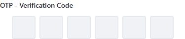 🟢 **Passed** |

[Detailed Documentation](./fragments/form-fragments/otp-input.md)

---

### Password Strength

#### Desktop (1920px)  🟢 **Passed**

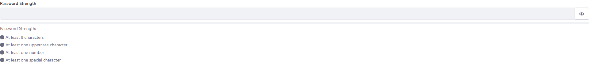

|                                                  Tablet (768px)                                                   |                                                  Mobile (375px)                                                   |
| :---------------------------------------------------------------------------------------------------------------: | :---------------------------------------------------------------------------------------------------------------: |
| 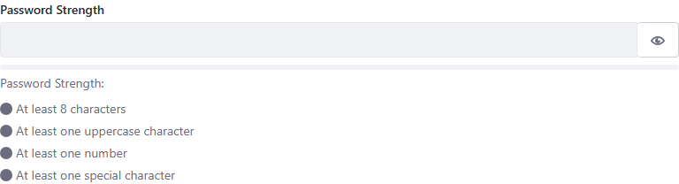 🟢 **Passed** | 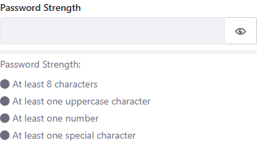 🟢 **Passed** |

[Detailed Documentation](./fragments/form-fragments/password-strength.md)

---

### Range

#### Desktop (1920px)  🟢 **Passed**

|                                            Tablet (768px)                                             |                                            Mobile (375px)                                             |
| :---------------------------------------------------------------------------------------------------: | :---------------------------------------------------------------------------------------------------: |
|  🟢 **Passed** |  🟢 **Passed** |

[Detailed Documentation](./fragments/form-fragments/range.md)

---

### Segmented Numeric

#### Original Design

#### Desktop (1920px)  🟢 **Passed**

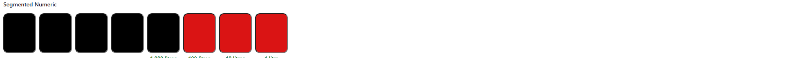

|                                                  Tablet (768px)                                                   |                                                  Mobile (375px)                                                   |
| :---------------------------------------------------------------------------------------------------------------: | :---------------------------------------------------------------------------------------------------------------: |
| 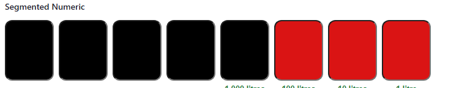 🟢 **Passed** | 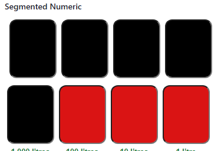 🟢 **Passed** |

[Detailed Documentation](./fragments/form-fragments/segmented-numeric.md)

---

### Signature Pad

#### Desktop (1920px)  🟢 **Passed**

|                                                Tablet (768px)                                                 |                                                Mobile (375px)                                                 |
| :-----------------------------------------------------------------------------------------------------------: | :-----------------------------------------------------------------------------------------------------------: |
| 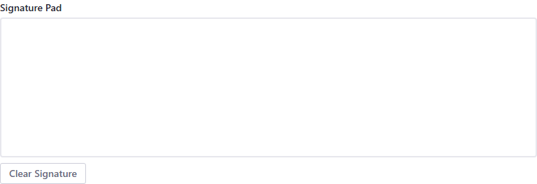 🟢 **Passed** | 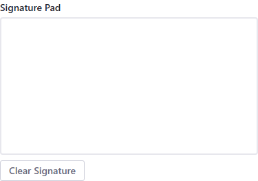 🟢 **Passed** |

[Detailed Documentation](./fragments/form-fragments/signature-pad.md)

---

### Star Rating

#### Original Design

#### Desktop (1920px)  🟢 **Passed**

|                                               Tablet (768px)                                                |                                               Mobile (375px)                                                |
| :---------------------------------------------------------------------------------------------------------: | :---------------------------------------------------------------------------------------------------------: |
|  🟢 **Passed** |  🟢 **Passed** |

[Detailed Documentation](./fragments/form-fragments/star-rating.md)

---

### Submit Button (Confirmation)

#### Desktop (1920px)  🟢 **Passed**

|                                                       Tablet (768px)                                                        |                                                       Mobile (375px)                                                        |
| :-------------------------------------------------------------------------------------------------------------------------: | :-------------------------------------------------------------------------------------------------------------------------: |
|  🟢 **Passed** |  🟢 **Passed** |

[Detailed Documentation](./fragments/form-fragments/submit-button.md)

---

### Toggle Switch

#### Original Design

#### Desktop (1920px)  🟢 **Passed**

|                                                Tablet (768px)                                                 |                                                Mobile (375px)                                                 |
| :-----------------------------------------------------------------------------------------------------------: | :-----------------------------------------------------------------------------------------------------------: |
|  🟢 **Passed** |  🟢 **Passed** |

[Detailed Documentation](./fragments/form-fragments/toggle-switch.md)

---

### User Attribute

#### Desktop (1920px)  🟢 **Passed**

|                                                 Tablet (768px)                                                 |                                                 Mobile (375px)                                                 |
| :------------------------------------------------------------------------------------------------------------: | :------------------------------------------------------------------------------------------------------------: |
| 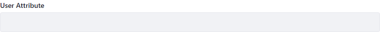 🟢 **Passed** | 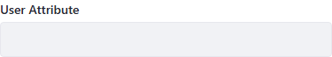 🟢 **Passed** |

[Detailed Documentation](./fragments/form-fragments/user-field.md)

---

## Forms

### Masthead Call to Action Form Holder

**Snapshot Prerequisites / Layout Components:**

- Fragment: `signature-pad`
- Fragment: `submit-button`
- Fragment: `user-field`

#### Desktop (1920px)  🟢 **Passed**

|                                                      Tablet (768px)                                                      |                                                      Mobile (375px)                                                      |
| :----------------------------------------------------------------------------------------------------------------------: | :----------------------------------------------------------------------------------------------------------------------: |
|  🟢 **Passed** |  🟢 **Passed** |

[Detailed Documentation](./fragments/forms/masthead-call-to-action-form-header.md)

---

## Gemini Generated

Visually appealing fragments generated by Gemini.

### Activity Heatmap

#### Original Design

#### Desktop (1920px)  🟢 **Passed**

|                                                  Tablet (768px)                                                  |                                                  Mobile (375px)                                                  |
| :--------------------------------------------------------------------------------------------------------------: | :--------------------------------------------------------------------------------------------------------------: |
|  🟢 **Passed** |  🟢 **Passed** |

[Detailed Documentation](./fragments/gemini-generated/activity-heatmap.md)

---

### AI Assistant Chat UI

#### Desktop (1920px)  🟢 **Passed**

|                                                    Tablet (768px)                                                    |                                                    Mobile (375px)                                                    |
| :------------------------------------------------------------------------------------------------------------------: | :------------------------------------------------------------------------------------------------------------------: |
|  🟢 **Passed** |  🟢 **Passed** |

[Detailed Documentation](./fragments/gemini-generated/ai-chat-ui.md)

---

### Animated Metric Counter

#### Original Design

#### Desktop (1920px)  🟢 **Passed**

|                                                     Tablet (768px)                                                      |                                                     Mobile (375px)                                                      |
| :---------------------------------------------------------------------------------------------------------------------: | :---------------------------------------------------------------------------------------------------------------------: |
|  🟢 **Passed** |  🟢 **Passed** |

[Detailed Documentation](./fragments/gemini-generated/animated-metric-counter.md)

---

### Dynamic Collection Slider

#### Original Design

#### Desktop (1920px)  🟢 **Passed**

|                                                      Tablet (768px)                                                       |                                                      Mobile (375px)                                                       |
| :-----------------------------------------------------------------------------------------------------------------------: | :-----------------------------------------------------------------------------------------------------------------------: |
|  🟢 **Passed** |  🟢 **Passed** |

[Detailed Documentation](./fragments/gemini-generated/dynamic-collection-slider.md)

---

### Dynamic Object Gallery

#### Original Design

#### Desktop (1920px)  🟢 **Passed**

|                                                     Tablet (768px)                                                     |                                                     Mobile (375px)                                                     |
| :--------------------------------------------------------------------------------------------------------------------: | :--------------------------------------------------------------------------------------------------------------------: |
|  🟢 **Passed** |  🟢 **Passed** |

[Detailed Documentation](./fragments/gemini-generated/dynamic-object-gallery.md)

---

### Interactive Event Timeline

#### Original Design

#### Desktop (1920px)  🟢 **Passed**

|                                                       Tablet (768px)                                                       |                                                       Mobile (375px)                                                       |
| :------------------------------------------------------------------------------------------------------------------------: | :------------------------------------------------------------------------------------------------------------------------: |
|  🟢 **Passed** |  🟢 **Passed** |

[Detailed Documentation](./fragments/gemini-generated/interactive-event-timeline.md)

---

### Interactive Wizard

#### Desktop (1920px)  🟢 **Passed**

|                                                   Tablet (768px)                                                   |                                                   Mobile (375px)                                                   |
| :----------------------------------------------------------------------------------------------------------------: | :----------------------------------------------------------------------------------------------------------------: |
|  🟢 **Passed** |  🟢 **Passed** |

[Detailed Documentation](./fragments/gemini-generated/interactive-wizard.md)

---

### Meta-Object Form

#### Original Design

#### Desktop (1920px)  🟢 **Passed**

|                                                  Tablet (768px)                                                  |                                                  Mobile (375px)                                                  |
| :--------------------------------------------------------------------------------------------------------------: | :--------------------------------------------------------------------------------------------------------------: |
|  🟢 **Passed** |  🟢 **Passed** |

[Detailed Documentation](./fragments/gemini-generated/meta-object-form.md)

---

### Meta-Object Record View

#### Original Design

#### Desktop (1920px)  🟢 **Passed**

|                                                     Tablet (768px)                                                      |                                                     Mobile (375px)                                                      |
| :---------------------------------------------------------------------------------------------------------------------: | :---------------------------------------------------------------------------------------------------------------------: |
|  🟢 **Passed** |  🟢 **Passed** |

[Detailed Documentation](./fragments/gemini-generated/meta-object-record-view.md)

---

### Meta-Object Table

**Snapshot Prerequisites / Layout Components:**

- Fragment: `activity-heatmap`
- Fragment: `radial-kpi-gauge`

#### Original Design

#### Desktop (1920px)  🟢 **Passed**

|                                                  Tablet (768px)                                                   |                                                  Mobile (375px)                                                   |
| :---------------------------------------------------------------------------------------------------------------: | :---------------------------------------------------------------------------------------------------------------: |
|  🟢 **Passed** |  🟢 **Passed** |

[Detailed Documentation](./fragments/gemini-generated/meta-object-table.md)

---

### Modern Parallax Hero

**Snapshot Prerequisites / Layout Components:**

- Fragment: `HTML (System Component)`

#### Original Design

#### Desktop (1920px)  🟢 **Passed**

|                                                    Tablet (768px)                                                    |                                                    Mobile (375px)                                                    |
| :------------------------------------------------------------------------------------------------------------------: | :------------------------------------------------------------------------------------------------------------------: |
|  🟢 **Passed** |  🟢 **Passed** |

[Detailed Documentation](./fragments/gemini-generated/modern-parallax-hero.md)

---

### Object-Linked Chart

#### Original Design

#### Desktop (1920px)  🟢 **Passed**

|                                                   Tablet (768px)                                                    |                                                   Mobile (375px)                                                    |
| :-----------------------------------------------------------------------------------------------------------------: | :-----------------------------------------------------------------------------------------------------------------: |
|  🟢 **Passed** |  🟢 **Passed** |

[Detailed Documentation](./fragments/gemini-generated/object-linked-chart.md)

---

### Pricing Comparison Grid

#### Original Design

#### Desktop (1920px)  🟢 **Passed**

|                                                     Tablet (768px)                                                      |                                                     Mobile (375px)                                                      |
| :---------------------------------------------------------------------------------------------------------------------: | :---------------------------------------------------------------------------------------------------------------------: |
|  🟢 **Passed** |  🟢 **Passed** |

[Detailed Documentation](./fragments/gemini-generated/pricing-comparison-grid.md)

---

### Radial KPI Gauge

#### Original Design

#### Desktop (1920px)  🟢 **Passed**

|                                                  Tablet (768px)                                                  |                                                  Mobile (375px)                                                  |
| :--------------------------------------------------------------------------------------------------------------: | :--------------------------------------------------------------------------------------------------------------: |
|  🟢 **Passed** |  🟢 **Passed** |

[Detailed Documentation](./fragments/gemini-generated/radial-kpi-gauge.md)

---

### Modern Search Overlay

#### Desktop (1920px)  🟢 **Passed**

|                                                    Tablet (768px)                                                     |                                                    Mobile (375px)                                                     |
| :-------------------------------------------------------------------------------------------------------------------: | :-------------------------------------------------------------------------------------------------------------------: |
|  🟢 **Passed** |  🟢 **Passed** |

[Detailed Documentation](./fragments/gemini-generated/search-overlay.md)

---

## Header Components

### Linear Gradient Container

**Snapshot Prerequisites / Layout Components:**

- Fragment: `HTML (System Component)`

#### Desktop (1920px)  🟢 **Passed**

|                                                       Tablet (768px)                                                       |                                                       Mobile (375px)                                                       |
| :------------------------------------------------------------------------------------------------------------------------: | :------------------------------------------------------------------------------------------------------------------------: |
|  🟢 **Passed** |  🟢 **Passed** |

[Detailed Documentation](./fragments/header-components/linear-gradient-container-%28custom%29.md)

---

### Site Logo

**Snapshot Prerequisites / Layout Components:**

- Fragment: `HTML (System Component)`

#### Desktop (1920px)  🟢 **Passed**

|                                               Tablet (768px)                                               |                                               Mobile (375px)                                               |
| :--------------------------------------------------------------------------------------------------------: | :--------------------------------------------------------------------------------------------------------: |
|  🟢 **Passed** |  🟢 **Passed** |

[Detailed Documentation](./fragments/header-components/logo.md)

---

### Site Name

#### Desktop (1920px)  🟢 **Passed**

|                                               Tablet (768px)                                               |                                               Mobile (375px)                                               |
| :--------------------------------------------------------------------------------------------------------: | :--------------------------------------------------------------------------------------------------------: |
|  🟢 **Passed** |  🟢 **Passed** |

[Detailed Documentation](./fragments/header-components/site-name.md)

---

### Master Page Header

**Snapshot Prerequisites / Layout Components:**

- Fragment: `login-and-user-menu`
- Fragment: `logo`
- Fragment: `site-name`

#### Desktop (1920px)  🟢 **Passed**

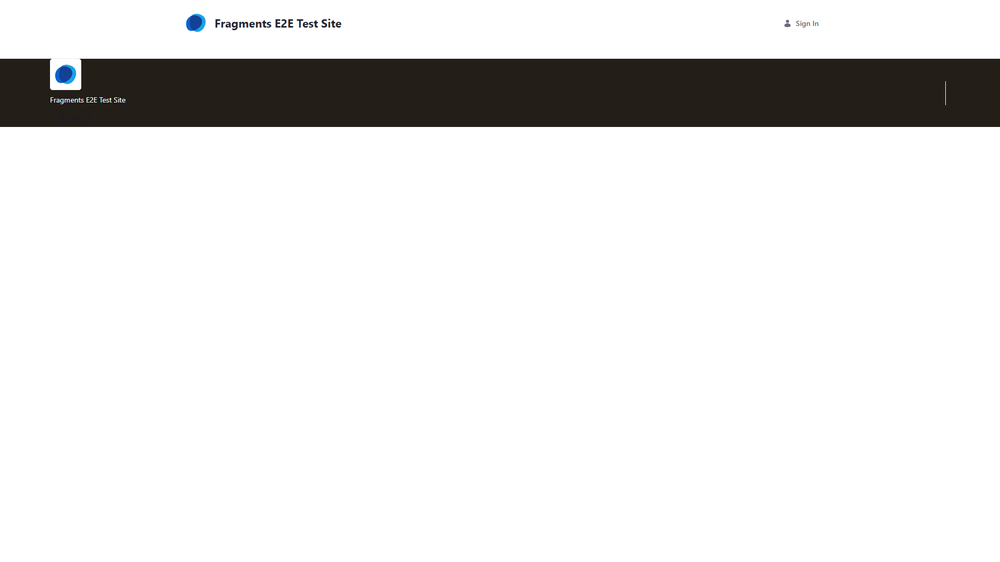

|                                                   Tablet (768px)                                                    |                                                   Mobile (375px)                                                    |
| :-----------------------------------------------------------------------------------------------------------------: | :-----------------------------------------------------------------------------------------------------------------: |
| 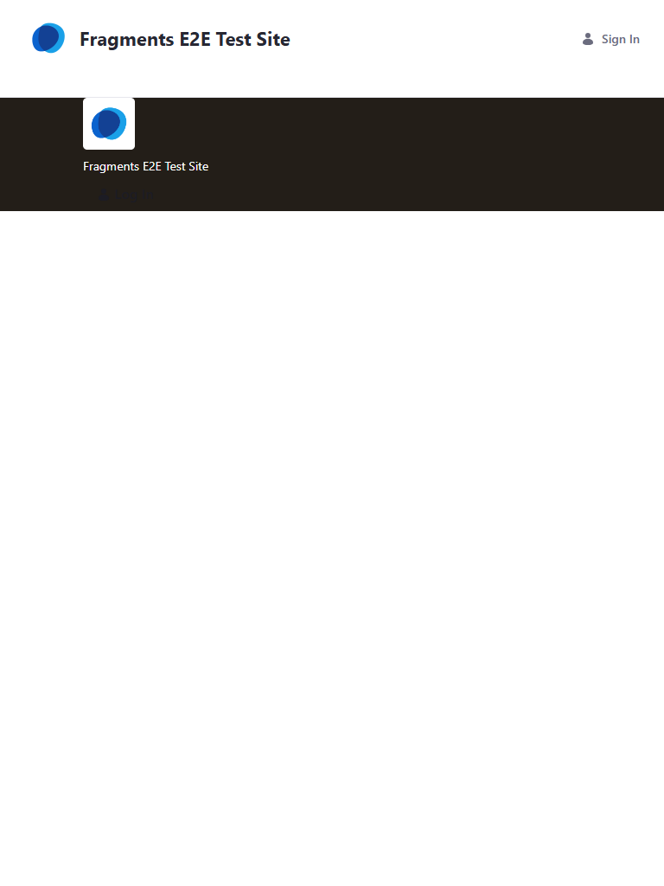 🟢 **Passed** | 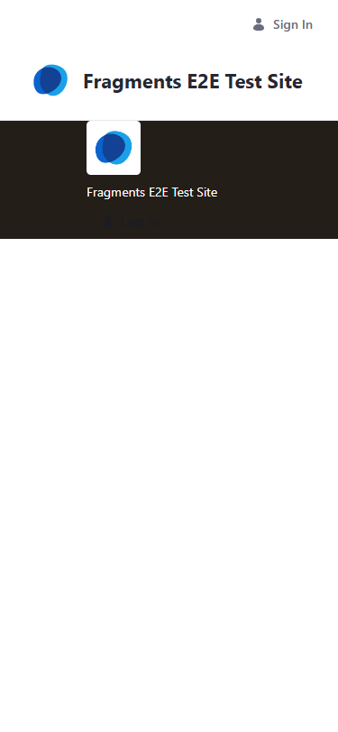 🟢 **Passed** |

[Detailed Documentation](./fragments/header-components/master-page-header.md)

---

## Hero Assets

Prominent visuals, such as videos or banners, that capture attention and define page impact.

### Banner Video

#### Desktop (1920px)  🟢 **Passed**

|                                             Tablet (768px)                                              |                                             Mobile (375px)                                              |
| :-----------------------------------------------------------------------------------------------------: | :-----------------------------------------------------------------------------------------------------: |
|  🟢 **Passed** |  🟢 **Passed** |

[Detailed Documentation](./fragments/hero-assets/hero-video.md)

---

### Overlay Background

**Snapshot Prerequisites / Layout Components:**

- Fragment: `HTML (System Component)`

#### Desktop (1920px)  🟢 **Passed**

|                                                Tablet (768px)                                                 |                                                Mobile (375px)                                                 |
| :-----------------------------------------------------------------------------------------------------------: | :-----------------------------------------------------------------------------------------------------------: |
|  🟢 **Passed** |  🟢 **Passed** |

[Detailed Documentation](./fragments/hero-assets/overlay-background.md)

---

## Layout Components

### Card Content

**Snapshot Prerequisites / Layout Components:**

- Fragment: `primary-card`

#### Desktop (1920px)  🟢 **Passed**

|                                                Tablet (768px)                                                 |                                                Mobile (375px)                                                 |
| :-----------------------------------------------------------------------------------------------------------: | :-----------------------------------------------------------------------------------------------------------: |
|  🟢 **Passed** |  🟢 **Passed** |

[Detailed Documentation](./fragments/layout-components/card-content.md)

---

### Primary Card

**Snapshot Prerequisites / Layout Components:**

- Fragment: `HTML (System Component)`

#### Desktop (1920px)  🟢 **Passed**

|                                                Tablet (768px)                                                 |                                                Mobile (375px)                                                 |
| :-----------------------------------------------------------------------------------------------------------: | :-----------------------------------------------------------------------------------------------------------: |
|  🟢 **Passed** |  🟢 **Passed** |

[Detailed Documentation](./fragments/layout-components/primary-card.md)

---

### Secondary Card

**Snapshot Prerequisites / Layout Components:**

- Fragment: `HTML (System Component)`

#### Desktop (1920px)  🟢 **Passed**

|                                                 Tablet (768px)                                                  |                                                 Mobile (375px)                                                  |
| :-------------------------------------------------------------------------------------------------------------: | :-------------------------------------------------------------------------------------------------------------: |
|  🟢 **Passed** |  🟢 **Passed** |

[Detailed Documentation](./fragments/layout-components/secondary-card.md)

---

## Meter Reading

### Meter Reading

#### Desktop (1920px)  🟢 **Passed**

|                                               Tablet (768px)                                               |                                               Mobile (375px)                                               |
| :--------------------------------------------------------------------------------------------------------: | :--------------------------------------------------------------------------------------------------------: |
|  🟢 **Passed** |  🟢 **Passed** |

[Detailed Documentation](./fragments/meter-reading/meter-reading.md)

---

## Miscellaneous

### Back Button

#### Desktop (1920px)  🟢 **Passed**

|                                              Tablet (768px)                                              |                                              Mobile (375px)                                              |
| :------------------------------------------------------------------------------------------------------: | :------------------------------------------------------------------------------------------------------: |
|  🟢 **Passed** |  🟢 **Passed** |

[Detailed Documentation](./fragments/misc/back-button.md)

---

### Custom Tabs

#### Desktop (1920px)  🟢 **Passed**

|                                              Tablet (768px)                                              |                                              Mobile (375px)                                              |
| :------------------------------------------------------------------------------------------------------: | :------------------------------------------------------------------------------------------------------: |
|  🟢 **Passed** |  🟢 **Passed** |

[Detailed Documentation](./fragments/misc/custom-tabs.md)

---

### Dynamic Copyright

#### Original Design

#### Desktop (1920px)  🟢 **Passed**

|                                                 Tablet (768px)                                                 |                                                 Mobile (375px)                                                 |
| :------------------------------------------------------------------------------------------------------------: | :------------------------------------------------------------------------------------------------------------: |
|  🟢 **Passed** |  🟢 **Passed** |

[Detailed Documentation](./fragments/misc/dynamic-copyright.md)

---

### Icon Button

#### Original Design

#### Desktop (1920px)  🟢 **Passed**

|                                              Tablet (768px)                                              |                                              Mobile (375px)                                              |
| :------------------------------------------------------------------------------------------------------: | :------------------------------------------------------------------------------------------------------: |
|  🟢 **Passed** |  🟢 **Passed** |

[Detailed Documentation](./fragments/misc/icon-button.md)

---

### Launch Analytics Cloud

#### Desktop (1920px)  🟢 **Passed**

|                                                   Tablet (768px)                                                    |                                                   Mobile (375px)                                                    |
| :-----------------------------------------------------------------------------------------------------------------: | :-----------------------------------------------------------------------------------------------------------------: |
|  🟢 **Passed** |  🟢 **Passed** |

[Detailed Documentation](./fragments/misc/launch-analytics-cloud.md)

---

### Modify My Profile Link

#### Desktop (1920px)  🟢 **Passed**

|                                                   Tablet (768px)                                                    |                                                   Mobile (375px)                                                    |
| :-----------------------------------------------------------------------------------------------------------------: | :-----------------------------------------------------------------------------------------------------------------: |
|  🟢 **Passed** |  🟢 **Passed** |

[Detailed Documentation](./fragments/misc/modify-my-profile-link.md)

---

### My Dashboard Link

#### Desktop (1920px)  🟢 **Passed**

|                                                 Tablet (768px)                                                 |                                                 Mobile (375px)                                                 |
| :------------------------------------------------------------------------------------------------------------: | :------------------------------------------------------------------------------------------------------------: |
|  🟢 **Passed** |  🟢 **Passed** |

[Detailed Documentation](./fragments/misc/my-dashboard-link.md)

---

## Modern Intranet

A collection of high-fidelity fragments for constructing modern corporate intranet pages, including social feeds, learning centers, and personalized dashboards.

### App Launcher

#### Desktop (1920px)  🟢 **Passed**

|                                               Tablet (768px)                                                |                                               Mobile (375px)                                                |
| :---------------------------------------------------------------------------------------------------------: | :---------------------------------------------------------------------------------------------------------: |
|  🟢 **Passed** |  🟢 **Passed** |

[Detailed Documentation](./fragments/modern-intranet/app-launcher.md)

---

### Course Progress Card

#### Desktop (1920px)  🟢 **Passed**

|                                                   Tablet (768px)                                                    |                                                   Mobile (375px)                                                    |
| :-----------------------------------------------------------------------------------------------------------------: | :-----------------------------------------------------------------------------------------------------------------: |
|  🟢 **Passed** |  🟢 **Passed** |

[Detailed Documentation](./fragments/modern-intranet/course-progress-card.md)

---

### File Repository List

#### Desktop (1920px)  🟢 **Passed**

|                                                   Tablet (768px)                                                    |                                                   Mobile (375px)                                                    |
| :-----------------------------------------------------------------------------------------------------------------: | :-----------------------------------------------------------------------------------------------------------------: |
|  🟢 **Passed** |  🟢 **Passed** |

[Detailed Documentation](./fragments/modern-intranet/file-repository-list.md)

---

### Intranet Feed

#### Desktop (1920px)  🟢 **Passed**

|                                                Tablet (768px)                                                |                                                Mobile (375px)                                                |
| :----------------------------------------------------------------------------------------------------------: | :----------------------------------------------------------------------------------------------------------: |
|  🟢 **Passed** |  🟢 **Passed** |

[Detailed Documentation](./fragments/modern-intranet/intranet-feed.md)

---

### News Hero

#### Desktop (1920px)  🟢 **Passed**

|                                              Tablet (768px)                                              |                                              Mobile (375px)                                              |
| :------------------------------------------------------------------------------------------------------: | :------------------------------------------------------------------------------------------------------: |
|  🟢 **Passed** |  🟢 **Passed** |

[Detailed Documentation](./fragments/modern-intranet/news-hero.md)

---

### Stat Card

#### Desktop (1920px)  🟢 **Passed**

|                                              Tablet (768px)                                              |                                              Mobile (375px)                                              |
| :------------------------------------------------------------------------------------------------------: | :------------------------------------------------------------------------------------------------------: |
|  🟢 **Passed** |  🟢 **Passed** |

[Detailed Documentation](./fragments/modern-intranet/stat-card.md)

---

### Welcome Banner

#### Desktop (1920px)  🟢 **Passed**

|                                                Tablet (768px)                                                 |                                                Mobile (375px)                                                 |
| :-----------------------------------------------------------------------------------------------------------: | :-----------------------------------------------------------------------------------------------------------: |
|  🟢 **Passed** |  🟢 **Passed** |

[Detailed Documentation](./fragments/modern-intranet/welcome-banner.md)

---

## Objects

### Audit Button

#### Desktop (1920px)  🟢 **Passed**

|                                           Tablet (768px)                                            |                                           Mobile (375px)                                            |
| :-------------------------------------------------------------------------------------------------: | :-------------------------------------------------------------------------------------------------: |
|  🟢 **Passed** |  🟢 **Passed** |

[Detailed Documentation](./fragments/objects/audit-button.md)

---

### Comment

#### Original Design

#### Desktop (1920px)  🟢 **Passed**

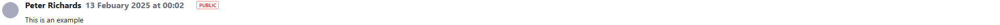

|                                         Tablet (768px)                                         |                                         Mobile (375px)                                         |
| :--------------------------------------------------------------------------------------------: | :--------------------------------------------------------------------------------------------: |
|  🟢 **Passed** | 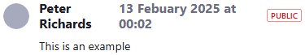 🟢 **Passed** |

[Detailed Documentation](./fragments/objects/comment.md)

---

### View Comments

#### Original Design

#### Desktop (1920px)  🟢 **Passed**

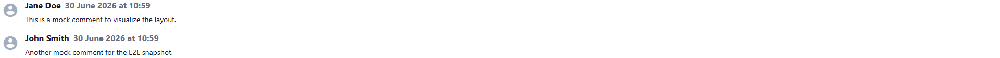

|                                            Tablet (768px)                                            |                                            Mobile (375px)                                            |
| :--------------------------------------------------------------------------------------------------: | :--------------------------------------------------------------------------------------------------: |
| 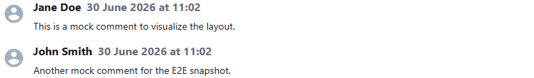 🟢 **Passed** | 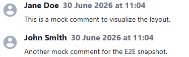 🟢 **Passed** |

[Detailed Documentation](./fragments/objects/public-comments.md)

---

## Populated Form Fields

### Populated Range

#### Original Design

#### Desktop (1920px)  🟢 **Passed**

|                                                    Tablet (768px)                                                    |                                                    Mobile (375px)                                                    |
| :------------------------------------------------------------------------------------------------------------------: | :------------------------------------------------------------------------------------------------------------------: |
|  🟢 **Passed** |  🟢 **Passed** |

[Detailed Documentation](./fragments/populated-form-fields/populated-range.md)

---

## Pulse

### Pulse Button

#### Desktop (1920px)  🟢 **Passed**

|                                          Tablet (768px)                                           |                                          Mobile (375px)                                           |
| :-----------------------------------------------------------------------------------------------: | :-----------------------------------------------------------------------------------------------: |
|  🟢 **Passed** |  🟢 **Passed** |

[Detailed Documentation](./fragments/pulse/pulse-button.md)

---

## Responsive Menus

### Responsive Menu

**Snapshot Prerequisites / Layout Components:**

- Fragment: `login-and-user-menu`
- Fragment: `logo`
- Fragment: `site-name`

#### Desktop (1920px)  🟢 **Passed**

|                                                 Tablet (768px)                                                  |                                                 Mobile (375px)                                                  |
| :-------------------------------------------------------------------------------------------------------------: | :-------------------------------------------------------------------------------------------------------------: |
|  🟢 **Passed** |  🟢 **Passed** |

[Detailed Documentation](./fragments/responsive-menus/responsive-menu.md)

---

### Responsive Side Menu

**Snapshot Prerequisites / Layout Components:**

- Fragment: `login-and-user-menu`
- Fragment: `logo`
- Fragment: `site-name`

#### Desktop (1920px)  🟢 **Passed**

|                                                    Tablet (768px)                                                    |                                                    Mobile (375px)                                                    |
| :------------------------------------------------------------------------------------------------------------------: | :------------------------------------------------------------------------------------------------------------------: |
|  🟢 **Passed** |  🟢 **Passed** |

[Detailed Documentation](./fragments/responsive-menus/responsive-side-menu.md)

---

## User Account

### My Rights

#### Desktop (1920px)  🟢 **Passed**

|                                            Tablet (768px)                                             |                                            Mobile (375px)                                             |
| :---------------------------------------------------------------------------------------------------: | :---------------------------------------------------------------------------------------------------: |
|  🟢 **Passed** |  🟢 **Passed** |

[Detailed Documentation](./fragments/user-account/my-rights.md)

---
