# Fragment Visual Gallery

A visual reference for the high-fidelity fragments available in this Liferay DXP repository. Generated automatically.

## Commerce

### Dynamic Badge Overlay

[Detailed Documentation](./fragments/dynamic-badge-overlay.md)

--- 

### Purchased Products

[Detailed Documentation](./fragments/purchased-products.md)

--- 

## Content

### Content Map

[Detailed Documentation](./fragments/content-map.md)

--- 

### Service Card

[Detailed Documentation](./fragments/service-card.md)

--- 

### Service Icon

[Detailed Documentation](./fragments/service-icon.md)

--- 

### Service Link Button

*No image available*

[Detailed Documentation](./fragments/service-link-button.md)

--- 

## Heathcare Portal

### Dashboard Container

*No image available*

[Detailed Documentation](./fragments/dashboard-container.md)

--- 

### Dashboard Filter

*No image available*

[Detailed Documentation](./fragments/dashboard-filter.md)

--- 

## Date Display

### Date Display (Collection Display) (DEPRECATED)

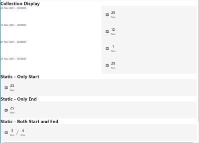

[Detailed Documentation](./fragments/date-display-collection-display.md)

--- 

### Data Display (Static) (DEPRECATED)

[Detailed Documentation](./fragments/date-display-static.md)

--- 

## Finance

### Loan Application Calculator

[Detailed Documentation](./fragments/loan-application-calculator.md)

--- 

### Loan Calculator

[Detailed Documentation](./fragments/loan-calculator.md)

--- 

## Forms Fragments

### Autocomplete (Object)

/thumbnail.png)

[Detailed Documentation](./fragments/autocomplete-(object).md)

--- 

### Autocomplete (Picklist)

/thumbnail.png)

[Detailed Documentation](./fragments/autocomplete-(picklist).md)

--- 

### Confirmation Field

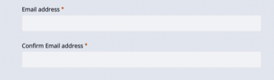

[Detailed Documentation](./fragments/confirmation-field.md)

--- 

### Hidden Relationship

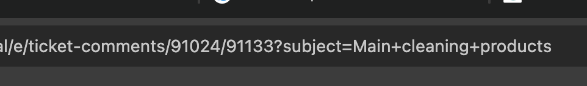

[Detailed Documentation](./fragments/hidden-relationship.md)

--- 

### Listbox Multiselect

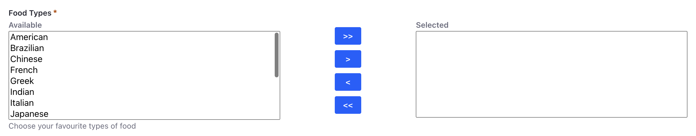

[Detailed Documentation](./fragments/listbox-multiselect.md)

--- 

### Range

[Detailed Documentation](./fragments/range.md)

--- 

### Segmented Numeric

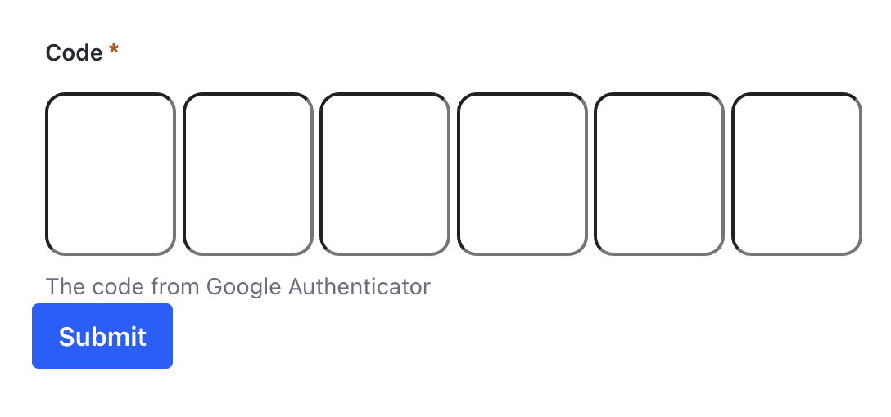

[Detailed Documentation](./fragments/segmented-numeric.md)

--- 

### Star Rating

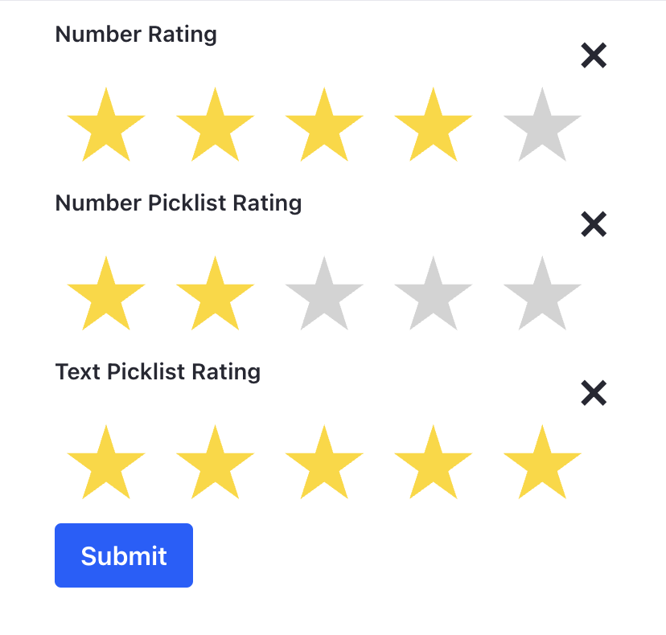

[Detailed Documentation](./fragments/star-rating.md)

--- 

### Submit Button (Confirmation)

*No image available*

[Detailed Documentation](./fragments/submit-button.md)

--- 

### Toggle Switch

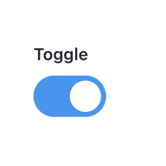

[Detailed Documentation](./fragments/toggle-switch.md)

--- 

### URL Populated Hidden Relationship

*No image available*

[Detailed Documentation](./fragments/url-populated-hidden-relationship.md)

--- 

### User Attribute

*No image available*

[Detailed Documentation](./fragments/user-field.md)

--- 

## Forms

### Form Populator (DEPRECATED)

[Detailed Documentation](./fragments/form-populator.md)

--- 

### Link Form to Applicant

*No image available*

[Detailed Documentation](./fragments/form-session-id.md)

--- 

### Generate Form Session Id

*No image available*

[Detailed Documentation](./fragments/generate-form-session-id.md)

--- 

### Masthead Call to Action Form Holder

*No image available*

[Detailed Documentation](./fragments/masthead-call-to-action-form-header.md)

--- 

### Redirect Page

*No image available*

[Detailed Documentation](./fragments/redirect-page.md)

--- 

### Refresh Page

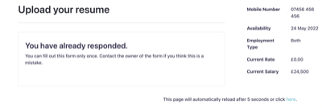

[Detailed Documentation](./fragments/refresh-page.md)

--- 

## Gemini Generated

Visually appealing fragments generated by Gemini.

### Activity Heatmap

[Detailed Documentation](./fragments/activity-heatmap.md)

--- 

### AI Assistant Chat UI

*No image available*

[Detailed Documentation](./fragments/ai-chat-ui.md)

--- 

### Animated Metric Counter

[Detailed Documentation](./fragments/animated-metric-counter.md)

--- 

### Dynamic Collection Slider

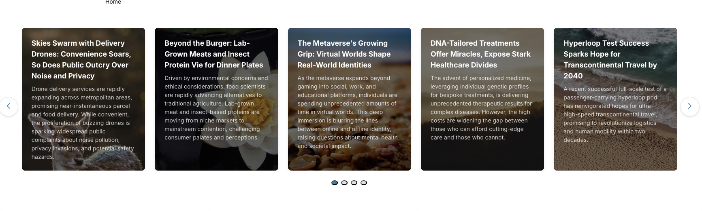

[Detailed Documentation](./fragments/dynamic-collection-slider.md)

--- 

### Dynamic Object Gallery

[Detailed Documentation](./fragments/dynamic-object-gallery.md)

--- 

### Interactive Event Timeline

[Detailed Documentation](./fragments/interactive-event-timeline.md)

--- 

### Interactive Wizard

*No image available*

[Detailed Documentation](./fragments/interactive-wizard.md)

--- 

### Meta-Object Form

[Detailed Documentation](./fragments/meta-object-form.md)

--- 

### Meta-Object Record View

[Detailed Documentation](./fragments/meta-object-record-view.md)

--- 

### Meta-Object Table

[Detailed Documentation](./fragments/meta-object-table.md)

--- 

### Modern Parallax Hero

[Detailed Documentation](./fragments/modern-parallax-hero.md)

--- 

### Object-Linked Chart

[Detailed Documentation](./fragments/object-linked-chart.md)

--- 

### Pricing Comparison Grid

[Detailed Documentation](./fragments/pricing-comparison-grid.md)

--- 

### Radial KPI Gauge

[Detailed Documentation](./fragments/radial-kpi-gauge.md)

--- 

### Modern Search Overlay

*No image available*

[Detailed Documentation](./fragments/search-overlay.md)

--- 

## Header Components

### Customer Registration (Deprecated)

*No image available*

[Detailed Documentation](./fragments/customer-registration.md)

--- 

### Linear Gradient Container

*No image available*

[Detailed Documentation](./fragments/linear-gradient-container-(custom).md)

--- 

### Linear Gradient Container (Deprecated)

[Detailed Documentation](./fragments/linear-gradient-container.md)

--- 

### Login and User Menu

[Detailed Documentation](./fragments/login-and-user-menu.md)

--- 

### Login Card (Deprecated)

*No image available*

[Detailed Documentation](./fragments/login-card.md)

--- 

### Site Logo

[Detailed Documentation](./fragments/logo.md)

--- 

### Lower Header Bar

[Detailed Documentation](./fragments/lower-header-layout.md)

--- 

### Navigation (Deprecated)

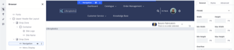

[Detailed Documentation](./fragments/navigation.md)

--- 

### Search Bar

[Detailed Documentation](./fragments/search-bar.md)

--- 

### Search Button

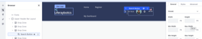

[Detailed Documentation](./fragments/search-button.md)

--- 

### Site Name

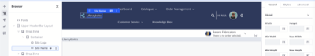

[Detailed Documentation](./fragments/site-name.md)

--- 

### Upper Header Bar Layout

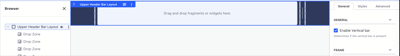

[Detailed Documentation](./fragments/upper-header-layout.md)

--- 

### User Personal Bar

[Detailed Documentation](./fragments/user-bar.md)

--- 

## Hero Assets

Prominent visuals, such as videos or banners, that capture attention and define page impact.

### Banner Video

[Detailed Documentation](./fragments/hero-video.md)

--- 

### Overlay Background

[Detailed Documentation](./fragments/overlay-background.md)

--- 

## Layout Components

### Card Content

*No image available*

[Detailed Documentation](./fragments/card-content.md)

--- 

### Primary Card

[Detailed Documentation](./fragments/primary-card.md)

--- 

### Secondary Card

[Detailed Documentation](./fragments/secondary-card.md)

--- 

## Meter Reading

### Meter Reading

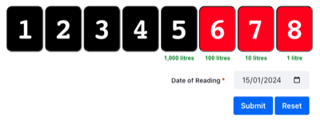

[Detailed Documentation](./fragments/meter-reading.md)

--- 

## Miscellaneous

### Back Button

*No image available*

[Detailed Documentation](./fragments/back-button.md)

--- 

### Custom Tabs

[Detailed Documentation](./fragments/custom-tabs.md)

--- 

### Customer Registration (Deprecated)

*No image available*

[Detailed Documentation](./fragments/customer-registration.md)

--- 

### Dynamic Copyright

[Detailed Documentation](./fragments/dynamic-copyright.md)

--- 

### Hide Control Menu

*No image available*

[Detailed Documentation](./fragments/hide-control-menu.md)

--- 

### Icon Button

[Detailed Documentation](./fragments/icon-button.md)

--- 

### Launch Analytics Cloud

[Detailed Documentation](./fragments/launch-analytics-cloud.md)

--- 

### Modify My Profile Link

*No image available*

[Detailed Documentation](./fragments/modify-my-profile-link.md)

--- 

### My Dashboard Link

*No image available*

[Detailed Documentation](./fragments/my-dashboard-link.md)

--- 

### Trigger Ray

*No image available*

[Detailed Documentation](./fragments/trigger-ray.md)

--- 

## Modern Intranet

A collection of high-fidelity fragments for constructing modern corporate intranet pages, including social feeds, learning centers, and personalized dashboards.

### App Launcher

*No image available*

--- 

### Course Progress Card

*No image available*

--- 

### File Repository List

*No image available*

--- 

### Intranet Feed

*No image available*

--- 

### News Hero

*No image available*

--- 

### Stat Card

*No image available*

--- 

### Welcome Banner

*No image available*

--- 

## Forms

### Audit Button

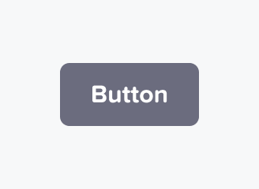

[Detailed Documentation](./fragments/audit-button.md)

--- 

### Comment

[Detailed Documentation](./fragments/comment.md)

--- 

### View Comments

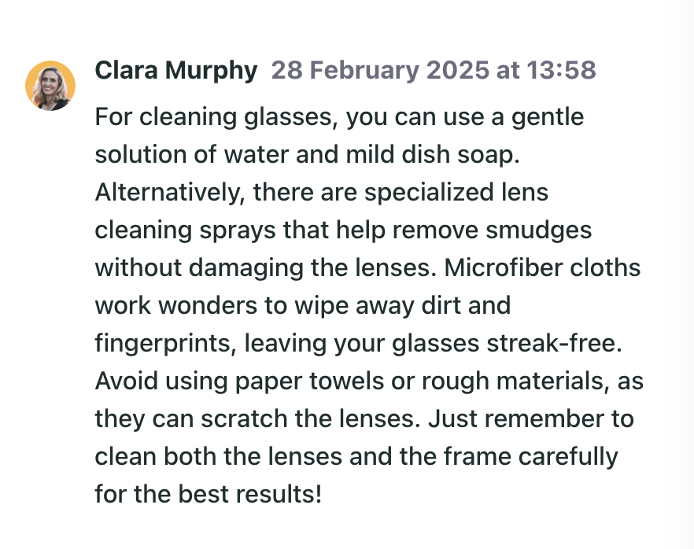

[Detailed Documentation](./fragments/public-comments.md)

--- 

## Populated Form Fields

### Populate Select

[Detailed Documentation](./fragments/populate-select.md)

--- 

### Populated Range

[Detailed Documentation](./fragments/populated-range.md)

--- 

### Store Default Value

[Detailed Documentation](./fragments/store-default-value.md)

--- 

### Store Form Field Values

*No image available*

[Detailed Documentation](./fragments/store-form-field-values.md)

--- 

### Text (Derived Value)

*No image available*

[Detailed Documentation](./fragments/text-derived-value.md)

--- 

## Profile

### Customer Profile (DEPRECATED)

[Detailed Documentation](./fragments/customer-profile.md)

--- 

### PDF Export (Dashboard) (Deprecated)

/thumbnail.png)

[Detailed Documentation](./fragments/pdf-export-(dashboard).md)

--- 

### PDF Export (DEPRECATED)

[Detailed Documentation](./fragments/pdf-export.md)

--- 

### Profile Detail (Dashboard) (Deprecated)

*No image available*

[Detailed Documentation](./fragments/profile-detail-(dashboard).md)

--- 

### Profile Detail (DEPRECATED)

[Detailed Documentation](./fragments/profile-detail.md)

--- 

### Profile Summary (Dashboard) (DEPRECATED)

*No image available*

[Detailed Documentation](./fragments/profile-summary-(dashboard).md)

--- 

### Profile Summary (DEPRECATED)

[Detailed Documentation](./fragments/profile-summary.md)

--- 

## Pulse

### Campaign Initialiser

*No image available*

[Detailed Documentation](./fragments/campaign-initialiser.md)

--- 

### Campaign Insights

*No image available*

[Detailed Documentation](./fragments/cookie-sniffer.md)

--- 

### Custom Event Listener

*No image available*

[Detailed Documentation](./fragments/custom-event-listener.md)

--- 

### Pulse Button

[Detailed Documentation](./fragments/pulse-button.md)

--- 

## Responsive Menus

### Logo Zone

*No image available*

[Detailed Documentation](./fragments/logo-zone.md)

--- 

### Responsive Menu

[Detailed Documentation](./fragments/responsive-menu.md)

--- 

### Responsive Side Menu

[Detailed Documentation](./fragments/responsive-side-menu.md)

--- 

### Zone Layout

*No image available*

[Detailed Documentation](./fragments/zone-layout.md)

--- 

## User Account

### My Rights

*No image available*

[Detailed Documentation](./fragments/my-rights.md)

--- 

### Ping

*No image available*

[Detailed Documentation](./fragments/ping.md)

--- 

### Who Am I

*No image available*

[Detailed Documentation](./fragments/who-am-i.md)

--- 

## Widget Modifiers

### Announcements Modifier

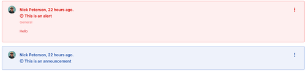

[Detailed Documentation](./fragments/alerts-modifier.md)

---
