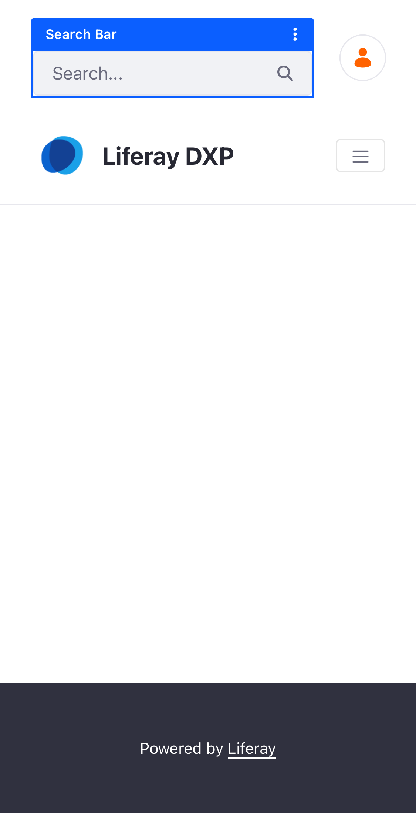
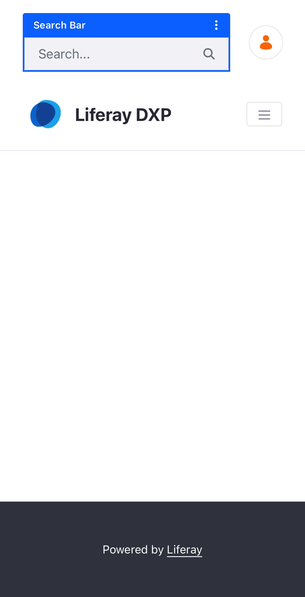
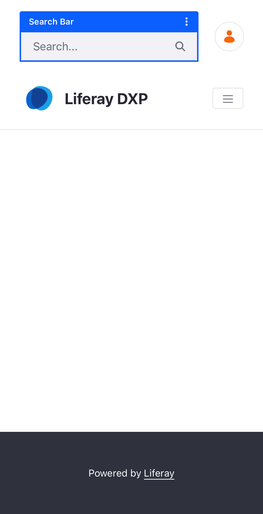
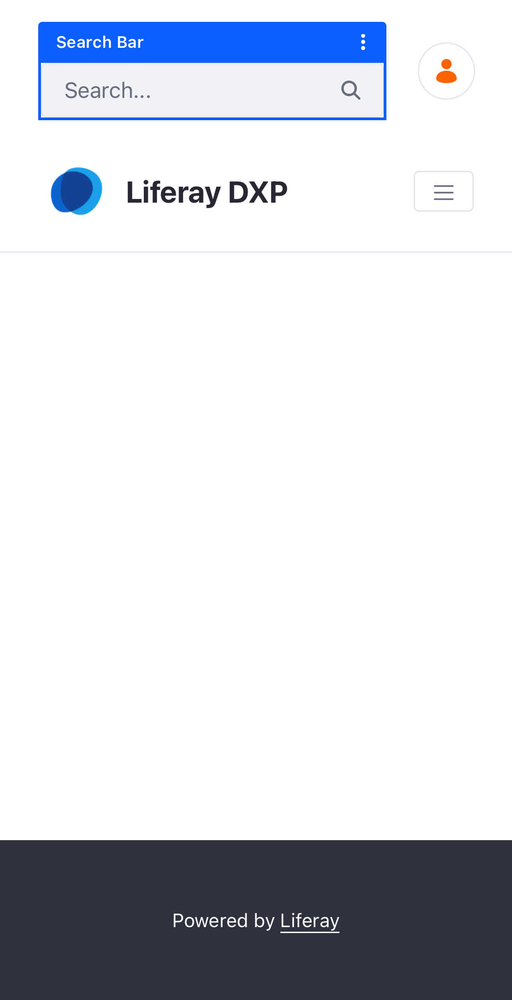

# Fragment Visual Gallery

A visual reference for the high-fidelity fragments available in this Liferay DXP repository. Generated automatically.

**Last Tested Against Liferay Version:** `2026.q1.7-lts`

## Aura Design System

A lifestyle-focused design system with a scoped container architecture, high-fidelity design tokens, and modern product showcase components.

### Aura - Final CTA Banner

--- 

### Aura - Lookbook Row

--- 

### Aura - Product Gallery

--- 

### Aura - Scoped Container

--- 

### Aura - USP Grid

--- 

## Commerce

### Dynamic Badge Overlay

[Detailed Documentation](./fragments/dynamic-badge-overlay.md)

--- 

### Purchased Products

[Detailed Documentation](./fragments/purchased-products.md)

--- 

## Content

### Content Map

[Detailed Documentation](./fragments/content-map.md)

--- 

### Service Card

[Detailed Documentation](./fragments/service-card.md)

--- 

### Service Icon

[Detailed Documentation](./fragments/service-icon.md)

--- 

### Service Link Button

[Detailed Documentation](./fragments/service-link-button.md)

--- 

## Heathcare Portal

### Dashboard Container

[Detailed Documentation](./fragments/dashboard-container.md)

--- 

### Dashboard Filter

[Detailed Documentation](./fragments/dashboard-filter.md)

--- 

## Date Display

### Date Display (Collection Display) (DEPRECATED)

[Detailed Documentation](./fragments/date-display-collection-display.md)

--- 

### Data Display (Static) (DEPRECATED)

[Detailed Documentation](./fragments/date-display-static.md)

--- 

## Finance

### Loan Application Calculator

[Detailed Documentation](./fragments/loan-application-calculator.md)

--- 

### Loan Calculator

[Detailed Documentation](./fragments/loan-calculator.md)

--- 

## Forms Fragments

### Address Autocomplete

--- 

### Autocomplete (Object)

[Detailed Documentation](./fragments/autocomplete-(object).md)

--- 

### Autocomplete (Picklist)

[Detailed Documentation](./fragments/autocomplete-(picklist).md)

--- 

### Color Swatches

--- 

### Confirmation Field

[Detailed Documentation](./fragments/confirmation-field.md)

--- 

### Currency Masked Input

--- 

### File Drop Zone

--- 

### Hidden Relationship

[Detailed Documentation](./fragments/hidden-relationship.md)

--- 

### Image Choice

--- 

### Listbox Multiselect

[Detailed Documentation](./fragments/listbox-multiselect.md)

--- 

### OTP / Verification Code

--- 

### Password Strength

--- 

### Range

[Detailed Documentation](./fragments/range.md)

--- 

### Segmented Numeric

[Detailed Documentation](./fragments/segmented-numeric.md)

--- 

### Signature Pad

--- 

### Star Rating

[Detailed Documentation](./fragments/star-rating.md)

--- 

### Submit Button (Confirmation)

[Detailed Documentation](./fragments/submit-button.md)

--- 

### Toggle Switch

[Detailed Documentation](./fragments/toggle-switch.md)

--- 

### URL Populated Hidden Relationship

[Detailed Documentation](./fragments/url-populated-hidden-relationship.md)

--- 

### User Attribute

[Detailed Documentation](./fragments/user-field.md)

--- 

## Forms

### Form Populator (DEPRECATED)

[Detailed Documentation](./fragments/form-populator.md)

--- 

### Link Form to Applicant

[Detailed Documentation](./fragments/form-session-id.md)

--- 

### Generate Form Session Id

[Detailed Documentation](./fragments/generate-form-session-id.md)

--- 

### Masthead Call to Action Form Holder

[Detailed Documentation](./fragments/masthead-call-to-action-form-header.md)

--- 

### Redirect Page

[Detailed Documentation](./fragments/redirect-page.md)

--- 

### Refresh Page

[Detailed Documentation](./fragments/refresh-page.md)

--- 

## Gemini Generated

Visually appealing fragments generated by Gemini.

### Activity Heatmap

[Detailed Documentation](./fragments/activity-heatmap.md)

--- 

### AI Assistant Chat UI

[Detailed Documentation](./fragments/ai-chat-ui.md)

--- 

### Animated Metric Counter

[Detailed Documentation](./fragments/animated-metric-counter.md)

--- 

### Dynamic Collection Slider

[Detailed Documentation](./fragments/dynamic-collection-slider.md)

--- 

### Dynamic Object Gallery

[Detailed Documentation](./fragments/dynamic-object-gallery.md)

--- 

### Interactive Event Timeline

[Detailed Documentation](./fragments/interactive-event-timeline.md)

--- 

### Interactive Wizard

[Detailed Documentation](./fragments/interactive-wizard.md)

--- 

### Meta-Object Form

[Detailed Documentation](./fragments/meta-object-form.md)

--- 

### Meta-Object Record View

[Detailed Documentation](./fragments/meta-object-record-view.md)

--- 

### Meta-Object Table

[Detailed Documentation](./fragments/meta-object-table.md)

--- 

### Modern Parallax Hero

[Detailed Documentation](./fragments/modern-parallax-hero.md)

--- 

### Object-Linked Chart

[Detailed Documentation](./fragments/object-linked-chart.md)

--- 

### Pricing Comparison Grid

[Detailed Documentation](./fragments/pricing-comparison-grid.md)

--- 

### Radial KPI Gauge

[Detailed Documentation](./fragments/radial-kpi-gauge.md)

--- 

### Modern Search Overlay

[Detailed Documentation](./fragments/search-overlay.md)

--- 

## Header Components

### Customer Registration (Header) (Deprecated)

[Detailed Documentation](./fragments/customer-registration.md)

--- 

### Linear Gradient Container

[Detailed Documentation](./fragments/linear-gradient-container-(custom).md)

--- 

### Linear Gradient Container (Deprecated)

[Detailed Documentation](./fragments/linear-gradient-container.md)

--- 

### Login and User Menu

[Detailed Documentation](./fragments/login-and-user-menu.md)

--- 

### Login Card (Deprecated)

[Detailed Documentation](./fragments/login-card.md)

--- 

### Site Logo

[Detailed Documentation](./fragments/logo.md)

--- 

### Lower Header Bar

[Detailed Documentation](./fragments/lower-header-layout.md)

--- 

### Navigation (Deprecated)

[Detailed Documentation](./fragments/navigation.md)

--- 

### Search Bar

[Detailed Documentation](./fragments/search-bar.md)

--- 

### Search Button

[Detailed Documentation](./fragments/search-button.md)

--- 

### Site Name

[Detailed Documentation](./fragments/site-name.md)

--- 

### Upper Header Bar Layout

[Detailed Documentation](./fragments/upper-header-layout.md)

--- 

### User Personal Bar

[Detailed Documentation](./fragments/user-bar.md)

--- 

## Hero Assets

Prominent visuals, such as videos or banners, that capture attention and define page impact.

### Banner Video

[Detailed Documentation](./fragments/hero-video.md)

--- 

### Overlay Background

[Detailed Documentation](./fragments/overlay-background.md)

--- 

## Layout Components

### Card Content

[Detailed Documentation](./fragments/card-content.md)

--- 

### Primary Card

[Detailed Documentation](./fragments/primary-card.md)

--- 

### Secondary Card

[Detailed Documentation](./fragments/secondary-card.md)

--- 

## Meter Reading

### Meter Reading

[Detailed Documentation](./fragments/meter-reading.md)

--- 

## Miscellaneous

### Back Button

[Detailed Documentation](./fragments/back-button.md)

--- 

### Custom Tabs

[Detailed Documentation](./fragments/custom-tabs.md)

--- 

### Customer Registration (Misc) (Deprecated)

[Detailed Documentation](./fragments/customer-registration.md)

--- 

### Dynamic Copyright

[Detailed Documentation](./fragments/dynamic-copyright.md)

--- 

### Hide Control Menu

[Detailed Documentation](./fragments/hide-control-menu.md)

--- 

### Icon Button

[Detailed Documentation](./fragments/icon-button.md)

--- 

### Launch Analytics Cloud

[Detailed Documentation](./fragments/launch-analytics-cloud.md)

--- 

### Modify My Profile Link

[Detailed Documentation](./fragments/modify-my-profile-link.md)

--- 

### My Dashboard Link

[Detailed Documentation](./fragments/my-dashboard-link.md)

--- 

### Trigger Ray

[Detailed Documentation](./fragments/trigger-ray.md)

--- 

## Modern Intranet

A collection of high-fidelity fragments for constructing modern corporate intranet pages, including social feeds, learning centers, and personalized dashboards.

### App Launcher

--- 

### Course Progress Card

--- 

### File Repository List

--- 

### Intranet Feed

--- 

### News Hero

--- 

### Stat Card

--- 

### Welcome Banner

--- 

## Forms

### Audit Button

[Detailed Documentation](./fragments/audit-button.md)

--- 

### Comment

[Detailed Documentation](./fragments/comment.md)

--- 

### View Comments

[Detailed Documentation](./fragments/public-comments.md)

--- 

## Populated Form Fields

### Populate Select

[Detailed Documentation](./fragments/populate-select.md)

--- 

### Populated Range

[Detailed Documentation](./fragments/populated-range.md)

--- 

### Store Default Value

[Detailed Documentation](./fragments/store-default-value.md)

--- 

### Store Form Field Values

[Detailed Documentation](./fragments/store-form-field-values.md)

--- 

### Text (Derived Value)

[Detailed Documentation](./fragments/text-derived-value.md)

--- 

## Profile

### Customer Profile (DEPRECATED)

[Detailed Documentation](./fragments/customer-profile.md)

--- 

### PDF Export (Dashboard) (Deprecated)

[Detailed Documentation](./fragments/pdf-export-(dashboard).md)

--- 

### PDF Export (DEPRECATED)

[Detailed Documentation](./fragments/pdf-export.md)

--- 

### Profile Detail (Dashboard) (Deprecated)

[Detailed Documentation](./fragments/profile-detail-(dashboard).md)

--- 

### Profile Detail (DEPRECATED)

[Detailed Documentation](./fragments/profile-detail.md)

--- 

### Profile Summary (Dashboard) (DEPRECATED)

[Detailed Documentation](./fragments/profile-summary-(dashboard).md)

--- 

### Profile Summary (DEPRECATED)

[Detailed Documentation](./fragments/profile-summary.md)

--- 

## Pulse

### Campaign Initialiser

[Detailed Documentation](./fragments/campaign-initialiser.md)

--- 

### Campaign Insights

[Detailed Documentation](./fragments/cookie-sniffer.md)

--- 

### Custom Event Listener

[Detailed Documentation](./fragments/custom-event-listener.md)

--- 

### Pulse Button

[Detailed Documentation](./fragments/pulse-button.md)

--- 

## Responsive Menus

### Logo Zone

[Detailed Documentation](./fragments/logo-zone.md)

--- 

### Responsive Menu

[Detailed Documentation](./fragments/responsive-menu.md)

--- 

### Responsive Side Menu

[Detailed Documentation](./fragments/responsive-side-menu.md)

--- 

### Zone Layout

[Detailed Documentation](./fragments/zone-layout.md)

--- 

## User Account

### My Rights

[Detailed Documentation](./fragments/my-rights.md)

--- 

### Ping

[Detailed Documentation](./fragments/ping.md)

--- 

### Who Am I

[Detailed Documentation](./fragments/who-am-i.md)

--- 

## Widget Modifiers

### Announcements Modifier

[Detailed Documentation](./fragments/alerts-modifier.md)

---
